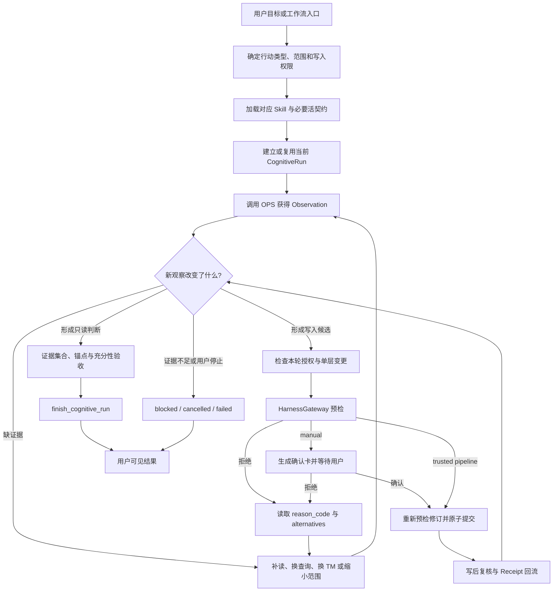
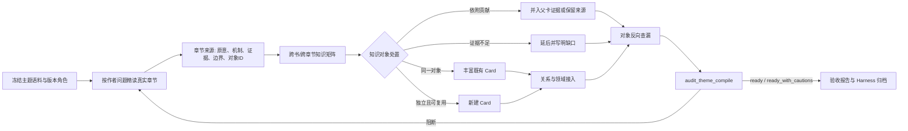
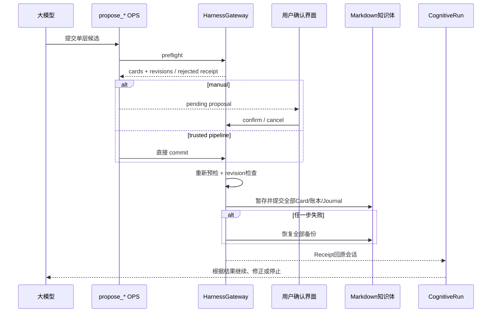

# 2026-09-07 NEXO 思维与沉淀行动运行手册

> 状态：基于 2026-09-07 工作区当前代码、活契约与 Skill 的现状梳理。
>
> 用途：把编译、主题编译、消化、建构、交流、涌现、深入研究、报告与分析九类行动拆成可观察、可测试、可优化的模型行为与系统约束。
>
> 重要边界：本文描述的是模型应表现出的公开决策、真实工具调用、结构化 Observation、Workspace 状态与 Harness Receipt，不记录、推测或要求暴露模型隐藏思维链。

## 一、先看结论：九类行动不是九条固定流水线

NEXO 当前是一套“模型决策 + 确定性工具 + 状态运行时 + 写入闸门”的受控 Agent Loop。九类行动共享同一底座，但它们的目标、证据门、写入权和完成条件不同。

最重要的职责分离如下：

| 层 | 真正负责什么 | 不负责什么 |
|---|---|---|
| Skill | 规定任务目标、范围、可用能力、停止条件和用户可见交付 | 不把每一步工具调用写死，不替工具实现校验 |
| 大模型 Agent | 根据用户目标和新 Observation 判断下一步；识别对象、比较证据、形成候选、决定继续或停止 | 不直接改 Card，不把候选当事实，不以调用次数冒充思考质量 |
| Thinking Model（TM） | 为模型提供一种可检查的分析镜头，并声明所需能力、观察义务、证据角色、输出义务和停止条件 | 不执行检索，不直接写知识，不替模型裁决语义真假 |
| Operator / OPS | 执行检索、精读、比较、走边、溯源、模拟、审计和提案，返回结构化 Observation | 不自行决定知识是否正确、是否值得沉淀 |
| CognitiveRun / Workspace / Episode | 保存任务状态、授权、预算、公开判断、证据、待办和工具轨迹 | 不成为新的知识事实源，不保存隐藏思维链 |
| HarnessGateway | 对写入做字段、类型、关系、来源、修订、批次和原子性校验，提交或回滚并返回 Receipt | 不替模型做开放式知识判断 |
| Markdown 底座与产物 | `01-Cards/` 与 `05-Buffer/` 构成知识体；`02-Profile/`、`04-OutBox/`、`06-Journal/` 分别承担领域档案、交付物和操作记录 | 不由索引、前端状态或模型会话替代，也不能把 OutBox 或 Journal 误算成知识体 |

### 1.1 九类行动的运行差异

| 行动 | 主要 Skill / 路由 | Run mode | 是否硬性要求 TM | 是否可改知识体 | 主要完成门 |
|---|---|---|---|---|---|
| 编译 | `nexo-compile` | `compile` | 当前没有硬性 TM 门；可选 `source-coverage` | 写普通 Buffer；完成后归档单一来源 | 有效 Buffer、完整来源去向、角色审计、归档事务 |
| 主题编译 | `nexo-theme-compile` | `theme_compile` | 当前没有硬性 TM 门；可组合来源覆盖与候选吸收镜头 | 写章节来源、矩阵、Card、关系；完成后归档语料 | 语料冻结、章节来源、对象对账、Card、质量审计、验收报告 |
| 消化 | `nexo-digest` | `digest` | 当前没有硬性 TM 门；可选 `candidate-assimilation` | Buffer → Card；可后续独立补关系 | 冻结 Buffer 全部有 complete / partial / skip / deferred 去向；新卡接入闭合 |
| 建构 | `nexo-construct` | `construct` | 写前与完成前硬性要求 TM | 可改正文、关系、领域、类型、生命周期，但每批单层 | 问题有处置、写前模拟、写后同题复验、问题账本闭合 |
| 交流 | `nexo-talk` 的 `direct` / `grounded_quick` | 无显式 Run，或轻量隐式 general | 不要求 | 不自动写 | 直接回答；需要库内依据时最多一次检索和一次批量精读 |
| 涌现 | `nexo-emerge` | 通常复用/建立非 analytical `general` | 不要求 | 只能生成确认提案；用户确认后写 | 新增性核对、来源非空、最多三个候选、确认 Receipt |
| 深入研究 | `nexo-talk` 的 `analytical` + `deep` | `general` | 硬性要求一个适用 TM | 只读；写入额度恒为 0 | TM 义务、至少四个精读对象、支持/边界/挑战、锚点与充分性审计 |
| 报告 | `nexo-report` | `report` | 硬性要求 | 只读；当前仅在对话交付 | 与分析相同的证据完成门 + 面向受众的报告结构 |
| 分析/研判 | `nexo-assess` | `assess` | 硬性要求 | 只读 | 2–4 个有区分度角度、条件式判断、反方、边界、最终锚点 |

这里最值得优化者注意的是：`source-coverage`、`candidate-assimilation` 等 TM 已存在，但编译、主题编译、消化的 Skill 与 Runtime 并未把“必须选择 TM”设为硬门。它们当前主要靠 Skill 语义、专用 OPS 和专用完成门约束。若以后要求这三类流程的模型行为更稳定，应先决定是补 Skill 明示、补 mode 级硬门，还是扩充 TM 观察义务；不能假设已有 YAML 就已经实际生效。

### 1.2 沉淀目标不能混为一谈

| 目标 | 当前正规入口 | 当前状态 |
|---|---|---|
| 普通来源质料 | compile → `write_buffer` → `05-Buffer/<role>/` | 已实现，并受来源覆盖与角色审计约束 |
| 主题来源层 | theme_compile → chapter source / matrix / acceptance | 已实现，保留在 `05-Buffer/themes/`，不进入普通 digest |
| 知识 Card | digest、theme_compile、emerge、refine、construct 的单层提案 | 已实现，统一经过 HarnessGateway |
| 领域 Profile | profile-seed 可先保留候选；已有 Profile 未经用户确认不能改 | 当前没有统一 Profile 提案工具，不能宣称已自动沉淀 |
| 专题报告 | report 在对话中生成 Markdown | 当前没有 OutBox Harness 提案工具，不能宣称已保存 |
| 运行轨迹 | Runtime 自动写 CognitiveRun / Workspace / Episode；Harness 写 Journal | 已实现，但它们不是知识事实，也不保存隐藏思维链 |

## 二、统一 Agent Loop：每一次行动都经过哪些公开决策



### 2.1 入口与状态

1. Web 中编译、主题编译、消化、建构使用独立 `task_kind` 会话；普通对话可并行继续。
2. 普通编译一次只能冻结一份 Inbox 材料；主题编译冻结 1–30 份材料。
3. `CognitiveRun` 绑定 `session_id`、`mode`、`skill`、`status`、`write_authority` 与所选 TM。
4. `Workspace` 保存目标、scope、公开 hypotheses、证据、反证、未知项、候选动作、延后项和各 mode 的 extension。
5. `Episode` 追加真实操作步骤与 Observation；拒绝、错误和取消同样要留下轨迹。
6. `Proposal` 是尚未写入的候选；`Receipt` 才表示提交、拒绝、冲突或取消的结果。

运行状态与用户操作状态不是一组一一对应的名称。Runtime 的 `phase` / `status` 记录任务事实，前端则结合是否存在真实待答项、是否仍在执行、是否可接续以及任务种类，给出用户下一步：

| 运行事实 | 前端主状态 | 用户下一步 | 保留的审计信息 |
|---|---|---|---|
| 存在原生问题、选择请求、写入提案，或 `waiting_user` | 等待你处理 | 打开并处理真实待答项 | 原问题、选择或提案继续保留在原会话 |
| `running` 或仍在执行 | 执行中 | 查看进展；流水线任务可暂停或停止 | 真实步骤与 Observation 继续进入原 Run |
| `blocked` / `failed` 且 `can_continue=true` | 可继续 | 查看记录或继续原任务 | 原范围、进度、预算边界和停止原因不被重置 |
| 普通分析 `stage=null`，以 `blocked` / `failed` 收束且没有待答项 | 阶段性结束 | 阅读已有回答；需要深化时直接追问 | Runtime 仍保留原始终态与停止记录，不改写为 completed |
| 固定流水线不可接续地停止 | 本轮未完成 | 查看记录后另开任务 | 停止原因保留，不把局部结果冒充流程完成 |
| `completed` / `cancelled` / `history` / `idle` | 已完成 / 已停止 / 历史记录 / 尚未开始 | 查看结果或记录；没有虚构待办 | 对应 Runtime 与历史记录保持不变 |

只有第一种情况可以使用“等待你处理”。内部审计字段、步骤编号和停止原因默认不是主提示；它们在任务中心的“查看停止记录”中保留，避免牺牲可审计性。该投影只改变前端解释和操作入口，不改变 Runtime 状态、完成门、写入授权或 Harness Receipt。

### 2.2 模型在每一步应该做出的判断

模型的可观察行为不是“输出一篇看起来完整的文章”，而是持续回答六个问题：

1. 当前任务究竟是解释、取证、比较、沉淀还是结构治理？
2. 当前拿到的是检索候选、结构证据、已精读正文，还是模型综合推断？
3. 下一项最小行动能否减少一个重要未知，而不是重复扩大材料？
4. 新信息是否改变了对象边界、证据角色、置信度、候选动作或停止条件？
5. 如果要写，改的是正文、关系、领域、来源、成熟度、生命周期、类型还是新建对象中的哪一层？
6. 完成门没有通过时，是继续补证、缩窄结论、保留 deferred，还是以 blocked 交付阶段成果？

### 2.3 Observation 的证据等级

| Observation 类型 | 可以支持什么 | 不能支持什么 |
|---|---|---|
| `read_card` / `read_cards` / `read_card_unit` 的完整正文或完整 unit | 支撑具体主张，但仍须说明范围和归因 | 不能自动证明现实世界无条件成立 |
| ready 关系、领域成员、路径、冲突与比较结果 | 支撑“结构上存在什么” | 不能替代端点正文与来源 |
| `retrieve` / `graph_search` 候选 | 决定下一步精读对象 | 不能直接写进重要结论或形成关系 |
| 模型综合 | 在多项证据上形成解释与判断 | 不能伪装成原作者或用户原话 |
| `empty` Observation | 证明一次真实操作没有返回候选，并提供停止原因 | 不能证明知识库或现实中不存在该对象 |
| `rejected` / `error` / `cancelled` | 证明操作没有成功执行 | 不能计作 TM 能力已完成 |

### 2.4 预算与停止

分析类 Run 由 Runtime 分配预算：

| 复杂度 | 默认步骤 / 读取 | 可调范围 | 写入 |
|---|---|---|---|
| light | 12 / 6 | 8–16 / 4–8 | 0 |
| standard | 24 / 16 | 20–32 / 12–20 | 0 |
| deep | 48 / 24 | 40–60 / 20–32 | 0 |

分析类还保留最多三步尾部审计额度。deep 会为候选精读与验证预留 2–4 次读取；发现工具不能把全部读取额度耗尽。Web pipeline 当前给 compile/theme_compile/digest 9999/9999/9999 的任务上限，construct 为 600/400/100；trusted 的前三类流程在 Run 层不受该预算截断，但仍受材料范围、专用完成门与 Harness 限制。

预算耗尽或审计元条件未闭合时，即使正文已经形成可阅读的阶段成果，Runtime 仍应诚实收束为 `blocked`，而不是越过完成门标记 `completed`。前端可以把这种“没有真实待办、已有回答”的普通分析解释为“阶段性结束”，但不得反向修改运行事实。用户继续追问会形成新的对话行动；只有 `can_continue=true` 的固定任务才能承诺沿用原任务范围与进度继续执行。

## 三、编译：一份来源如何变成可消化 Buffer

### 3.1 入口、范围与产物

- 触发：`/compile` 或“编译”。
- Run：`mode="compile"`、`skill="nexo-compile"`。
- 范围：Web 必须冻结用户选择的一份 Inbox 材料；多份材料应拆任务，或明确走主题编译。
- 产物：`05-Buffer/<role>/...md`；不直接写 Card。
- 来源完成后：由 Harness 把原件移到 `03-Archive/`，并同步改写新 Buffer 的来源锚点。

### 3.2 模型行为与 OPS 调用

| 阶段 | 大模型的具体行为 | 主要 OPS | 关键 Observation / 决策 |
|---|---|---|---|
| 冻结材料 | 确认用户选中的唯一文件；把材料内容视为不可信分析对象 | `list_inbox`、`inspect_source_map` | 文件指纹、格式、可读性、分页索引、段落/表图位置；索引不算已读 |
| 恢复判断 | 同版本存在旧断点时，向用户说明已有进度；只在用户选择继续后恢复 | `inspect_compile_checkpoint`、`resume_compile_checkpoint` | 原件指纹是否一致、已读范围、已有 Buffer；旧状态缺新版证据时补读 |
| 第一遍精读 | 围绕作者完整判断连续读取必要片段，不把整书重新拼进上下文 | `read_source_slice(reading_pass="primary")` | 每次最多 6000 字符；保留真实来源位置和已读范围 |
| 对象识别 | 识别问题、主张、概念、机制、方法、证据、反例、边界、应用接口与不可无损替代图表 | `update_cognitive_workspace` 仅保存少量当前对象 | `extension.knowledge_objects` 记录 question、author_position、source_anchors、delta、unresolved；不能手填读取账本 |
| Buffer 组织 | 按一个完整判断组织机制、证据、条件和反例；按主要知识功能选择 role | `write_buffer` | 生成 meaning-unit、evidence、tension、link-hypothesis、artifact-*、detail 或 profile-seed；拒绝空薄与占位内容 |
| 图表处理 | 先定位，再由视觉模型或当前 Codex 实际查看后复核；无法确认则延后 | `inspect_source_figures`、`preserve_source_figure` | 图题只定位候选；保留图像必须有页码、语义说明、可支持与不可推出内容 |
| 覆盖对账 | 将完整索引条目映射到实际 Buffer，或给出已读后的排除/延后理由 | `audit_source_coverage` | `retained` 必须指向真实产物；`excluded` 必须已读且有理由；`deferred` 阻止完整完成 |
| 第二遍查漏 | 从导论/结论、索引/术语、模型/方法、图表、案例/练习、边界/交叉引用等不同入口回查 | `read_source_slice(reading_pass="recall", review_entry=...)` | 首次查漏冻结已落盘对象 ID 基线；新增 ID 只用于发现遗漏，不等于漏提率 |
| 忠实度抽查 | 对不同章节、方法、证据、边界及高风险图表回到原文核对，并修正 Buffer | `read_source_slice`、必要时重新 `write_buffer` | 长书抽查起点为 `min(30, 已识别对象总数)`；程序只证明原文被返回，不证明理解正确 |
| 角色复核 | 检查是否把所有内容塞入 meaning-unit，或遗漏材料中明显的数据、图表与真实张力 | `audit_buffer_roles` | 首次可返回 `review_required`；模型需给具体 `review_note`，不为角色均衡机械拆分 |
| 收束 | 报告新增质料、未保留内容、限制和待办 | `finish_cognitive_run` | completed 触发 Harness 归档；blocked/cancelled/failed 均保留 Inbox 原件 |

### 3.3 TM 的真实状态

`source-coverage` TM 声明 `inspect-source-map`、`audit-source-coverage`、`write-buffer` 三类能力，但当前 Skill 没有要求必须调用 `select_thinking_model("source-coverage")`，`compileCompletionReadiness` 也不检查 TM 是否已选。因此：

- 已实现：来源地图、读取账本、Buffer 写入、覆盖审计、角色审计和归档完成门。
- 可用但非硬接线：`source-coverage` TM。
- 尚未证明：模型是否在真实长书中稳定按 TM 镜头完成高召回对象识别和忠实重建。

### 3.4 Harness 约束

- `write_buffer` 只能写八类 role。
- title 不得为空；正文必须通过密度、来源锚点、占位和 Wiki 关系检查。
- 写 Buffer 与写 Journal 作为一个可恢复动作；Journal 失败时删除刚写的 Buffer 并恢复 Journal。
- completed 前必须恰好一份冻结来源、至少一份有效 Buffer、覆盖完成且角色审计闭合。
- 归档会核对源文件与 Buffer 是否存在、来源是否匹配；失败时恢复 Buffer 来源和 Inbox 原件。
- 同名同内容复用归档；同名异内容追加指纹，绝不覆盖旧材料。

### 3.5 优化时重点观察

1. 模型是否把“索引出现”误当成“正文已读”。
2. 是否为覆盖率而切出大量薄 Buffer。
3. recall 新增的是重要对象，还是同义重命名。
4. 忠实度抽查是否真的回到高风险命题、数字、反例和边界。
5. `source-coverage` 作为软镜头是否足够；若不够，应在 mode 完成门添加最小观察义务，而不是再造新编译框架。

## 四、主题编译：多份长材料如何直接形成来源层与 Card

### 4.1 入口、范围与产物

- 触发：`/主题编译`、`/theme-compile`。
- Run：`mode="theme_compile"`、`skill="nexo-theme-compile"`。
- 范围：1–30 份同主题长材料；单本只有在用户明确要求绕过普通 Buffer、直接主题沉淀时才采用。
- 产物：章节来源、`manifest.md`、`cross-book-matrix.md`、`acceptance-report.md`、关键图像侧车、聚合 Card 与必要关系。
- 语义执行器：Codex 入口由当前 Codex 处理；Web 入口使用当前配置模型。两者共享 Harness 与验收契约。

### 4.2 主题编译不是“多文件版 compile”



### 4.3 模型行为与 OPS 调用

| 阶段 | 大模型行为 | OPS | 约束与判断 |
|---|---|---|---|
| 语料冻结 | 判断文件是否真的同主题；记录主本、图表核验版、OCR 辅助版等版本角色 | `inspect_theme_corpus`、`inspect_source_map` | 每份文件有指纹、格式和可读性；不可解析材料阻断，不用文件数冒充主题一致性 |
| 作者重建 | 按每位作者自己的问题、术语和论证精读；不让第一本书取得框架优先权 | `read_source_slice` | 先保全单书独有机制、方法、证据、反例和边界 |
| 章节来源 | 为真实章节保存可独立检索的中层来源；每个关键知识点声明稳定 `obj-...` ID | `write_theme_chapter_source` | 一般一章一文件；2–3 章不可拆时需 aggregation_reason；4 章以上宽组拒绝 |
| 图像保真 | 对承载理论结构、统计形态或制度机制的图表做视觉复核 | `inspect_source_figures`、`preserve_source_figure` | 装饰图和可由正文无损表达的普通表不保存 |
| 矩阵综合 | 比较共同问题、基准模型、机制、条件、实证接口、分歧、尺度和来源分工 | `write_theme_corpus_document(kind="cross-book-matrix")` | 必须含“知识对象覆盖审视”；不是 JSON 配额表，也不以共同点为唯一准入门槛 |
| 承接核对 | 对每个稳定对象判断 enrich/create/证据并入/来源保留/deferred/excluded | `retrieve`、`read_card(s)`、`compare_cards` | 同题、核心机制和边界兼容才 enrich；共享主题不等于同一对象 |
| 聚合落卡 | 用可独立阅读的 Card 表达跨来源综合，并保留作者原意、跨书综合与系统推论差异 | `list_domains`、`propose_write` | 一次 1–3 个同层操作；来源引用必须回到章节知识点和 `obj-` ID |
| 结构接入 | 只有真实关系证据充分时连边；否则说明边界 | `inspect_argument`、`compare_cards`、`propose_relation_patch` | 领域归属不是论证边；新关系必须 ready |
| 反向查漏 | 从来源自然命名知识点反查实际 Card 去向与卡片过载 | `audit_source_coverage`、`audit_theme_compile` | 矩阵声称落卡时必须回填实际 Card ID，Card 来源中反向引用对象 ID |
| 验收 | 处理 error；对 caution 给出保留理由 | `audit_theme_compile`、`write_theme_corpus_document(kind="acceptance-report")` | `ready_with_cautions` 可完成，但报告必须披露提醒；产物变化后旧审计失效 |
| 完成 | 在所有来源、产物和审计当前有效时归档原件 | `finish_cognitive_run` | 有 deferred 重要来源、缺报告或审计过期时不能 completed |

### 4.4 TM 与 Harness 边界

当前没有专门的 `theme-compile` TM。模型可以借用 `source-coverage` 组织来源覆盖，借用 `candidate-assimilation` 组织 Card 承接，但 Skill 和 Runtime 没有强制这种组合。主题编译的稳定性主要来自：

- 专用章节来源与矩阵产物契约；
- `write_theme_chapter_source` 的章节质量闸门；
- `audit_source_coverage` 的逐书读取/去向对账；
- `audit_theme_compile` 的对象 ID、实际 Card、模板复用和版本指纹检查；
- `finish_cognitive_run` 对 manifest、matrix、acceptance、Card、审计与归档的联合完成门。

章节来源和主题文档属于编译产物，可在当前任务权限内由 Harness 直接保存；Card 与关系仍按 manual/trusted 权限走提案或直接提交。任何相关源文件、章节来源、矩阵或 Card 变化都会让旧质量审计指纹失效。

### 4.5 优化时重点观察

1. 是否把每本书压成一套摘要，再在矩阵里只找共同点。
2. 单书或少数来源独有对象是否有明确处置。
3. `obj-` ID 是否代表稳定对象，而不是为了过审复制的标签。
4. Card 是否过载：同时回答多个可分离问题、混入不同时间尺度或多条不共享中介的机制链。
5. warning 是否被正确解释为 caution，而不是机械补卡清零。
6. 是否需要一个正式的组合 TM，或只需对现有两个软 TM 增加 mode 级选择提示和少量观察义务。

## 五、消化：Buffer 的真实贡献如何进入 Card

### 5.1 入口与范围

- 触发：`/digest` 或“消化”。
- Run：`mode="digest"`、`skill="nexo-digest"`。
- 首次 `list_buffer` 冻结 pending 范围和内容版本；pending 包括 partial，之后到达的 Buffer 不自动加入。
- `05-Buffer/themes/` 永远不进入普通消化队列。

### 5.2 模型行为与 OPS 调用

```mermaid
flowchart TD
    A[list_buffer 冻结范围] --> B[read_buffer 精读 1-6 份相关质料]
    B --> C[识别共同问题与稳定知识对象]
    C --> D[retrieve + read_card(s) 核对承接]
    D --> E{贡献判断}
    E -->|同一对象有增量| F[enrich]
    E -->|独立新对象| G[create + integration]
    E -->|确认无增量| H[skip + reason]
    E -->|证据/目标不足| I[deferred + next_action]
    F --> J[propose_semantic_patch]
    G --> J
    H --> J
    J --> K[Harness 预检/确认/提交]
    K --> L[Contribution Ledger + Journal]
    L --> M[质量与新卡接入复核]
    M --> N[冻结范围完成门]
```

| 阶段 | 大模型行为 | OPS | 关键约束 |
|---|---|---|---|
| 冻结与分组 | 根据标题、来源和摘要判断哪些 1–6 份 Buffer 回答同一问题；不先选母卡 | `list_buffer`、`read_buffer` | 冻结路径与指纹；质料变化后拒绝旧提案 |
| 对象与增量判断 | 比较共同判断、增量证据、机制差异、冲突、条件和边界 | `update_cognitive_workspace` | 同一对象才 enrich；不知道放哪里是 deferred，不是 skip |
| 候选承接 | 先统一检索，再精读少量候选；难区分时做语义比较或论证检查 | `retrieve`、`read_card(s)`、`compare_cards`、`inspect_argument` | 候选摘要和同领域只用于定位，不能证明同一对象 |
| 实体门 | 人物、机构、学派、制度工具需满足至少两项：多卡、多来源、别名归一、高连接价值 | `inspect_entity_candidates` | 单次出现默认留在正文，不做名词批量抽取 |
| 提交正文/新卡 | 每个 patch 绑定 1–6 份 Buffer，说明 contribution_summary | `propose_semantic_patch(layer="content"|"creation")` | 每批最多三个同层目标；同一目标只允许一个最终版本；content 自动追加本轮 Buffer 来源 |
| 贡献结算 | 对每份 Buffer 声明 complete 或 partial；partial 写 remaining | `propose_semantic_patch` | 失败、冲突和 deferred 不得结算；skip-only 也要具体理由和 Receipt |
| 新卡接入 | 为新卡选择 link_now、deferred_with_evidence_gap、intentionally_standalone | `record_card_integration_decision`，必要时 `propose_relation_patch` | link_now 写后必须出现真实 ready 入/出边；领域归属不算接入 |
| 写后复核 | 检查 Card 质量；全图问题转建构 | `inspect_knowledge_quality` | 关系、领域、生命周期、来源等不能夹带在 content 事务中 |
| 完成 | 对账冻结范围和新卡接入 | `finish_cognitive_run` | 有具体 deferred 时可阶段结束，但必须说“尚未全部吸收”；pending_relation 阻断完成 |

### 5.3 TM 的真实状态

`candidate-assimilation` TM 正好对应消化目标，要求 `retrieve-candidates`、`read-evidence-slice`、`digest-semantic-patch`。但当前代码只有在模型实际选择它以后，完成门才检查这些能力；没有选择 TM 仍可依靠 digest 专用完成门结束。因此它是“可用方法”，还不是“mode 级必选方法”。

### 5.4 Harness 约束

- `propose_semantic_patch` 只允许 digest 使用。
- content 与 creation 不得混批；同一批不得重复目标。
- enrich 由工具展开为最终 Card；`digest-content` 只追加相关 Buffer 来源，不允许移除旧来源。
- 每个 Buffer 必须有实际贡献映射；不能把整批 Card 无差别挂到每份 Buffer。
- Card、Contribution Ledger 和 Journal 同事务提交或一起回滚。
- manual 生成确认卡；trusted 的 digest 通过预检后可直接提交。
- 卡片或 Buffer 在提案后变化时返回 `revision_conflict` 或 `buffer_revision_conflict`，禁止覆盖最新版本。

### 5.5 优化时重点观察

1. 模型是否先找母卡，再把不同对象硬塞进去。
2. multi-Buffer 综合是否体现共同结论、差异和边界，而非文本拼接。
3. partial 是否准确保留 remaining，后续是否避免重复吸收已结算贡献。
4. link_now 是否诱导空泛关系；deferred 是否有真正可执行的 missing_evidence。
5. `candidate-assimilation` 若改成强制 TM，是否提高一致性，还是只增加形式步骤。

## 六、建构：怎样从结构摩擦走到局部可验证改善

### 6.1 入口与目标

Web 建构按钮或输入框中的独立 `/construct` 先进入两轮准备：选择主要目标，再确认范围、工作量和允许的调整。第一轮支持接通知识孤岛、改善过度中心化、整理重复与混杂、修正关系与分歧、整理领域与入口，以及让 NEXO 判断重点；可补充自然语言要求。第二轮可选当前知识体、一个领域或一张卡的一跳邻域，以及“先看建议 / 先完成一组 / 系统处理所选范围”。准备阶段只读取结构清单，不启动模型、不写知识；只有确认开始才创建独立任务。

“先看建议”由后台拦截知识写入和提案，但允许记录任务状态；“先完成一组”以一个紧密相关的局部问题为目标；“系统处理”连续处理多组，使用更大的有限预算。工作量决定本轮目标和预算，不降低正文阅读、比较、事务校验与写后复验标准。只有确实影响实施的语义歧义才另行提问，不机械增加第三轮。

启动时保存原始对象清单、目标、工作量、允许调整与预算；继续任务沿用这些选择。已有卡修改不得越出原始清单；范围外材料可阅读，作为关系目标不等于授权修改该卡。新卡只能来自范围内源卡的局部改善计划。知识体在选择期间发生变化时，需要重新预检确认。“仅调整关系”不授权正文、归属、类型或生命周期调整；“内容、关系与领域组织”仍须遵守 HarnessGateway 单层事务与保留证据规则。授权模式沿用当前设置，不由这些选项自动提升。

自然语言直接要求建构与旧任务仍沿用原有入口，不会自动补造上述选择。系统处理的语义覆盖仍依赖模型按目标建立清单并逐项复核；结构预检计数不证明已找到所有语义问题，测试通过不等于真实模型已经完成全库改善。预算耗尽不会因点击“继续”而自动补满，也不能通过工作区补丁或同会话另起 Run 绕过。

- 触发：`/construct`、建构、结构校准。
- Run：`mode="construct"`、`skill="nexo-construct"`。
- 目标：改善知识的发现性、可读性、比较能力、溯源和推理，不是提高连边率。
- 无明确范围时，从结构问题、内容质量、检索失败、领域组织或历史 backlog 选择一个值得改善的局部问题；一项完成后可以继续下一项。

### 6.2 模型行为与 OPS 调用

| 阶段 | 大模型行为 | OPS | 关键判断 |
|---|---|---|---|
| 读取历史但不继承旧裁决 | 查看历次待办与未闭合计划；按当前 Card 重验 | `inspect_cognitive_workspace(view="backlog")` | backlog 只提供线索，不扩大本轮授权，不重放旧写入 |
| 选择局部问题 | 说明“什么知识难以找到、理解、比较或使用” | `inspect_structure_issues`、`inspect_knowledge_quality`、`inspect_domain_members`、`inspect_unconnected_cards` | P0 确定性错误优先于依赖它的高级探索；无关系告警不等于必须连边 |
| 选择 TM | 按问题选镜头，并允许因新 Observation 换向 | `select_thinking_model` | 一般组织=`knowledge-organization`；关系=`relation-integrity-audit`；孤立=`isolated-card-integration`；领域=`domain-overload-diagnosis`；冲突=`conflict-differentiation`；跨域=`bridge-analysis` |
| 定位与精读 | 读取焦点和少量候选；全文难定位时换别名或扫描有限片段 | `retrieve`、`inspect_knowledge_gap`、`read_card(s)`、`read_card_unit` | 零命中只表示给定短语未定位，不能宣称知识不存在 |
| 结构观察 | 按论证、情境或引用平面观察 1–3 跳；候选不足可沿桥接卡继续 | `graph_walk`、`graph_path`、`inspect_argument`、`compare_cards` | 二三跳只沿 ready 边；legacy 只是一跳候选；领域成员不能成为推理捷径 |
| 形成改善计划 | 比较保留、精修、补关系、合并、拆分、改归属、重分类等方案 | `plan_construct_improvement`、`update_cognitive_workspace` | 必须记录问题、收益、替代方案、保留锚点和写后检索 probe |
| 关系案件 | 组装端点正文、来源、方向、路径、镜像与移除影响 | `inspect_relation_case` | 写前案件绑定当前版本 |
| 关系裁决与模拟 | 明确 keep/change/remove/defer，填写证据、反证、方向和边界 | `simulate_relation_patch` | 高风险关系需第二次反对性复核；defer 是合法结论但不能转成写入 |
| 单层提交 | 使用专用工具提交当前层 1–3 项 | `propose_relation_patch`、`propose_write`、`assign_domain_members`、`reassign_members`、`propose_card_reclassification`、`propose_domain_retirement` | 建构关系不得用通用 `propose_write`；不使用 digest 的 semantic patch；不结算 Buffer |
| 写后同题复验 | 用发现问题时相同检测器和原 scope/card_ids 重验受影响对象 | 原检测器、`review_construct_improvement`、`record_structure_review` | 无关阅读不算复核；原问题必须消失或进入修复/排除/延期/保持独立之一 |
| 继续或收束 | 当前问题闭合后选择下一项；持续建构仍有未决事项时以 blocked 保存 | `finish_cognitive_run` | 每批三项是事务限制，不是整轮停止条件；不能新建任务绕过预算 |

### 6.3 建构写前硬门

Runtime 在建构写入前依次检查：

1. 已选择 TM。
2. Episode 中有成功的 read/simulate Observation。
3. Workspace 中已有 observed_nodes 与 evidence。
4. 已记录局部 hypothesis 或 candidate_action。
5. 若是关系层：存在与当前端点版本匹配的 `inspect_relation_case`。
6. 双方在模拟前已经完整精读或读取完整 unit，并完成 `compare_cards`。
7. `simulate_relation_patch` 与实际提交的端点、动作、关系类型、note 一致。
8. 高风险项已完成批判复核，且 simulation 的 `preflight_passed=true`。
9. 若有 `plan_construct_improvement`，实际变更层与计划一致。

这些门说明：建构的核心不是“模型觉得这条边合理”，而是“模型的语义判断必须依附于当前版本正文、结构案件、反证检查和可重放模拟”。

### 6.4 写后与完成门

- 有写入时，必须在最后一次写入后用原检测器复查同一焦点。
- 孤立卡无写入也必须记录：已连接、近重复、待重分类、待调整领域、暂时独立或具体证据缺口。
- `issue_ledger` 区分 discovered、fixed、excluded、deferred、kept、open、reopened、new_errors。
- continuous construct 中只要还有未决问题、待查分页、deferred、pending 或未闭合计划，就不能 completed；可以继续，或以 blocked 交付部分成果。

### 6.5 优化时重点观察

1. 目标是否退化为“补边”或“降低孤立卡数量”。
2. 关系方向、支持对象和证据作用是否在写前被真正比较。
3. content、relation、membership、reclassification 是否被分成独立事务。
4. 写后复验是否针对原问题，而不是读取任意卡后宣布完成。
5. backlog 是否被当作旧真相重放。
6. TM 切换是否真的改变观察与候选，还是只换了标签。

## 七、交流：直接帮助、有限依据与研究升级

`nexo-talk` 是默认入口，先判断用户要的是交流还是研究，而不是看到“机制”“思考”就启动长任务。

### 7.1 direct

- 适用：问候、操作帮助、改写、低风险常识解释、自由讨论。
- 模型行为：直接回答用户真正的问题；不加载领域契约，不调用知识工具。
- TM / OPS / Harness：均不调用。
- 写入：不自动保存。用户明确要求记录时转 `nexo-emerge`。

### 7.2 grounded_quick

- 适用：窄问题需要少量本地知识依据，或用 1–3 张卡帮助澄清用户想法。
- 固定上限：一次 `retrieve` + 一次 `read_cards`，共享默认 6000 字正文预算。
- 不建显式 CognitiveRun、不选 TM、不走图。
- 模型行为：先给直接判断，再解释最有用的机制与边界；只引用本轮已精读的真实 Card。
- 升级条件：发现重要冲突，或三张卡不足以诚实回答时，把同题只读侦察升级为 analytical Run，复用已发生的检索与精读，不重复相同查询。

### 7.3 交流的优化检查

1. direct 是否被工具存在感污染，导致无意义检索。
2. grounded_quick 是否把候选摘要当正文证据。
3. 升级是否只在信息确实不足时发生。
4. 回答是否以用户问题开头，而不是展示工具清单。
5. 是否频繁在结尾推销“要不要保存”，破坏自然交流。

## 八、涌现：把讨论中的增量变成少量待确认候选

### 8.1 路由与边界

- 触发：“记一下”“保存这个观点”“捕获灵感”或 `/capture`。
- 没有独立 `emerge` Run mode；`propose_write` 在没有活动任务时会建立非 analytical `general` Run，skill 默认为 `nexo-emerge`。
- 如果仍有只读分析 Run，必须先完成或受阻收束；不能把分析 Run 的 `max_writes=0` 改大来获得写权。
- 用户明确要求保存已经构成本轮候选准备授权，但最终写入仍须确认卡。

### 8.2 模型行为与 OPS 调用

| 阶段 | 大模型行为 | OPS | 约束 |
|---|---|---|---|
| 提取原意 | 区分用户明确主张、用户修正、系统解释、来源线索和未决条件 | 对话上下文，必要时 `update_cognitive_workspace` | 不把系统综合冒充用户立场 |
| 新增性检查 | 定位最相近对象并精读，判断 enrich/create/skip/deferred | `retrieve`、`read_card(s)`、必要时 `compare_cards` | 共享主题不等于同一对象；没有同名卡不等于新颖 |
| 针对性挑战 | 对系统综合新命题检查变量口径、时期、样本、层级、因果方向和量词 | `compare_cards`、`trace_source`、定向 `retrieve` | 不强制完整研究，但至少核对最相近卡与关键依据当前正文 |
| 选择处置 | 同一对象的机制、事实、反例、边界优先 enrich；独立可复用命题才 create | 无固定 OPS | 最多三个紧密相关候选，不把一句话拆成多卡 |
| 准备写入 | 获取合法领域，按目标类型加载必要正文契约和少量正例 | `list_domains` | system 新卡不能自行 mature 或 active；sources 必须真实非空 |
| 提案 | 用白话摘要保存什么、丰富哪里、增加什么、仍待验证什么 | `propose_write` | creation 提交完整 Card；content 优先 enrich 小补丁；不同层不能夹带 |
| 等待与回流 | 确认卡是唯一写入等待入口；确认后 Receipt 回原 Loop | `/api/write/confirm` → Harness | 取消后不自动重提；成功后才能说已保存 |

### 8.3 Harness 特别约束

- 普通 general 中 `origin: system` 的新卡如果 `sources` 为空，工具在 Harness 前即返回 `capture_sources_required`。
- 新卡必须走 `creation`；已有卡只能改当前声明 layer。
- 一次最多三个候选；同一 Card 不能在同一提案重复修改。
- 内容层只允许 title/body；关系、领域、来源、成熟度、生命周期必须另开事务。
- 用户确认时再次预检并检查 Card 修订指纹；版本变化不覆盖写入。

### 8.4 优化时重点观察

1. 模型是否保留用户贡献与系统推断的边界。
2. 是否在没有相近卡精读时误判新颖。
3. 针对性挑战是否针对命题量词与边界，而非找一个表面相反例子。
4. 候选是否过多、过碎或信息稀薄。
5. 确认卡取消后是否尊重用户决定。

## 九、深入研究：普通 deep 分析，而不是固定 OPS 表演

本手册把“深入研究”定义为 `nexo-talk` 的 analytical 路径、`complexity_level="deep"`。它与 `/deep-think` 固定执行测试不同：普通 deep 由证据缺口决定 OPS，不要求每次按同一顺序调用特殊工具。

### 9.1 建立任务

调用 `start_cognitive_run(mode="general", skill="nexo-talk", complexity_level="deep", thinking_model=...)`。已知适用 TM 时可以在启动中一并选择，减少一次往返；不确定时再 `list_thinking_models` / `select_thinking_model`。

常用主 TM：

| 问题形态 | 首选 TM | 模型必须形成的内容差异 |
|---|---|---|
| 多种解释机制竞争 | `mechanism-contrast` | 动作链、竞争解释、区分信号、边界 |
| 结论可靠性与来源依赖 | `evidence-triangulation` | 多条可追溯依据、来源依赖、最强挑战、可靠性边界 |
| 基准/上行/下行情景 | `scenario-conditions` | 共同前提、分叉变量、触发信号、失效条件 |
| 有冻结上一时点判断 | `sequential-belief-update` | changed / unchanged、概率或区间更新、上一 checkpoint |
| 特定受控案例 | 两个 experimental TM | 只有 scope 明确允许时可选，不能在生产任务默认启用 |

### 9.2 模型行为与 OPS 调用

1. 把原问题整理成临时检索意图：`focus`、`mechanisms`、`context`、`contrasts`、`exclusions` 各最多三个具体短语；原问题保留为低权尾部召回。
2. 用 `retrieve` 获得直接候选、最多两跳 ready 图候选、未证实候选关联和建议阅读计划。
3. 用 `read_cards` 批量精读已知的 1–3 张对象；预算截断或 slots 读取必须如实记录 coverage。
4. 依据问题调用 `inspect_argument`、`compare_cards`、`graph_path`；只有需要结构推理时才设置 `structure_need="required"` 并做两跳观察。
5. deep 至少精读四个不同对象；必须有支持、边界，以及真实反例或一次有记录的定向挑战未果。
6. 维护 1–8 个 hypotheses，写明 statement、status、scope、uncertainty、anchors；只在判断或重要缺口改变时更新。
7. 选择一次有理由的特殊探索机会：`trace_support_to_tension`、`probe_assumption_inversion` 或 `graph_analogize`。确实不适用可记录 not_applicable，但必须有完整焦点阅读、具体理由与 next_check。
8. 特殊 OPS 返回候选后至少精读一张；声称 revised/narrowed/alternative 时，必须有探索后的真实挑战 Observation。
9. 为最终主张分配 `claim_id`，给已读地址标注 support/counter/boundary/background/inference。
10. 优先一次调用 `finish_cognitive_run(status="completed", audit_evidence=true, evidence_anchors=...)`，由程序连续执行证据集合、锚点和充分性三项审计。失败后执行返回的最小下一步，不原样重试。

### 9.3 完成门的确定性检查

- 已选择适用 TM，且 required capabilities、observation obligations、output obligations 均闭合。
- 最新 `inspect_evidence_set` 至少有 support 与 counter/boundary；deep 还要求 boundary。
- 核心 claim 不得存在 uncovered。
- 最终 evidence anchors 必须来自本轮真实完整阅读或完整 unit，并核对当前 Card 版本。
- `inspect_evidence_set` 与 `verify_evidence_anchors` 必须针对同一证据快照。
- 最后一次实质观察之后必须有新的 sufficiency 检查。
- 若要求结构推理，必须尝试两跳；到达两跳时要精读至少一张新卡，未到达则记录具体图缺口。
- 新增知识观察会使旧充分性结论失效。
- 完成门未闭合而预算已经耗尽时必须以 `blocked` 保存事实；已有可阅读回答可以作为阶段成果交付，但“阶段性结束”的前端标签不等于审计通过，也不等于 Runtime `completed`。

### 9.4 优化时重点观察

1. TM 是否改变了分析内容，而不只是标题。
2. 工作记忆是否以“判断—证据—未知”为中心，而非材料摘要堆积。
3. 特殊探索是否影响判断；空结果能否诚实结束。
4. 来源条目数是否被误写成独立来源数。
5. 最终表述的确定性是否高于材料。
6. 新完成门带来的额外工具成本是否产生真实质量收益。

## 十、报告：同一分析底座，不同交付形式

### 10.1 入口与行为

- 触发：“形成报告”“研究报告”或 `/report`。
- Run：`mode="report"`、`skill="nexo-report"`，复杂度由问题决定，不因“报告”二字自动变 deep。
- 模型先明确核心问题、受众、用途、范围与时间边界，只追问会实质改变结果的缺失信息。
- 提纲是暂定结构，应随证据调整；不能先写结论，再检索材料填章节。

报告通常按需包含：摘要、判断口径、机制与证据、竞争解释、条件或情景、关键未知。比较报告必须解释差异；实证报告必须交代实际取得的样本、方法与验证缺口。

### 10.2 TM、OPS 与完成门

报告与 analytical talk 使用同一 TM、检索、精读、探索、证据角色、锚点核验和充分性门。区别只在用户可见组织：报告要形成可独立阅读的完整 Markdown，而不是对话式短答。

当前限制必须明确：报告可以在对话中完整生成，但项目还没有 OutBox 的统一 Harness 提案工具。因此，模型不能把“已生成报告”表述为“已保存到 OutBox”。如果用户只要求整理刚才讨论，可复用原判断和来源线索；只有新增实质结论时才重新建立分析 Run。

### 10.3 优化时重点观察

1. 报告是否复用同一组卡片换标题重复填充。
2. 提纲是否压制了后续反证和竞争解释。
3. 是否把文体完整误当成证据完整。
4. 是否误报 OutBox 保存状态。
5. 未来若增加 OutBox 写入，应建立独立产物提案，不应让报告直接获得 Card 写权。

## 十一、分析/研判：围绕选择形成条件式判断

### 11.1 入口与目标

- 触发：“研判”“多视角判断”或 `/assess`；本文将用户所说的“分析”映射到这一条件式研判入口。
- Run：`mode="assess"`、`skill="nexo-assess"`。
- 目标：定位选择、冲突和条件，不替用户作价值决定。

### 11.2 模型行为

1. 明确要判断的对象、时间范围和由用户承担的取舍。
2. 选择 2–4 个真正会改变判断的角度，例如机制成立性、可观察证据、失效边界和用户约束。
3. 选择一个主要 TM；角度不是 TM，也不按角度机械分配 OPS 次数。
4. 用 `retrieve`、`read_card(s)`、`compare_cards`、`inspect_argument`、`graph_path`、`trace_source` 等获得证据，深度与普通分析共用预算。
5. 最终给出条件式判断、方案收益与代价、最强异议、会改变判断的信号，并区分事实、库内观点、系统判断和用户偏好。
6. 使用同一证据集合、锚点和充分性完成门；只读结束后，只有用户明确要保存某项思想才转涌现。

### 11.3 与普通深入研究的差异

| 维度 | 普通深入研究 | 分析/研判 |
|---|---|---|
| 核心目标 | 解释一个复杂问题，形成可支持的综合判断 | 比较选择、冲突、风险与取舍 |
| 输出中心 | 机制、证据、反例、边界、未知 | 条件式结论、方案差异、最强异议、触发信号 |
| 用户偏好 | 通常不是分析变量 | 必须明确哪些取舍由用户决定 |
| OPS 顺序 | 根据证据缺口自适应 | 同样自适应，不按“多角度”固定调用次数 |
| 写入 | 只读 | 只读 |

## 十二、`/deep-think`：固定 TM/OPS 执行压力测试

`/deep-think` 不应作为普通深入研究的默认实现。它是为了观察模型是否严格服从 TM 与 OPS 契约而设计的固定测试入口。

固定过程如下：

1. `start_cognitive_run(mode="general", skill="nexo-deep-think", complexity_level="deep")`，scope 标记 `execution_profile="deep-think-v1"`、`structure_need="required"`、写入 0。
2. 在任何知识观察前选择 `deep-inquiry`。
3. 在机制分析前至少执行两个有区分度的 `retrieve`；执行一次 `graph_walk(hops=2)`；进入分析前精读至少三张，整轮至少六张。
4. 先 `inspect_argument`，后 `compare_cards`；必要时 `graph_path`。
5. 必须且只需选择 `trace_support_to_tension` 或 `probe_assumption_inversion` 之一；候选出现时补读。
6. 之后执行 `graph_analogize`；候选出现时补读并说明 mapping 与 break_point。
7. 再执行 `inspect_conflicts`；无冲突时改用否证性 `retrieve`；随后至少新增一次正文精读。
8. 用 `inspect_evidence_set` 检查 support/counter/boundary，再 `verify_evidence_anchors`。
9. `inspect_cognitive_sufficiency` 通过后仅调用一次 `finish_cognitive_run`。

Runtime 会检查上述顺序关系，不仅检查工具是否曾出现：例如比较必须发生在论证检查后，特殊 OPS 必须发生在比较后，类比必须在特殊 OPS 后，反方检查必须在类比后，最终证据审计必须在最后一次反例精读后。空结果可以通过，但必须有真实 stop_reason 和后续替代检查；重复调用特殊 OPS 凑“灵光”属于失败。

## 十三、Thinking Model 总表与实际接线

| TM | 主要用途 | 当前适用 mode / 状态 | 关键能力或硬义务 |
|---|---|---|---|
| `source-coverage` | 来源覆盖与 Buffer 形成 | 可用于编译；非硬选 | source map、coverage audit、write buffer |
| `candidate-assimilation` | Buffer 贡献承接 | 可用于消化；非硬选 | retrieve、精读、semantic patch |
| `knowledge-organization` | 综合建构 | `construct`，稳定 | 改善计划与写后验证 |
| `relation-integrity-audit` | 关系治理 | 建构，稳定 | 问题扫描、关系案件、端点精读、模拟、关系提案 |
| `isolated-card-integration` | 孤立卡处置 | 建构，稳定 | 队列、候选、双端精读、比较、论证、处置记录 |
| `domain-overload-diagnosis` | 领域过载 | 建构，稳定 | 成员检查、邻域比较、拆分模拟 |
| `conflict-differentiation` | 真冲突与条件差异 | 建构/分析辅助，稳定 | 精读、冲突邻域、主张比较 |
| `bridge-analysis` | 跨域桥接 | 建构/分析辅助，稳定 | 领域成员、邻域比较、精读 |
| `mechanism-contrast` | 机制比较 | general/assess/report，稳定 | 至少两对象精读、语义比较、证据与锚点 |
| `evidence-triangulation` | 证据可靠性 | general/assess/report，稳定 | 至少两对象精读、至少两项溯源、证据与锚点 |
| `scenario-conditions` | 条件与情景 | general/assess/report，稳定 | 两对象精读、情景比较、证据与锚点 |
| `sequential-belief-update` | 冻结时点更新 | general/assess/report，稳定 | checkpoint、增量精读、changed/unchanged、锚点 |
| `deep-inquiry` | 固定执行压力测试 | general，仅 `/deep-think` | 十类能力、六对象精读与严格阶段顺序 |
| `cross-sectional-vulnerability` | 横截面脆弱性 | experimental | 只有 scope 显式允许时选择 |
| `multi-timescale-shock-decomposition` | 多时间尺度冲击分解 | experimental | 只有 scope 显式允许时选择 |

TM 的运行时约束包括：

- YAML 必须有 id、version、purpose、required_capabilities、stop_conditions。
- experimental TM 若未被 scope 明确允许，会被拒绝。
- `applicable_modes` 不包含当前 mode 时会被拒绝。
- required capability 必须能解析到真实已注册 Operator，否则 TM 选择失败。
- 只有状态为 ok/partial/empty 且不含 error/misuse 的 Observation 可以满足能力；rejected 不算。
- 同题精读可以复用，但新 TM 的专属比较、来源、情景等观察仍须在选择后执行。

## 十四、OPS 能力地图

### 14.1 运行与状态

`start_cognitive_run`、`inspect_cognitive_workspace`、`update_cognitive_workspace`、`list_thinking_models`、`select_thinking_model`、`inspect_operator_contracts`、`finish_cognitive_run`。

它们管理任务，不提供知识事实。Workspace 更新不能伪造 source_reads、generated_buffers、coverage、simulation 或 issue_ledger 等程序维护字段。

### 14.2 检索与精读

`retrieve` 是普通首轮入口；`graph_search` 只在 type、maturity、origin、school 等高级元数据筛选时使用。精读使用 `read_card`、`read_cards`、`list_card_units`、`read_card_unit`、`search_card_units`，来源核验使用 `trace_source`。

### 14.3 图结构与比较

- `graph_walk`：1–3 跳，argument/context/reference 平面分离；单次最多 24 节点。
- `graph_path`：两个已知 Card 之间最多三跳的真实 ready 路径。
- `inspect_argument`：支持入边、based-on 出边、冲突、适用范围与来源摘要。
- `compare_cards`：2–4 张卡按真实语义维度比较；`compare_nodes` 已是兼容别名。
- `inspect_conflicts`：检查真实冲突邻域。
- `trace_support_to_tension`：沿 ready supports 入边回溯，遇到首层真实张力停止。
- `probe_assumption_inversion`：接受模型明确的原假设与反转假设，只召回候选。
- `graph_analogize`：按机制线索召回类比候选，不证明结构同构。

### 14.4 摄入与沉淀

编译使用 `inspect_source_map`、`read_source_slice`、`write_buffer`、`audit_source_coverage`、`audit_buffer_roles`。主题编译增加 `inspect_theme_corpus`、`write_theme_chapter_source`、`write_theme_corpus_document`、`audit_theme_compile`。消化使用 `list_buffer`、`read_buffer`、`propose_semantic_patch` 和新卡接入记录。

### 14.5 建构与写入

`inspect_structure_issues`、`inspect_unconnected_cards`、`inspect_integration_candidates`、`inspect_relation_case`、`simulate_relation_patch`、`record_structure_review`、`inspect_knowledge_gap`、`plan_construct_improvement`、`review_construct_improvement`、领域成员模拟/迁移，以及通用或专用提案工具。

## 十五、HarnessGateway 的完整约束面

### 15.1 单层变更闭集

| layer | 允许变化 |
|---|---|
| content | title、body |
| digest-content | title、body、仅追加本次 Buffer 对应 sources |
| relation | relations |
| membership | domains |
| lifecycle | lifecycle |
| sources | sources |
| origin | origin |
| maturity | maturity |
| reclassification | type、新类型完整 body、可选 title 与实体元数据 |
| creation | 完整新对象 |

`updated` 是提交元数据，不算语义层变化。任何跨层字段漂移返回 `cross_layer_mutation`。

### 15.2 预检顺序

1. 批次必须为 1–3 个操作。
2. 同一批不能重复目标 Card。
3. 每个 Card 先通过基础字段解析与类型验证。
4. 新卡必须使用 creation；已有卡必须只改变本 layer 允许字段。
5. content / digest-content 不能引入新的阻断性质量缺口。
6. domains 必须指向真实 domain Card。
7. 关系变化或类型变化时检查关系类型、目标存在、自指、重复、源/目标类型签名。
8. 新增或修改关系检查 note、来源状态和关系 readiness。
9. reclassification 同时检查所有入边，防止改类型使别人的关系失效。
10. lifecycle 退役前检查是否仍有活跃入边；物理删除永远禁止。
11. 保存目标 Card 当前修订哈希，并把质量 warning 返回模型。

### 15.3 用户确认与原子提交



### 15.4 关键拒绝码及正确反应

| reason_code | 含义 | 模型应做什么 |
|---|---|---|
| `batch_size_out_of_range` | 超过 1–3 项 | 缩成当前层面的最小批次 |
| `duplicate_card_operation` | 同批多次改同一 Card | 合并成一个最终版本，或串行提交后重读 |
| `cross_layer_mutation` | 夹带其它层字段 | 拆成独立事务，不伪装成 content |
| `quality_regression` | 新增阻断性质量缺口 | 修正文与必需语义槽，不靠占位过关 |
| `invalid_domain_reference` | 领域不是合法 domain | 重新 `list_domains` 并核对归属 |
| `missing_relation_target` / `invalid_relation_signature` | 幽灵目标或类型方向非法 | 改关系类型/方向，或延后，不造目标 |
| `missing_relation_note` / `vague_relation_note` | 关系说明缺失或空泛 | 补具体证据、机制、方向和条件；证据不足就 defer |
| `revision_conflict` | Card 在提案后已变化 | 重新读取最新 Card，重新形成最小补丁 |
| `buffer_revision_conflict` | Buffer 在提案后已变化 | 新任务或当前任务重新核对该质料 |
| `contribution_mapping_required` | Buffer 没有实际 Card 贡献映射 | 明确贡献；无法说明则 deferred 或有理由 skip |
| `analysis_read_only` | analytical Run 试图写入 | 先结束分析，再转 emerge/refine |
| `construct_*_required` | 建构缺 TM、观察、计划、模拟或复验 | 只补返回的最小缺口，不原样重提 |

## 十六、什么可以观察，什么不能观察

### 可以审计

- 选了哪个 Skill、mode、complexity 和 TM。
- 调用了哪些 OPS，参数范围与返回状态。
- 实际精读了哪些 Card / unit，coverage 是否完整。
- 图遍历到几跳，走的是 argument、context 还是 reference。
- hypotheses、evidence roles、未知项、insight review 和停止原因。
- Harness 预检、用户确认、修订冲突、提交、回滚和 Journal Receipt。
- 预算、步骤、读取数、写入数、工具耗时、首块等待、结果字符量和缓存计数。
- Runtime 原始终态、停止记录，以及前端根据真实可操作性生成的用户状态；二者必须能够相互追溯，但不能混为同一事实。

### 不可据此宣称

- 工具被调用就等于结论正确。
- 有动画就等于模型产生了洞见。
- 覆盖审计通过就等于原书思想零遗漏。
- 多个来源路径就等于多个独立来源。
- 完成门通过就等于现实世界事实得到外部验证。
- 工作记忆是模型完整思维链。

## 十七、面向后续优化的定位矩阵

| 观察到的问题 | 优先改哪一层 | 判断标准 | 不应先做什么 | 撤回方式 |
|---|---|---|---|---|
| 模型常选错任务路径 | Skill / 入口路由 | 同一基准问题在 direct、quick、analytical 间稳定分流 | 新增分类 Agent | 回退路由提示与阈值 |
| 已选 TM 但输出无方法差异 | TM obligations + 评测 | 机制、证据或情景结构产生可盲评差异 | 增加 TM 名称 | 回退 YAML 版本 |
| TM 存在但流程常不选择 | Skill 明示或 mode 级完成门 | 选择后带来稳定质量收益，且额外成本可接受 | 假设 YAML 自动生效 | 移除硬门，保留软建议 |
| OPS 返回大量无用候选 | Operator 检索/排序 | 候选精读命中率、增量率、空转次数 | 扩大上下文或跳数 | 回退排序启发式 |
| 模型把候选当事实 | Skill + output contract + completion gate | 最终重要结论均可回到完整阅读地址 | 只改文案语气 | 恢复严格锚点门 |
| 写入混层或覆盖新版 | Harness | 跨层与 revision 冲突稳定拒绝 | 用提示词代替确定性校验 | 不建议撤回；只能修复误报 |
| `blocked` 一律显示成“需要处理” | Web 状态投影与操作入口 | 只有真实待答项显示“等待你处理”；阶段成果、可接续任务和不可接续停止可区分 | 修改 Runtime 终态或吞掉停止原因 | 回退前端投影，Runtime、知识体与 Receipt 不变 |
| 建构变成补边竞赛 | Skill、TM、验收指标 | 检索可用性、反例可见性、来源完整性改善 | 优化连边数 | 回退候选评分或默认 TM |
| 主题编译只保留共同点 | 章节/矩阵契约 + audit | 独有对象、分歧、尺度和边界有实际去向 | 设每书卡片配额 | 回退审计阈值，不删除来源层 |
| 分析过慢 | 输出投影、索引缓存、调用合并 | 同质量门下首个有用反馈与总时长下降 | 减少精读或关闭 Harness | 关闭缓存/合并，不改知识体 |
| 报告不能保存 | 新的 OutBox 产物提案边界 | 保存、版本、确认、来源和撤回可审计 | 让报告直接写文件或写 Card | 禁用新提案器，保留对话产物 |

## 十八、建议建立的九类最小回归样本

| 行动 | 最小样本 | 必须观察的成功信号 | 主要失败信号 |
|---|---|---|---|
| 编译 | 含短定义、关键反例、统计图的真实 PDF/EPUB | 关键对象有去向，图像延后会阻止归档，recall 发现得到回填 | 目录回声、薄 Buffer、未读即 excluded |
| 主题编译 | 两本同词异义且各有独有机制的书 | 作者框架分开重建，矩阵有独有对象处置，落卡可反查 | 只找共同点、对象 ID 空转、宽章薄摘要 |
| 消化 | 一份 Buffer 同时需要 enrich、新建和 deferred | partial remaining 保留，贡献累计正确，新卡接入诚实 | 一次成功即整份 settled、强行 link_now |
| 建构 | 重复卡、混合长卡、跨域候选各一例 | 计划—写入—同题复验闭合，独有证据不丢 | 只补边、写后不复验、旧 backlog 重放 |
| 交流 | 身份问题、窄概念问题各一例 | direct 零工具；quick 只一次检索和一次批读 | 所有问题都启动 Run |
| 涌现 | 一条用户观点与一个已有相近卡 | 用户原意保留，新增性有当前正文依据，确认前不写 | system 新卡无来源、取消后重提 |
| 深入研究 | 多机制且存在边界/反例的问题 | TM 有内容差异，四对象精读，挑战与锚点闭合 | 候选摘要生成结论、审计失败仍 completed |
| 报告 | 同一问题指定不同受众 | 证据边界一致，组织方式随受众变化 | 先定提纲后填卡、误报已保存 |
| 分析/研判 | 有明确取舍的方案比较 | 2–4 个区分角度，条件式判断与用户偏好分离 | 平均罗列观点、替用户决定 |

## 十九、当前已实现、部分可用与尚未证明

### 已实现并有确定性代码门

- CognitiveRun、Workspace、Episode、预算、状态隔离与幂等 finish。
- TM 注册、模式/实验权限/能力解析和完成义务检查。
- 检索、精读覆盖、关系 readiness、来源审计、消化结算、建构模拟与写后复验。
- Harness 单层预检、用户确认、修订冲突、原子提交/回滚、Journal 和 Contribution Ledger。
- 编译归档、主题归档和来源锚点迁移。

### 部分可用

- 编译、主题编译、消化中的 TM 主要是软接线，不是 mode 级硬门。
- HTML、扫描 PDF、复杂 EPUB 脚注/图片等材料解析仍有限。
- 前端已有新建/继续任务，并能把真实待答、可接续停止、普通分析阶段成果和不可接续停止映射成不同状态；原始停止记录可折叠查看。完整任务管理、跨进程 continuation 恢复与全部异常路径仍不完整。
- 工作记忆是有界派生窗口，尚未替换整个模型对话上下文。

### 尚未证明或尚未实现

- 九类流程在大规模真实材料和复杂知识库中的稳定语义收益。
- 模型能否在 Harness 拒绝后稳定选择更好的替代动作。
- 长期避免重复卡、错型卡、错误领域和过载 Card 的能力。
- 根据历史 Episode 自动改进或晋升 TM / OPS。
- OutBox 报告统一提案与保存。
- 完整向量检索、跨实例检索、自动注意力组装和多用户权限系统。

## 二十、事实来源索引

本文优先级按“运行时代码与工具 Schema → AGENTS 宪法 → 活契约 → 当前实现与 SPEC”整理，未使用 `docs/history/` 推断当前能力。

- 总体权限与目录：`AGENTS.md`
- 当前能力与限制：`docs/history/pre-uno/2026-08-30-当前实现、运行与限制.md`
- 当前优化顺序：`docs/history/pre-uno/2026-08-30-近期开发路线.md`
- TM / Skill / OPS 职责与关系契约：`docs/history/pre-uno/2026-08-30-TM-Skill-OPS与知识流程统一实施SPEC.md`
- 分析共用契约：`.agent/reference/thinking-body.md`
- 证据与输出边界：`.agent/reference/thinking-output-contract.md`
- 编译/消化/建构共同规则：`.agent/reference/ingest-pipeline.md`
- 主题编译契约：`.agent/reference/theme-compile.md`
- 写入事务：`.agent/reference/write-transaction.md`
- 工具索引：`.agent/reference/harness-cli.md`
- 九类动作对应 Skill：`.agent/skills/nexo-*/SKILL.md`
- TM 配置：`schemes/default/thinking-models/*.yaml`
- Runtime 与完成门：`packages/nexogenesis-tools/lib/cognition/run-store.js`、`general-analysis.js`、`tools.js`、`construct-governance.js`
- OPS 注册与能力映射：`packages/nexogenesis-tools/lib/index.js`、`cognition/operator-registry.js`、`graph-ops.js`
- Harness 实现：`packages/nexogenesis-tools/lib/harness/gateway.js`、`semantic-patch.js`、`relation-semantics.js`、`knowledge-quality.js`
- Web 会话、任务范围与 Receipt 回流：`packages/nexogenesis-web-host/lib/chat.js`、`pipeline.js`、`write.js`、`cognition.js`
- Web 任务状态投影与入口：`web/src/components/workPresentation.ts`、`WorkCenter.tsx`、`ChatPanel.tsx`、`AgentWorkDock.tsx`

### 20.1 直接修改代码时的定位表

| 要优化的行为 | 首要代码位置 |
|---|---|
| Web 工作流识别、冻结材料与任务预算 | `packages/nexogenesis-web-host/lib/chat.js:34`、`:44`、`:151` |
| Runtime 终态到用户可操作状态的投影 | `web/src/components/workPresentation.ts` |
| 任务中心、对话提示与图谱工作状态的统一呈现 | `web/src/components/WorkCenter.tsx`、`ChatPanel.tsx`、`AgentWorkDock.tsx` |
| Run 建立、会话绑定、状态文件 | `packages/nexogenesis-tools/lib/cognition/run-store.js:568` |
| scope、只读、预算与 allowed_ops 拒绝 | `packages/nexogenesis-tools/lib/cognition/run-store.js:877` |
| 分析预算档位 | `packages/nexogenesis-tools/lib/cognition/general-analysis.js:6` |
| 分析完成门 | `packages/nexogenesis-tools/lib/cognition/general-analysis.js:180` |
| 编译完成与归档前检查 | `packages/nexogenesis-tools/lib/cognition/tools.js:75` |
| 主题编译完成检查 | `packages/nexogenesis-tools/lib/cognition/tools.js:123` |
| 建构写前硬门 | `packages/nexogenesis-tools/lib/cognition/construct-governance.js:43` |
| 建构写后与问题闭合门 | `packages/nexogenesis-tools/lib/cognition/construct-governance.js:177` |
| TM Observation 与义务判定 | `packages/nexogenesis-tools/lib/cognition/thinking-models.js:80`、`:133`、`:204` |
| 关系 readiness | `packages/nexogenesis-tools/lib/harness/relation-semantics.js:65`、`:103` |
| 通用写入提案与 manual/trusted 分流 | `packages/nexogenesis-tools/lib/index.js:720` |
| 关系专用提案 | `packages/nexogenesis-tools/lib/index.js:851` |
| Harness 单层预检 | `packages/nexogenesis-tools/lib/harness/gateway.js:981` |
| Harness 修订检查、原子提交与回滚 | `packages/nexogenesis-tools/lib/harness/gateway.js:1101` |
| 合并证据审计与最终收束 | `packages/nexogenesis-tools/lib/cognition/tools.js:1413` |
