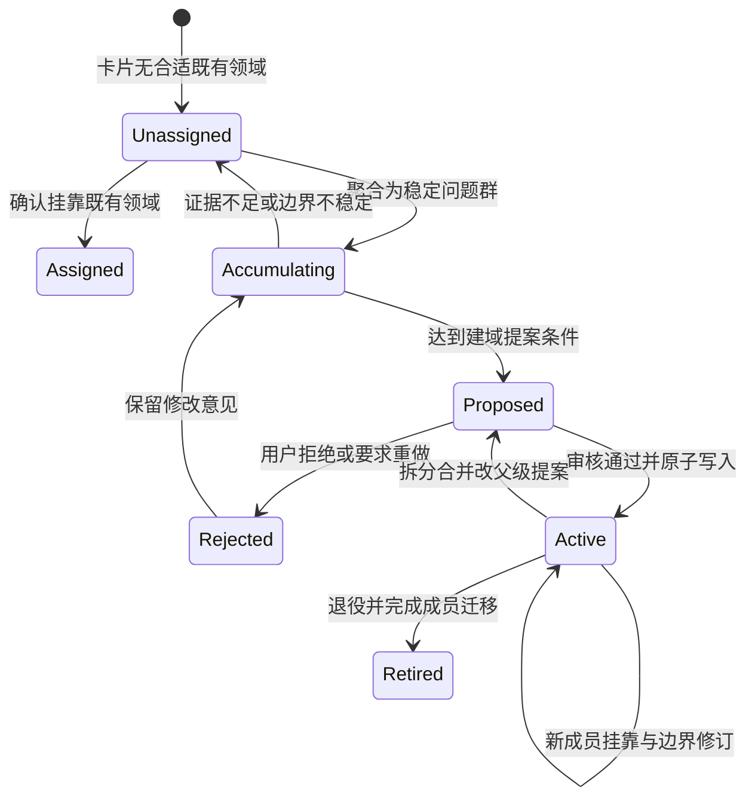

# UNO 领域治理方案

未组织池界面同时展示正式无领域卡与编译隔离待办。领域治理只处理正式卡的 `domains: []`；待修复候选、响应及关系问题保留在编译任务中，不能参与领域成员写入或普通检索。单项修复经审核与 Gateway 保存后，若仍没有领域，再进入本方案的正式未组织状态；原任务的治理待办同步补齐。编译隔离与修复规则见[编译失败恢复](UNO-编译失败恢复.md)。

> 状态：核心生命周期已实施并通过程序回归；正式 3093 仍是修改前进程，尚未加载本能力，真实模型领域质量也尚未验收。高级拆分、合并、改父级、退役和全库存量批量入口仍为后续边界。
>
> 适用范围：新建知识库的领域启动、编译后的领域归属、现有无领域卡片的治理，以及后续拆分、合并、改父级与退役的目标边界；已实现与未实现项以下文“当前实现边界”为准。

## 当前实现边界（2026-09-18）

已实现：

- `.nexogenesis/domain-governance/state.json` 未组织池与提案状态，可从正式 Markdown 卡片重建；
- 本地领域候选召回，不读取 Buffer；
- 编译任务从旧进度补算检查点，按 10 个有效单元、20 张新未组织卡或有意义的书末收尾触发；
- 每批最多 20 张，最多 5 张完整卡正文，其余只提交 ID、标题、类型、摘要、来源组和关系；
- 既有领域批量挂靠；新领域默认在 Web 中逐项批准或暂缓，也可由用户在开始编译时授权本任务自动批准；
- `HarnessGateway.applyDomainGovernance` 原子创建领域、保存成员卡历史并挂靠首批成员；
- 版本冲突、父子重复、非法领域、重复成员和幂等重试校验；
- 编译进度分别显示知识处理与领域组织。

尚未实现：独立的全库存量治理启动按钮、人工预设 1–3 个建设方向的编辑器，以及领域的拆分、合并、改父级和退役。现行编译不会假装提供这些能力；旧建构中已保存的 `domain_proposals` 只保留为延期审计记录，不能作为替代。

## 一、问题与设计目标

本轮治理前，系统只解决了“已经有领域时如何选”：卡片使用一个主类型 `type` 与零到三个既有领域 `domains`，模型不得在编译单元内临时发明领域，却没有后续生长闭环；空知识库中的卡片会长期停留在 `domains: []`。现行核心路径已经用未组织池、批量检查点、待确认提案和原子提交补齐这一缺口，本节保留问题起点用于解释设计目标。

领域治理的目标是：

1. 保留 `type + domains` 两个分类维度，不恢复 `tags/topics`。
2. 允许新库先产生高质量卡片，但无领域状态必须进入可见、可聚合、可结算的待办。
3. 制卡请求只尝试挂靠已有领域；新领域由独立的批量治理检查点提出，合并、拆分、改父级和退役仍由后续高影响治理流程处理。
4. 程序负责候选检索、版本校验、影响预览和原子事务；模型负责判断语义归属与边界。新领域默认由用户逐项确认，也可在创建编译任务时明确授权自动批准；高影响变更始终需要单独确认。
5. 不让每张卡遍历全库领域，不为每张卡单独调用模型，不把领域修复塞进单卡返工循环。

## 二、核心概念

### 2.1 领域

领域是跨材料、可长期扩充、能说明核心问题和边界的知识空间。领域不是论证关系，也不是书名、章节、作者或临时关键词。

领域正式记录仍保存在 `01-Cards/_meta/domains/*.md`，至少包含：

```yaml
schema: uno-domain-v2
id: state-governance
title: 国家治理与组织制度
summary: 研究国家组织如何分配权力、激励、信息和执行责任。
core_questions:
  - 中央与地方如何分配信息与执行权？
includes:
  - 官僚体制、行政发包、运动式治理与政府间谈判
excludes:
  - 不以具体部门名称或单一政策作为建域依据
parents: []
representative_card_ids: []
lifecycle: active
```

`representative_card_ids` 只是导航入口。成员归属的唯一事实源仍是卡片自身的 `domains`。

### 2.2 未组织项

`domains: []` 是合法过渡状态，不是自动失败，也不是长期默认状态。每张无领域卡必须在运行态产生一个未组织项：

```json
{
  "card_id": "example-card",
  "card_revision": "sha256",
  "reason": "NO_MATCHING_DOMAIN",
  "candidate_domains": [],
  "source_groups": ["book-or-material-id"],
  "organization_signals": ["local-term-1", "local-term-2"],
  "status": "open",
  "created_at": "ISO-8601",
  "last_evaluated_at": "ISO-8601"
}
```

`organization_signals` 是可重建的聚合线索，不回写卡片，不参与知识语义。未组织池保存在 `.nexogenesis/domain-governance/state.json`，可从正式卡和领域目录重建，不是新的知识事实源。

### 2.3 领域提案

提案是待用户审核的运行态对象，不是已建立领域。统一支持：

- `create`：新建领域并挂靠首批成员；
- `assign`：把未组织卡挂靠到既有领域；
- `split`：拆分边界过宽的领域；
- `merge`：合并长期高度重叠的领域；
- `reparent`：调整父子关系；
- `retire`：退役领域并明确成员去向。

提案必须包含领域定义、边界、父领域、候选成员及版本、来源分布、最接近既有领域、不能挂靠它们的理由和完整影响预览。

## 三、领域生命周期



不在正式领域 Markdown 中引入 `proposed` 半成品。只有审核并提交后才存在正式 `active` 领域；提案属于运行态。

## 四、三种主流程

### 4.1 新知识库启动

用户可以在“知识库建设规划”中选择两种起步方式：

1. **人工预设方向**：用户给出 1–3 个大的长期问题方向。系统先生成领域定义预览，用户确认后建立正式领域，之后编译可直接选择。
2. **空目录起步**：先生成卡片并进入未组织池。系统等待出现稳定问题群，不在第一张卡出现时立即建域。

用户给出的大方向是可以提前建立领域的授权，不等于所有卡都必须归入该领域。

### 4.2 编译中挂靠既有领域

```mermaid
flowchart LR
    A[一个单元生成候选卡] --> B[本地领域索引召回]
    B --> C[每张卡 5–8 个候选领域]
    C --> D[批量语义判断]
    D -->|匹配| E[写入既有 domains]
    D -->|不确定或无匹配| F[domains=[]]
    F --> G[结构化未组织池]
```

领域索引只索引领域的 ID、标题、摘要、核心问题、纳入边界、排除边界、父领域和代表卡摘要，不索引 Buffer。

- 领域不超过 20 个时，可把全部短定义作为候选。
- 超过 20 个时，本地检索每张卡返回 5–8 个候选。
- 候选得分只是召回依据，不自动证明归属。
- 模型按单元或小批一次处理多张卡，禁止每张卡一次请求。
- 模型只能从候选中选择；可以为空，不用低置信度挂靠凑数。
- Gateway 使用完整实时目录校验 ID、版本、父子重复和最多三个的约束。

每个制卡请求使用发出时的领域目录，不因并发变更而改写请求。领域治理只在阅读单元之间运行；检查点新建的领域会更新任务目录，供后续尚未发出的单元选择，不会追改已生成卡片的正文。既有卡片的归属由治理事务单独挂靠，不要求重新制卡。

### 4.3 批量领域生长与治理

编译中的领域治理在以下边界中最先到达者触发：

- 自上次检查点以来完成 10 个产生或复用卡片的有效阅读单元；
- 新未组织卡累计达到 20 张；
- 一本书或一批材料结束，且已有正式领域可供挂靠，或本轮至少有 3 个有效单元／10 张未组织卡，避免用一两张卡过早建域；
- 用户主动进入领域治理；
- 某领域内部问题明显分裂；
- 多个领域长期高度重叠；
- 大量卡反复无法归入已有领域。

系统先用本地特征聚合未组织卡，模型再对候选群进行语义判断。本地聚合可使用标题、摘要、主类型、来源组和已有关系，不把聚类结果当作语义结论。

一个新领域提案通常需要：

- 至少 3 张围绕同一稳定问题的卡；
- 尽量来自至少 2 个来源或 2 个独立材料单元；
- 现有领域无法合理容纳；
- 可以明确写出核心问题、纳入边界与排除边界；
- 预期可继续承接后续材料，而非只服务当前书或章节。

这些是提案门槛，不是机械建域规则。用户明确给出建设方向时，可以在材料较少时提前提案。模型自动发现只能生成结构化提案；是否直接提交取决于本次任务冻结的授权方式，且提交始终经过相同的确定性校验和 Gateway 事务。

## 五、用户交互

### 5.1 知识库建设规划

知识库管理中增加：

- 知识库目的与主要使用场景；
- 关心的长期问题方向；
- 明确不包括的范围；
- 默认领域建设方式（只作为新任务的初始选择，任务创建后冻结）；
- 未组织数量提醒阈值。

建设规划为领域治理提供方向，不作为强制每张卡归属的单一大领域。

### 5.2 编译结果

编译进度分开显示：

- **知识处理**：单元、卡片、审核、归档状态；
- **领域组织**：已归属、无领域、待审提案、受领域变更影响的卡数。

知识编译可以完成而领域组织待处理，但界面不得把两者合并显示为“全部完成”。

### 5.3 领域治理面板

每个提案显示：

- 操作类型和领域定义；
- 为什么不能使用现有领域；
- 来源和成员分布；
- 要加入、移出或改挂的卡片；
- 父子关系变化；
- 检索结果的预期影响；
- 当前版本与过期状态。

用户可以批准、修改名称与边界后批准、拒绝或保留观察。高影响操作（合并、拆分、改父级、退役）必须显式确认。

## 六、模型与上下文编排

### 6.1 既有领域挂靠

一次处理一个单元的候选卡或 8–20 张待组织卡，提交：

- 卡片 ID、标题、主类型、摘要、现有关系；
- 每张卡 5–8 个领域候选的核心问题和边界；
- 最多 3 张需要解决歧义的完整卡正文；
- 库建设规划的相关片段。

输出只包含 `assignments` 和 `unassigned`，不改正文，不新建领域，不生成关系。

### 6.2 新领域提案

先提交候选群的卡片摘要、来源分布与最接近领域；模型可要求读取最多 3 张代表卡和 2 张边界卡全文。每个提案必须输出：

- 标题、稳定 ID、核心问题；
- 纳入边界和排除边界；
- 父领域建议；
- 成员卡 ID 及版本；
- 最接近已有领域与不能挂靠的理由；
- 不建域时的备选处理。

### 6.3 独立审核

领域提案的审核不重读全库，只读提案、代表卡、边界卡、最近领域和影响预览。审核重点是：

- 是否真的跨材料且可长期扩充；
- 与最近领域的边界是否可辨；
- 成员是否因词面相似而被错聚合；
- 排除边界是否能阻止领域逐渐变成“其他”容器；
- 是否存在范围更小的挂靠或延期方案。

不使用逐卡修复，审核不通过时修改整份提案或保留观察。

## 七、事务、版本与恢复

增加单一 Gateway 语义操作 `applyDomainGovernance`。一次提交必须原子完成：

1. 校验提案 ID 和授权范围；
2. 校验所有受影响领域与卡片的当前 revision；
3. 新建或修订领域记录；
4. 更新所有成员卡的 `domains`；
5. 保留卡片和领域的历史版本；
6. 写入同一幂等收据和 Journal 记录；
7. 成功后关闭对应未组织项。

任一版本已变化时整个事务拒绝，重新计算影响预览，不做部分挂靠。重试同一提案使用同一幂等键，不重放成功写入。

对已有领域的普通挂靠，用户已授权的 `trusted` 编译可随卡提交。新领域默认逐项确认；若用户在开始编译时明确选择自动领域建设，则本任务可自动批准通过检查的新领域提案。合并、拆分、改父级和退役不属于该授权，仍须单独确认。

正式未组织卡还可由用户显式发起人工建域。当前卡固定为首个成员，用户必须填写领域名称、摘要、核心问题、纳入边界和排除边界；确认后通过同一个 `applyDomainGovernance` 事务创建领域并挂靠当前卡。该入口不调用模型，不复用卡片标题作为领域名，不接受“其他”“综合”“未分类”等容器名称，也不授权编译或单卡模型后续自动建域。

## 八、成本约束

- 不向制卡模型发送全领域正文。
- 不把领域全文加入每次单卡修复和复核。
- 已有领域挂靠优先复用单元的候选检查或书末批处理，不增加逐卡循环。
- 未组织聚合先走本地程序；模型只阅读有界的候选群。
- 同一领域提案的作者和审核不重复搬运全部卡片；完整正文最多 5 张，其余只传 ID、标题、类型、摘要、来源组和已有关系。
- 领域索引、未组织池和聚合结果可重建，不和卡片全文混成新的长期上下文。

## 九、当前无领域卡的启动治理

现有库不先由模型逐张读全文，也不把旧 `tags/topics` 直接映射为领域。启动步骤为：

1. 生成只读基线：卡片数、无领域数、来源组、主类型、已有关系和版本。
2. 用标题、摘要、来源组和已有关系本地聚合，只产生候选群，不写入。
3. 优先由用户确认 1–3 个大建设方向；如用户选择完全自底向上，则从证据最稳定的候选群开始提案。
4. 每批审查候选领域和 8–20 张成员卡；完整正文只读代表卡与边界卡。
5. 先生成全部影响预览，不修改正文。
6. 按本次任务授权逐项确认或自动批准后，原子创建领域并挂靠该批成员。
7. 未被稳定领域覆盖的卡继续留在未组织池，不为追求 100% 归属而创建杂项领域。

存量治理只修改 `domains` 和领域记录，不同时改正文、主类型、关系或来源，以便审核和回滚。

## 十、程序模块

| 模块 | 职责 | 事实性 |
|---|---|---|
| `uno/domain-governance.js` | 未组织项、候选召回、检查点、提案、状态与原子写入计划 | 已实现；运行态可重建 |
| `domain-governance-request.js` | 有界模型上下文与返回契约 | 已实现 |
| `HarnessGateway.applyDomainGovernance` | 正式领域与成员的原子写入 | 已实现，唯一写入入口 |
| Web 编译领域检查点 | 提案预览、默认逐项批准或暂缓；显式任务授权时自动批准；继续任务 | 已实现 |
| 独立未组织池管理 | 查看领域治理正式登记的未组织卡；单卡可整理既有领域、按来源重写并审核、显式人工创建一个以当前卡为首成员的新领域，或由用户确认后删除并清理结构引用 | 已实现局部入口；全库批量建设方向仍未实现 |
| 高级生命周期 | split/merge/reparent/retire | 尚未实现 |

`HarnessGateway.writeUnoDomain` 已从公开写入面移除。建构宿主不再单独提交历史 `domain_proposals`；若恢复的旧任务仍携带这类记录，系统将其转存为 `legacy_domain_proposals` 并标记 `LEGACY_DOMAIN_PROPOSAL_UNSUPPORTED`，不生成正式领域。当前正式领域创建与首批成员挂靠只通过 `HarnessGateway.applyDomainGovernance` 的同一事务完成。

## 十一、实施状态

### 阶段 A：可见且可结算的未组织池（已完成）

- 把 `DOMAIN_UNASSIGNED` 从收据 warning 提升为可持久、可重建的未组织项。
- 编译单元结果和总结显示已归属与未组织数。
- 不增加模型请求，先用程序回归验证。

### 阶段 B：已有领域候选与批量挂靠（已完成）

- 建立领域索引与候选接口。
- 增加按单元或小批进行的归属请求。
- 既有领域挂靠只改 `domains`，不触发单卡正文修复。

### 阶段 C：新领域提案与原子提交（已完成核心路径）

- 增加领域提案工具和审核契约。
- 增加 `applyDomainGovernance`。
- 完成 Web 影响预览、人工确认与任务级自动批准。

### 阶段 D：存量启动与高级治理（部分实现）

- 卡片目录提供未组织池入口，只呈现 `.nexogenesis/domain-governance/state.json` 正式登记且当前仍无领域的卡；可查看原因、来源与关系数量。单卡重编译只发送当前卡和已绑定的局部来源，独立审核通过后由 Gateway 发布；局部返修不再携带原文或通用建构上下文。也可在输入卡片 ID 确认后直接删除。删除由 HarnessGateway 原子移出活动卡片、清理入边与领域代表引用，并保留删除归档。旧卡仅有 `domains: []` 但没有治理记录时不自动混入该池。
- 对现有无领域卡进行成组领域提议和建设方向规划尚未实现。
- 增加拆分、合并、改父级、退役和重复领域检测。
- 只在基础创建与挂靠稳定后开启高级治理。

## 十二、验收标准

### 空库启动

- 空领域目录不阻止制卡。
- 所有 `domains: []` 卡均有唯一未组织项，恢复和重启不重复。
- 默认人工模式下没有用户确认不新建领域；自动模式只在任务开始时显式授权，并在提案通过全部校验后新建。

### 既有领域归属

- 模型只看有界候选，全目录只在 Gateway 校验。
- 一次请求可处理多张卡，没有逐卡模型循环。
- 空归属不触发正文返工；非法领域、父子重复和过期版本必须拒绝。

### 新建与高影响变更

- 提案在人工确认或本次任务的自动批准完成前不进入正式领域目录。
- 领域创建与首批成员挂靠同一事务成功或失败。
- 合并、拆分、改父级和退役都必须显示完整受影响卡片。
- 任一卡或领域版本变化时，不部分应用旧提案。

### 体验与经济性

- 用户能区分“知识卡已完成”和“领域组织待处理”。
- 可从编译结果直接打开本轮未组织卡与提案，不依赖找收据或日志。
- 领域治理不重发原书，不改卡片正文，可分别统计本地处理和模型请求成本。
- 治理后的检索应用固定问题集验证：领域筛选不遗失关键卡、不同领域边界有区分度、未组织池不被强行清零。

## 十三、明确不做

- 不为了达到 100% 归属率而创建“其他”、“综合”或书名领域。
- 不把本地聚类或相似度得分当作语义归属。
- 不把领域成员关系写成因果、支持、反驳或类比关系。
- 不在单卡内保存候选词、置信度、聚类 ID 或治理过程。
- 不让领域治理修改卡片正文、来源或论证关系。
- 不以领域数量、归属率或图谱聚集程度作为知识质量分数。

## 领域说明与关系的读写基础

领域核心问题、纳入与排除范围、代表入口及正文按[领域说明与领域关系](design/knowledge-guidance/domains.md)保存和展示。内容修订与创建共用定义校验；`HarnessGateway.writeDomain` 仅提供版本受控的内容与关系写入基础。编译检查点不提出领域关系，自动发现与批准连边尚未接入建构。成员挂靠仍使用 `applyDomainGovernance`，不通过领域关系间接变更。
