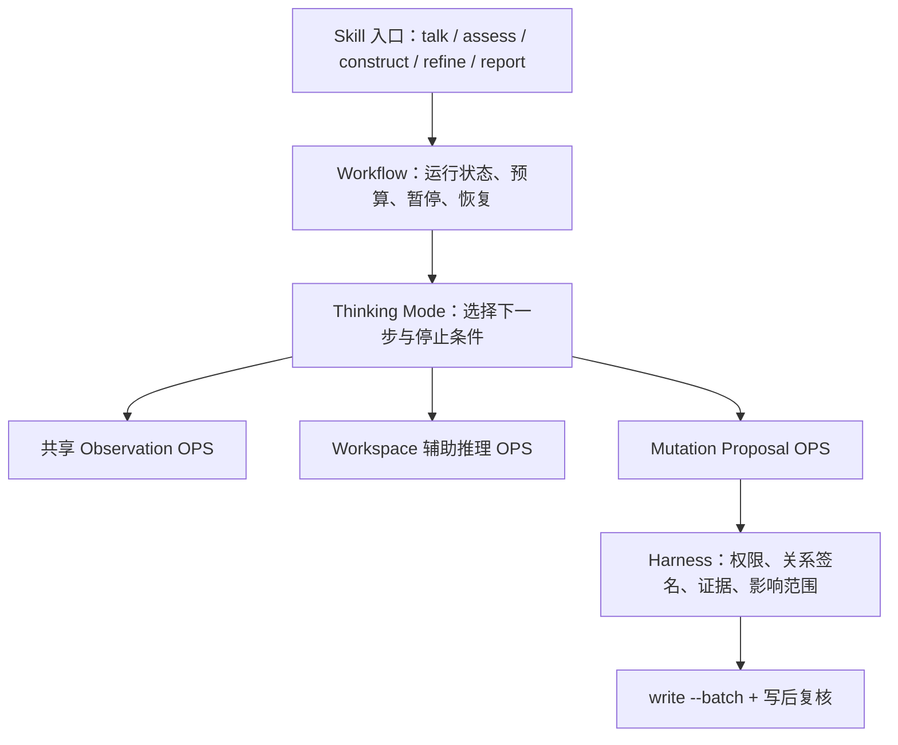

# 知识卡片标注与统一推理 OPS 清单

> 适用版本：Nexogenesis / DSH v2.2
>
> 目的：说明现有 Cards 能支持什么，统一对话 GraphOps 与建构 Observation Ops，并给出 Thinking Model 可调用的观察、辅助推理和结构修改操作清单。
>
> 状态标记：**已有**＝当前代码已接线；**部分已有**＝某一入口已有但尚未统一；**建议新增**＝尚未实现；**shadow**＝只形成候选，不允许自动写入。

## 1. 先回答：当前 Cards 是否已经适合 OPS 搜索和推理

  当前 Card 结构已经足以支持第一阶段的快速定位、按领域筛选、沿关系走边、按槽精读、冲突检查和有限类比。`type`、`domains`、`relations`、七型正文槽及稳定中文 id 已经构成可用的结构骨架；Thinking Model 不必把全库正文一次性塞入提示词。

  但它还不是完整的机器推理表示。当前主要缺口不是卡片类型太少，而是部分已有标注没有贯通运行模型，Observation 返回的信息也偏薄：`school`、`applicable_scope` 已进入 schema，却没有稳定进入 `Card` 模型和 GraphOps；来源不能从卡片可靠回查到原文锚点；对话与建构的比较、冲突观察存在重复实现；`graph_walk` 还不能按正式关系类型精确过滤；有限路径、证据矩阵和适用性核验尚未成为明确操作。

  因此当前结论是：**Cards 已能支撑结构化检索和一跳推理，但要让 Thinking Model 稳定完成论证、反证、适用性判断和结构修改，还需补齐统一 OPS 与来源接线。**

## 2. Card 为 OPS 提供的四层控制面

### 2.1 身份与状态

| 字段 | 回答的问题 | 当前作用 | 使用纪律 |
|---|---|---|---|
| `id` | 这是哪个稳定知识对象 | OPS 定位、关系目标、引用 | 新卡使用中文语义 id |
| `title` | 人如何识别它 | 搜索与显示 | 不代替正文核心表达 |
| `type` | 它是什么对象 | 类型过滤、关系签名、操作选择 | 保持七型闭集 |
| `maturity` | 它发展得是否充分 | 部分检索排序、写入权限 | 不是正确率或置信度 |
| `lifecycle` | 它现在是否仍应使用 | 排除 archived、跟随替代 | 不与 maturity 混用 |
| `theory_status` | 本库理论处于何种状态 | draft / active / dormant | 只用于 claim / model |
| `superseded_by` | 它被什么替代 | 路由到新对象 | 禁止直接删除旧卡 |

### 2.2 领域、立场与适用范围

| 字段/槽 | 回答的问题 | 当前状态 | 建议 |
|---|---|---|---|
| `domains` | 属于哪个思想领域 | 已有且可用于过滤和成员列表 | 继续作为领域归属唯一事实源 |
| `school` | 这是谁的学派或理论立场 | schema 已有，运行接线缺失 | 贯通 Card、写入和 GraphOps |
| `applicable_scope` | 在哪些条件下适用 | schema 已有，运行接线缺失 | 作为简短机器摘要，正文详细解释 |
| `## 立场/学派来源` | 观点归属的解释 | 正文槽已有 | 保留混合立场和内部差异 |
| `## 适用条件` / `## 失效边界` | 成立与失效条件 | 正文槽已有 | 供 `read_card(slots=...)` 精读 |

  `domains` 是知识归属，`school` 是观点归属，`applicable_scope` 是使用条件。三者不能互相替代，也不要重新使用 `applies-to` 表示领域归属。

### 2.3 关系

| 正式关系 | 推理含义 | 典型方向 |
|---|---|---|
| `supports` | 源卡为目标卡提供证据、机制或论据 | 证据/现象/模型 → claim/model/method |
| `based-on` | 源卡建立在目标卡之上 | claim/model/method → 其思想或事实基础 |
| `extends` | 源卡扩展或修正目标卡 | claim/model/method → claim/model/method |
| `conflicts-with` | 两项主张、模型或方法直接矛盾 | 双方互为对立观察 |
| `involves` | conflict 卡涉及哪些对立方 | conflict → claim/model/method/entity |
| `example-of` | 源卡是目标卡的实例 | 实例 → 一般对象 |
| `part-of` | 源卡是目标卡的部分或环节 | 部分 → 整体 |

  `relations[].note` 必须说明关系为什么成立、方向是什么、必要时注明成立条件。只写“相关”“支持”“类似”不足以供 OPS 解释或核验。

```yaml
relations:
  - target: 流动性偏好影响利率
    type: supports
    note: 在货币供给既定且短期价格黏性的条件下，持币需求变化构成利率调整的需求侧机制。
```

### 2.4 正文槽与来源

  正文槽是 OPS 的定向读取界面。`read_card` 应优先读取与当前问题有关的槽，而不是默认返回整张卡。`sources` 则负责把卡片判断回指到 Buffer、Archive、页码、章节、表格或图像。

```yaml
sources:
  - 03-Archive/货币政策报告.pdf#page=28
  - 05-Buffer/meaning-unit/短端利率传导.md
```

```text
read_card(
    card_id="央行影响但不能完全决定市场利率",
    slots=["一句话主张", "依据", "适用条件", "已知限制"]
)
```

### 2.5 面向 OPS 的完整卡片示例

  下面是目标形态示例。`school`、`applicable_scope` 在 schema 中已经存在，但在完成运行接线前仍应同时保留对应正文槽，不能假定 GraphOps 已经能够筛选它们。

```markdown
---
id: 央行影响但不能完全决定市场利率
title: 央行通过制度工具影响而非完全决定市场利率
type: claim
maturity: growing
lifecycle: active
theory_status: draft
domains:
  - 货币传导与利率机制
school: 新凯恩斯主义
applicable_scope: 现代法币体系；短中期；银行与债券市场传导机制正常
origin: document
sources:
  - 03-Archive/货币政策报告.pdf#page=28
relations:
  - target: 流动性偏好利率模型
    type: based-on
    note: 以短期货币需求和流动性供给共同形成利率为机制基础。
created: 2026-08-27
updated: 2026-08-27
---

## 一句话主张

央行能够锚定政策利率并影响收益率曲线，但市场风险、期限偏好和资金供求仍参与形成最终市场利率。

## 依据

……

## 已知限制

……

## 立场/学派来源

……

## 适用条件

……

## 原文摘录

……
```

## 3. 统一结构：一套 GraphOps，多种 Thinking Mode



  统一的是操作语义、代码实现、Observation 契约和事件；不同 Thinking Mode 只决定可用操作子集、预算、目标、停止条件和写入权限。Compile 面对来源材料，不应被硬塞进 GraphOps；Digest 可以使用只读 GraphOps，但其质料结算继续通过 SemanticPatch。

## 4. 第一组：共享 Observation OPS

### 4.1 总清单

| OPS | 状态 | 输入重点 | 返回重点 | 主要用途 |
|---|---|---|---|---|
| `graph_search` | 已有 | query、types、domains、limit | 候选卡 | 没有焦点卡时定位对象 |
| `graph_walk` | 已有，待增强 | card_id、direction | 一跳邻居、方向、via | 沿论证边展开 |
| `graph_members` | 已有 | domain_id、types、query | 领域成员 | 打开领域而非走论证链 |
| `read_card` | 已有 | card_id、slots | 元数据、关系、正文槽 | 精读已观察卡片 |
| `inspect_conflicts` | 部分已有 | card_ids | 对立方、覆盖 conflict | 研判争议与结构张力 |
| `compare_cards` | 建构部分已有 | 2–4 card_ids、dimensions | 对比矩阵 | 比较解释、边界和来源 |
| `graph_analogize` | 已有 | card_id、limit | 跨域结构近似对象 | 发现类比，不能直接证明 |
| `graph_path` | 建议新增 | from_id、to_id、关系过滤、max_hops | 有限真实路径 | 解释两个对象如何相连 |
| `trace_source` | 建议新增 | card_id、slot、limit | 来源锚点与短摘录 | 核验卡片依据 |
| `inspect_argument` | 建议新增，组合 Op | card_id | 支持、基础、冲突、边界 | 快速形成论证结构 |
| `graph_note` | 已有 | kind、cards、reason | 结构债记录 | 记账，不修改 Card |

### 4.2 `graph_search`

  只负责找到可能相关的卡，不把搜索结果当作论证关系。建议在现有 `types`、`domains` 上补充 `schools`、`maturity_min`、`include_superseded` 和自然语言 `scope_query`；这些过滤只有在 Card 字段贯通后才启用。

```json
{
  "op": "graph_search",
  "query": "央行如何影响市场利率",
  "types": ["model", "claim", "conflict"],
  "domains": ["货币传导与利率机制"],
  "limit": 8
}
```

### 4.3 `graph_walk`

  从已有焦点卡沿一跳正式关系展开。建议新增 `relation_types`，并在返回中包含边的 `source`、`target`、`type`、`direction` 与 `note`。

```json
{
  "op": "graph_walk",
  "card_id": "央行影响但不能完全决定市场利率",
  "direction": "both",
  "relation_types": ["supports", "based-on", "conflicts-with"],
  "limit": 12
}
```

### 4.4 `graph_members`

  只用于 domain 成员，不把领域归属伪装成推理边。

```json
{
  "op": "graph_members",
  "domain_id": "货币传导与利率机制",
  "types": ["model", "claim", "conflict"],
  "query": "政策利率",
  "limit": 12
}
```

### 4.5 `read_card`

  只允许读取本轮已经观察到的少量卡片。返回应补齐 `maturity`、`lifecycle`、`origin`、`theory_status`、`school`、`applicable_scope` 和稳定来源摘要。

```json
{
  "op": "read_card",
  "card_id": "流动性偏好影响利率",
  "slots": ["核心思想", "因果链条", "失效边界", "原文摘录"]
}
```

### 4.6 `compare_cards`

  对话和建构共用一个实现。它返回差异，不替模型裁决胜负。当前建构的 `compare_nodes` 只比较两卡且维度有限，应迁入共享实现后扩展为 2–4 卡、显式 dimensions。

```json
{
  "op": "compare_cards",
  "card_ids": ["流动性偏好利率模型", "可贷资金利率模型"],
  "dimensions": ["核心命题", "机制", "适用条件", "失效边界", "学派", "来源"]
}
```

### 4.7 `inspect_conflicts`

  同时检查直接 `conflicts-with`、覆盖双方的 conflict 卡及缺失覆盖的结构债。对话现有 `graph_walk(mode=conflicts)` 与建构 `inspect_conflicts` 应统一到底层 GraphOps。

```json
{
  "op": "inspect_conflicts",
  "card_ids": ["央行决定利率", "市场资金供求决定利率"],
  "include_uncovered": true
}
```

### 4.8 `graph_analogize`

  从 model、claim、method 出发寻找跨领域关系签名相近的对象。返回必须包含“为什么相似”，并提醒 Thinking Model 再检查适用范围；结构相似不构成证据。

### 4.9 `graph_path`

  寻找两个已知对象之间最多 2–3 跳的真实路径。默认只走正式关系，限制路径数、节点数和 hub 比例，避免高连接领域卡制造无意义捷径。

```json
{
  "op": "graph_path",
  "from_id": "美联储政策利率",
  "to_id": "企业资本开支",
  "relation_types": ["supports", "based-on", "part-of", "extends"],
  "max_hops": 3,
  "max_paths": 4
}
```

### 4.10 `trace_source`

  从卡片槽位回查 Buffer、Archive 页码、章节或图表锚点。它返回可核验摘录，不自动宣布来源支持卡片全部内容。

```json
{
  "op": "trace_source",
  "card_id": "央行影响但不能完全决定市场利率",
  "slot": "依据",
  "limit": 4
}
```

### 4.11 `inspect_argument`

  这是复用基础 GraphOps 的组合操作，不另建图算法：读取目标卡，查 supports 入边、based-on 出边、conflicts-with、适用条件、失效边界和来源锚点，形成一份有界 Argument View。

```python
def inspect_argument(ops, card_id: str) -> dict:
    card = ops.read_card(card_id, slots=[
        "一句话主张", "核心思想", "依据", "适用条件", "已知限制", "失效边界",
    ])
    support = ops.graph_walk(card_id, direction="in", relation_types=["supports"])
    basis = ops.graph_walk(card_id, direction="out", relation_types=["based-on"])
    conflicts = ops.inspect_conflicts([card_id])
    sources = ops.trace_source(card_id, slot="依据", limit=4)
    return {"card": card, "support": support, "basis": basis,
            "conflicts": conflicts, "sources": sources}
```

## 5. 第二组：Workspace 辅助推理 OPS

  这组操作不修改 Card，也不应伪装成新的知识事实。它们把已经获得的 Observation 组织进本轮 Workspace，使 Thinking Model 可以显式记录焦点、假设、证据、反证和停止理由。早期可以是确定性状态更新，不需要把每一步再交给另一个模型。

| OPS | 状态 | 作用 | 重要约束 |
|---|---|---|---|
| `focus_set` | 建议新增 | 设置当前问题、对象与排除范围 | 改变写入范围时使旧授权失效 |
| `hypothesis_add` | 建议新增 | 记录待检验解释 | 必须标明来自用户、卡片还是模型假设 |
| `evidence_attach` | 建议新增 | 把 Observation 引用挂到假设 | 只接受真实 observation/card/source refs |
| `counterevidence_seek` | 建议新增，组合 Op | 定向寻找冲突、限制与反例 | 不允许只重复原搜索词 |
| `applicability_check` | 建议新增 | 对照问题情境与卡片适用范围 | 返回 matched / mismatched / unknown，不给伪精确分数 |
| `evidence_matrix_build` | 建议新增 | 按主张组织支持、反对、边界、来源 | 矩阵是运行产物，不写入 Card |
| `hypothesis_update` | 建议新增 | 保留、修正、拒绝或暂缓假设 | 必须给 observation refs |
| `gap_record` | 可复用 `graph_note` | 记录来源、实体、冲突或结构缺口 | 不自动新建空卡 |
| `reasoning_stop` | 建议新增 | 记录停止原因与未决项 | 区分完成、预算耗尽、证据不足、需用户决定 |

### 5.1 建议的 Workspace 结构

```python
from dataclasses import dataclass, field
from typing import Literal

@dataclass
class Hypothesis:
    id: str
    statement: str
    origin: Literal["user", "card", "model"]
    status: Literal["open", "supported", "challenged", "rejected", "deferred"]
    evidence_refs: list[str] = field(default_factory=list)
    counterevidence_refs: list[str] = field(default_factory=list)
    boundary_notes: list[str] = field(default_factory=list)

@dataclass
class ThinkingWorkspace:
    question: str
    focus_card_ids: list[str] = field(default_factory=list)
    hypotheses: list[Hypothesis] = field(default_factory=list)
    unknowns: list[str] = field(default_factory=list)
    observation_refs: list[str] = field(default_factory=list)
    intent_revision: int = 1
```

### 5.2 适用性核验示例

```json
{
  "op": "applicability_check",
  "card_ids": ["流动性偏好利率模型", "可贷资金利率模型"],
  "context": {
    "time_horizon": "短期",
    "institution": "现代法币和中央银行体系",
    "conditions": ["高通胀", "银行体系正常", "央行主动紧缩"]
  }
}
```

```json
{
  "matched": ["流动性偏好利率模型"],
  "partial": ["可贷资金利率模型"],
  "mismatched": [],
  "unknown": ["长期通胀预期是否锚定"],
  "evidence_refs": ["obs-17", "obs-19"]
}
```

### 5.3 反证搜索示例

```python
def counterevidence_seek(ops, card_ids: list[str]) -> list[dict]:
    observations = []
    for card_id in card_ids:
        observations.append(ops.inspect_conflicts([card_id]))
        observations.append(ops.graph_walk(
            card_id,
            direction="both",
            relation_types=["conflicts-with"],
        ))
        observations.append(ops.read_card(
            card_id,
            slots=["已知限制", "反例与失效条件", "失效边界"],
        ))
    return observations
```

## 6. 第三组：改变知识结构的 Mutation Proposal OPS

  这一组很重要，但必须与 Observation 分开。Thinking Model 可以自主提出改变，不能直接把改变当作已完成事实。所有提案都要携带观察证据、影响范围和修改理由，再由 Harness 编译为唯一写入事务。

### 6.1 当前可用和近期应统一的操作

| OPS | 当前名称/状态 | 风险 | 作用 | 默认执行方式 |
|---|---|---:|---|---|
| `propose_rewrite_card` | `rewrite_node` 已有 | 中 | 重写已有卡的槽、元数据或局部关系 | 范围内可审核提交 |
| `propose_add_relation` | `add_relation` 已有 | 中 | 增加有证据的正式关系 | Harness 检查签名和目标 |
| `propose_remove_relation` | `remove_relation` 已有 | 中 | 删除错误、重复或已失效关系 | 必须说明为什么不成立 |
| `propose_create_conflict` | `create_conflict` 已有 | 中 | 为真实对立建立 conflict 卡 | 至少两方，检查 involves |
| `graph_note` | `record_debt` 已有 | 低 | 只记录结构债 | 自动，不写 Card |
| `propose_supersede_card` | 建议新增 | 中高 | 用新对象替代旧对象 | 不删除旧卡，写 superseded_by |

### 6.2 高风险 shadow 操作

| OPS | 当前状态 | 主要风险 | 要求 |
|---|---|---|---|
| `propose_merge_cards` | 已定义为 `merge_nodes`，未开放 | 丢失差异、扩大单卡 | 只生成 diff、来源并集和回退方案 |
| `propose_split_card` | 已定义为 `split_node`，未开放 | 引用和关系重定向错误 | 明确切分依据与关系分配 |
| `propose_promote_hub` | 已定义为 `promote_hub`，未开放 | 制造空心中心节点 | 必须证明多个对象反复围绕同一结构 |
| `propose_regroup_domains` | 已定义为 `regroup_members`，未开放 | 大范围改变检索结果 | 输出影响成员、旧新领域和撤回方案 |
| `propose_extract_entity` | 已定义为 `extract_entity`，未开放 | 把普通名词误升实体 | 跨卡复现且能承担稳定关系后才候选 |

  高风险操作在近期只形成 shadow 候选，不自动进入 write。用户确认也不应替代 Harness 的目标存在、引用重定向、关系签名和写后完整性检查。

### 6.3 Mutation Proposal 统一契约

```python
from dataclasses import dataclass, field
from typing import Any, Literal

@dataclass
class MutationProposal:
    op: str
    target_ids: list[str]
    reason: str
    evidence_refs: list[str]
    expected_effect: str
    patch: dict[str, Any]
    risk: Literal["low", "medium", "high"] = "medium"
    rollback_hint: str = ""
    intent_revision: int = 1
```

```json
{
  "op": "propose_add_relation",
  "target_ids": ["流动性偏好利率模型", "央行影响但不能完全决定市场利率"],
  "reason": "前者提供后者所需的短期货币需求机制。",
  "evidence_refs": ["obs-card-12", "obs-source-07"],
  "expected_effect": "回答央行与市场共同决定利率时能够沿真实机制边展开。",
  "patch": {
    "source": "流动性偏好利率模型",
    "relation": {
      "target": "央行影响但不能完全决定市场利率",
      "type": "supports",
      "note": "在短期价格黏性和货币传导正常的条件下提供需求侧机制支持。"
    }
  },
  "risk": "medium",
  "rollback_hint": "移除本次新增关系，不改动两张卡正文。"
}
```

### 6.4 Harness 必须检查什么

```text
提案是否来自当前授权的观察范围
→ evidence_refs 是否真实存在
→ 目标卡及领域是否存在
→ 关系方向和类型签名是否合法
→ 新卡是否满足七型正文槽
→ 是否影响 mature 卡、枢纽或大量成员
→ 是否需要用户决定
→ 编译为 write batch
→ 原子提交
→ 重建索引
→ 重新执行相关 Observation 验证预期效果
```

## 7. 统一 OPS 契约与轻量代码演示

### 7.1 请求、观察与上下文

```python
from dataclasses import dataclass, field
from typing import Any

@dataclass
class OpRequest:
    op: str
    params: dict[str, Any]
    scope_ids: list[str] = field(default_factory=list)
    budget: dict[str, int] = field(default_factory=dict)
    intent_revision: int = 1

@dataclass
class Observation:
    observation_id: str
    op: str
    nodes: list[dict[str, Any]] = field(default_factory=list)
    edges: list[dict[str, Any]] = field(default_factory=list)
    excerpts: list[dict[str, Any]] = field(default_factory=list)
    source_refs: list[str] = field(default_factory=list)
    truncated: bool = False
    warnings: list[str] = field(default_factory=list)
    workspace_revision: int = 1
```

  Observation 应返回结构化数据；`message` 只供界面展示，不能让后端通过解析自然语言判断执行状态。Observation 也不是新的知识事实，运行结束后可以归档或删除。

### 7.2 共享实现，不建万能工具

```python
class UnifiedGraphOps:
    def __init__(self, graph_ops, source_reader):
        self.graph = graph_ops
        self.sources = source_reader

    def execute(self, request: OpRequest) -> Observation:
        handlers = {
            "graph_search": self._search,
            "graph_walk": self._walk,
            "graph_members": self._members,
            "read_card": self._read,
            "compare_cards": self._compare,
            "inspect_conflicts": self._conflicts,
            "graph_analogize": self._analogize,
            "graph_path": self._path,
            "trace_source": self._trace_source,
            "graph_note": self._note,
        }
        try:
            handler = handlers[request.op]
        except KeyError as exc:
            raise ValueError(f"未知 OPS：{request.op}") from exc
        return handler(request)
```

  不建议做成 `graph_action(mode=..., op=..., subtype=...)`。一个参数巨大的万能工具会增加非法组合，也会让权限和测试失去边界。

### 7.3 Thinking Mode 只获得允许的操作视图

```python
TM_CAPABILITIES = {
    "talk": {
        "graph_search", "graph_walk", "graph_members", "read_card",
        "compare_cards", "inspect_conflicts", "graph_analogize",
    },
    "assess": {
        "graph_search", "graph_walk", "graph_members", "read_card",
        "compare_cards", "inspect_conflicts", "graph_analogize",
        "graph_path", "trace_source", "applicability_check",
        "evidence_matrix_build", "counterevidence_seek",
    },
    "construct": {
        "graph_search", "graph_walk", "graph_members", "read_card",
        "compare_cards", "inspect_conflicts", "graph_analogize",
        "graph_path", "trace_source", "graph_note",
        "propose_rewrite_card", "propose_add_relation",
        "propose_remove_relation", "propose_create_conflict",
        "propose_supersede_card",
    },
}

def authorize_op(mode: str, op: str) -> None:
    if op not in TM_CAPABILITIES.get(mode, set()):
        raise PermissionError(f"{mode} 不允许调用 {op}")
```

### 7.4 Construct 作为 Thinking Mode 调用同一套 OPS

```python
async def construct_turn(model, workspace, ops, harness):
    decision = await model.decide(workspace)
    authorize_op("construct", decision.op)

    if decision.op.startswith("propose_"):
        proposal = compile_mutation_proposal(decision, workspace)
        result = harness.preflight(proposal)
        workspace.absorb_preflight(result)
        return result

    observation = ops.execute(decision.request)
    workspace.absorb(observation)
    return observation
```

  `ConstructWorkflow` 仍负责暂停、恢复、预算、授权和事务；`Construct Thinking Mode` 负责根据 Observation 选择下一步；共享 GraphOps 负责观察。三者不能混成一个提示词函数。

## 8. 典型 Thinking Mode 程序

### 8.1 解释机制

```text
graph_search(types=model/claim)
→ graph_walk(relation_types=based-on/supports/part-of)
→ read_card(核心思想/因果链条/失效边界)
→ trace_source
→ applicability_check
→ reasoning_stop(completed)
```

### 8.2 研判争议

```text
graph_search(types=claim/conflict)
→ inspect_conflicts
→ read_card(双方依据/限制/适用条件)
→ counterevidence_seek
→ trace_source
→ evidence_matrix_build
→ hypothesis_update
→ 条件式结论
```

### 8.3 跨领域类比

```text
read_card(焦点 model/method)
→ graph_analogize
→ compare_cards(组件/关系/条件/边界)
→ applicability_check
→ 保留可迁移部分，拒绝表面相似
```

### 8.4 建构局部结构

```text
graph_search 或 Mission seed
→ graph_walk
→ compare_cards
→ inspect_conflicts
→ trace_source
→ graph_note 或 Mutation Proposal
→ Harness preflight
→ 授权后 write --batch
→ 写后重复 graph_walk / inspect_conflicts
```

## 9. 与当前代码的对应关系

| 目标位置 | 当前实现 | 处理方式 |
|---|---|---|
| 共享读图 | `nexogenesis/graph/ops.py` | 作为统一 Observation OPS 底座 |
| 对话工具 schema | `nexogenesis/runtime/agent.py::_graph_tools` | 改为从统一 OPS 契约生成或薄包装 |
| 对话执行 | `nexogenesis/runtime/agent_tools.py` | 只保留权限、事件和 UI 适配 |
| 建构观察 | `nexogenesis/construct/v1.py::execute_construct_observation` | 迁移到共享 GraphOps，删除重复读卡/走边逻辑 |
| 建构修改 | `compile_construct_action` | 改为编译 MutationProposal，不直接拥有另一套观察语义 |
| 关系语义 | `nexogenesis/relation_semantics.py` | 继续作为写入与遍历共用事实 |
| 卡片 schema | `nexogenesis/schemas.py` | 保留闭集，贯通 school/applicable_scope |
| Card 模型 | `nexogenesis/models.py` | 补齐 schema 已有但运行缺失的字段 |
| 写入事实 | `write --batch` / WriteBatchGateway | 保持唯一权威 |

## 10. 近期实施顺序

  第一项应先统一已有重复能力，而不是先开发全部新 OPS：让对话和建构共同调用 `graph_search`、`graph_walk`、`read_card`、`compare_cards`、`inspect_conflicts`、`graph_note`，并统一 Observation 返回结构和事件。旧名称可以保留一个短暂适配期，但不得继续维护两套实现。

  第二项补齐 Cards 的机器可见性：贯通 `school`、`applicable_scope`，让 read/search 返回 maturity、lifecycle、origin、theory_status、关系 note 和稳定来源摘要；同时把 `graph_walk(relation_types=...)` 做实。

  第三项增加最有直接收益的辅助推理：`trace_source`、`compare_cards` 完整版、`applicability_check`、`counterevidence_seek`、`evidence_matrix_build`，随后再增加受限 `graph_path`。这些操作应先服务 assess 与 construct 的真实案例。

  第四项统一 Mutation Proposal：现有 rewrite/add/remove/create_conflict 迁入同一契约，增加 supersede；merge、split、promote、regroup、extract_entity 继续保持 shadow，直到真实案例证明 Harness 能可靠计算影响与回退。

## 11. 验收清单

### Cards

- [ ] `school`、`applicable_scope` 能被读取、写入、enrich 和保留。
- [ ] GraphOps Observation 返回 maturity、lifecycle、origin、theory_status。
- [ ] `relations[].note` 随边返回，不再只有端点和类型。
- [ ] sources 能回到真实 Buffer、Archive、页码、章节或图表锚点。
- [ ] superseded 卡默认不作为答案骨架，并能跟随 `superseded_by`。

### Observation OPS

- [ ] 对话与建构共用同一 `read_card`、`graph_walk`、冲突和比较实现。
- [ ] `graph_walk` 支持正式关系类型过滤。
- [ ] `compare_cards` 支持 2–4 卡和明确比较维度。
- [ ] `trace_source` 不把来源摘录自动解释为全部支持。
- [ ] `graph_path` 有 hop、path、node 和 hub 限制。
- [ ] 所有 OPS 发出统一事件，图谱动画不再猜测行为。

### 辅助推理

- [ ] 假设、证据、反证、边界和未决项进入 Workspace，而非 Card。
- [ ] 每个结论能够回指 observation refs。
- [ ] 适用性核验允许 unknown，不制造伪精确评分。
- [ ] 达到预算、证据不足和需要用户决定时有明确停止状态。

### 结构修改

- [ ] Thinking Model 只能产生 MutationProposal，不能直接写 Markdown。
- [ ] 每个提案包含 evidence refs、expected effect、risk 与撤回提示。
- [ ] Harness 检查范围、目标、关系签名、来源、权限与影响集合。
- [ ] 写入统一经过 `write --batch`，并执行写后 Observation。
- [ ] merge / split / promote / regroup / extract_entity 保持 shadow，直到单独验收。

## 12. 不在当前范围内的事情

  这份清单不要求立即增加新的卡片类型、关系类型、图数据库、认知 DSL、自动奖励函数或多 Agent。先让现有 Card 结构被统一 OPS 完整消费，并用真实对话、研判和建构案例验证缺口；只有反复出现现有七型或七种正式关系无法表达的问题，才考虑修改 ontology。

## 13. 相关真实契约与代码

- [卡片类型与关系契约](../.agent/reference/card-contracts/ontology.md)
- [Card 正文结构契约](../.agent/reference/card-contracts/body-structure.md)
- [架构真图与后续路径](架构真图与后续路径.md)
- [当前 GraphOps 实现](../nexogenesis/graph/ops.py)
- [当前对话工具契约](../nexogenesis/runtime/agent.py)
- [当前建构 OPS 与风险边界](../nexogenesis/construct/v1.py)
- [关系签名与遍历语义](../nexogenesis/relation_semantics.py)
