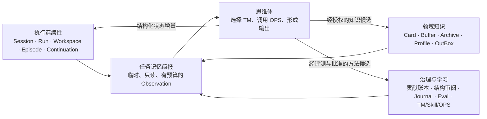

# 2026-08-30 智能体记忆框架

> 核对日期：2026-08-30
> 职责：统一解释项目中已经存在的会话、任务、知识、操作记录、领域 Profile 与程序性认知资产，规定它们如何被思维体取用、失效和受控晋升。
> 状态：设计与后续开发指导；除文中明确标为“已实现”的部分外，不代表运行时已经具备自动记忆装配或自动学习能力。

## 一、结论

  当前项目不缺持久化对象，缺的是一条统一的记忆使用闭环：什么值得保留、保存到哪里、在什么范围内有效、何时取回、为什么进入本轮上下文、变化后怎样失效，以及经验何时才有资格影响 Thinking Model、Skill 或 OPS。

  本项目不应再建设一套与 Markdown 知识体平行的“通用长期记忆库”。更合适的做法是把现有对象按职责组织成三个面：执行连续性、领域知识、治理与学习；再由一个只读的“任务记忆简报”在任务开始、恢复和关键决策前按需装配少量上下文。简报是临时 Observation，不是新的事实源。

  这套框架服务的对象不是通用聊天助理，而是能够处理材料、维护知识结构、调用思维模型并接受评测的领域智能体。因此，用户偏好式个人画像、无审查的自动记忆提取、把整段历史对话塞回提示词，都不应成为默认方向。

## 二、当前项目已经有哪些“记忆”

| 记忆职责 | 当前载体 | 当前状态 | 主要边界或缺口 |
|---|---|---|---|
| 会话连续性 | DSH session | 已实现 | 保留对话连续性，但不是领域事实源，也不应跨任务隐式共享进度 |
| 任务工作状态 | `.nexogenesis/cognition/runs/<run>/run.json`、`workspace.json` | 已实现 | 已有目标、范围、用户指令、假设、证据、反证、冲突、候选动作、预算与模式扩展；尚未统一装配跨 run 相关信息 |
| 操作经历与审计 | 同一 run 下的 `episode.json`、`06-Journal/` | 已实现 | 能说明做过什么及结果；大段工具正文会压缩，不保存隐藏思维链；目前不会自动总结成方法改进 |
| 暂停与恢复 | checkpoint、`continuations.json`、session/run 与 interaction/run 映射 | 部分可用 | 后端状态与续投队列存在，Web 的恢复与任务管理体验仍需真实验证 |
| 领域知识事实 | `01-Cards/` | 已实现且为语义权威 | 必须经 `HarnessGateway` 写入；运行日志和模型记忆不能覆盖它 |
| 待综合质料与来源 | `05-Buffer/`、`03-Archive/` | 已实现 | Buffer 是尚待综合的质料，Archive 保存来源；不能把检索命中直接当成成熟知识 |
| 分析产物 | `04-OutBox/` | 已实现 | 是可追溯产物，不因保存下来就自动成为知识体结论 |
| 领域思考特质 | `02-Profile/` | 结构已存在，内容仍基本为空 | 当前是模板；更新必须是领域级、带来源并经用户批准，不能当作自动用户画像 |
| 防重复与结构治理 | `contributions.json`、`debts.jsonl`、`structure-reviews.jsonl` | 部分已实现 | 已有贡献结算、结构债和 Card 指纹失效机制；尚未形成面向所有任务的统一查询入口 |
| 程序性认知 | `.agent/skills/`、`schemes/default/thinking-models/`、prompts、OPS 代码 | 已实现为版本化资产 | 决定智能体怎样观察与行动，但 Episode 目前不会自动修改这些资产 |
| 评测证据 | `tools/eval/`、测试与评测案例 | 部分已实现 | 已有确定性校验、隔离 fixture 和评分基础；自动模型运行、候选谱系与受控晋升尚未闭环 |
| 注意力与旧 STM 草案 | `schemes/default/attention.yaml` | 未实现的历史模板 | 文件注释已写明“实现后生效”；十会话滚动、双账户选卡和强信号捕获不能作为当前能力使用 |

  这份盘点说明，项目已经有足够的存储基础。近期真正需要补齐的不是更多“记忆类型”，而是现有对象之间的取用契约、作用域隔离、失效检查和可观察性。

## 三、框架：三个职责面与一座装配桥



### 3.1 执行连续性面：记住“本次任务进行到哪里”

  Session、CognitiveRun、Workspace、Episode、checkpoint 和 continuation 共同承担短期连续性。Workspace 是当前任务的状态真相；Episode 是可审计的动作经历；Session 保留自然对话；continuation 处理界面或投递中断。它们可以帮助恢复任务，但不能被解释成已经确认的领域知识。

  这里沿用当前代码已经具备的 `inspect_cognitive_workspace`、`update_cognitive_workspace`、checkpoint 与恢复机制，不另建 `.nexogenesis/memory/stm`。旧 `attention.yaml` 中“按十个会话卷”的 STM 只有在真实案例证明 Session + Workspace 不足时，才值得重新评估。

### 3.2 领域知识面：记住“领域中可以依赖什么”

  Card 是唯一可长期依赖的领域语义事实源；Buffer 是待综合质料；Archive 保留原始来源；Profile 只保存经确认的领域级理念、启发式、推理模式、内在张力和重复证据缺口；OutBox 保存面向任务的分析产物。它们的权威等级不同，检索命中时必须保留这种差异。

  思维体可以读取知识面，但普通分析不得自动写回。Card、Profile 等实质写入继续经过 `HarnessGateway`、授权、预检、冲突检查和收据。模型的一次判断、某次任务的成功经验或一条聊天偏好，都不能直接晋升为领域知识。

### 3.3 治理与学习面：记住“做过什么、哪些方法被证明有效”

  贡献账本、结构债、结构审阅、Journal、测试、评测案例以及版本化的 TM、Skill、OPS 和 prompts 共同承担治理与程序性学习。这里要明确区分“运行证据”和“生效规则”：Episode 可以证明某个动作发生过，评测可以证明某个候选在特定案例上改善，但只有经过比较、回归和人工批准的版本变更，才会真正改变程序性认知。

  这对应一个保守但重要的边界：经验先成为候选证据，再成为评测对象，最后才可能成为规则。不得从一次成功或一次模型自评直接改写 TM、Skill 或 OPS。

### 3.4 装配桥：任务记忆简报

  “任务记忆简报”是本框架唯一建议新增的统一接口。它不保存新事实，只从现有对象中选出本轮确实需要的信息，并说明来源、有效性和入选理由。它可以作为 `inspect_cognitive_workspace` 的扩展结果或其内部只读辅助模块，而不是再注册一组泛化记忆 OPS。

  最小输出契约如下。字段名在实现时可以贴合现有 Observation Schema，但语义不应丢失。

```yaml
version: 1
run_ref:
  run_id: "..."
  mode: "construct"
  checkpoint_revision: 7
task:
  goal: "..."
  scope: {}
  user_directives: []
checkpoint:
  last_completed: "..."
  next_candidates: []
evidence_refs:
  - address: "card-id#unit-id"
    role: "support|counter|boundary|background"
    authority: "card|buffer|archive|outbox"
    revision_or_fingerprint: "..."
    included_because: "..."
prior_decisions:
  - decision: "..."
    source_ref: "run/episode/ledger address"
    status: "active|superseded|rejected"
conflicts_and_gaps: []
anti_repeat:
  settled_sources: []
  valid_structure_reviews: []
cognitive_assets:
  selected_thinking_model: "..."
  applicable_profile_refs: []
validity:
  assembled_at: "..."
  as_of: "..."
  excluded_stale_refs: []
omissions:
  - "raw tool output omitted"
```

  简报只保留可行动信息，不保存或重建模型的逐字思维过程。`included_because` 和 `excluded_stale_refs` 很关键：它们让开发者能判断检索错了、记忆过期了，还是模型没有正确使用已经提供的上下文。

## 四、写入规则：一条信息应去哪里

| 新信息或事件 | 默认去向 | 写入权限 | 不应做什么 |
|---|---|---|---|
| 当前目标、范围、用户指令、已验证证据、冲突、下一步 | Workspace | 当前 run 的认知工具 | 不写成 Card，不跨任务隐式共享 |
| 工具调用、拒绝、失败、写入收据、状态差异 | Episode；必要时 Journal | 运行时确定性记录 | 不保存大段原文，不把模型自述当事实 |
| 暂停点和待继续动作 | checkpoint、continuation | 运行时确定性记录 | 不依赖前端内存变量维持进度 |
| 来源中的高质量质料 | Buffer、Archive | compile 受控写入 | 不因切片或检索命中直接建 Card |
| 可独立成立的领域知识或既有卡增量 | Card | 用户授权 + `HarnessGateway` | 不由 Session、Episode 或向量索引直接覆盖 |
| 领域级理念、推理范式、反模式、重复证据缺口 | Profile 候选，确认后进入 `02-Profile/` | 用户批准 + 受控写入 | 不记录个人口吻偏好，不凭一次观察更新 |
| 已处理来源、有效结构审阅、待还结构债 | 现有贡献或图治理账本 | 专用确定性工具 | 不把账本升格为语义事实源 |
| 某种流程可能需要改进 | Episode/评测材料中的方法候选 | 先记录、后评测 | 不自动改 TM、Skill、OPS 或 prompt |

  写入时先判断“它要帮助哪个未来任务作出什么决定”，再选择去向。无法回答这个问题的信息默认不进入长期提示上下文；若出于审计需要保留，则只进入 Episode 或 Journal。

## 五、检索与上下文装配规则

### 5.1 先缩小作用域，再做相关性检索

  检索顺序应是：当前 run 与 mode → 当前实体、Card、来源或主题范围 → revision/fingerprint/as-of 有效性 → 权威等级 → 相关性与预算。不能先在所有历史记录上做语义相似度搜索，再让模型自行猜测哪些记录属于当前任务。

### 5.2 默认优先级

1. 当前用户指令、目标、checkpoint 和停止条件。
2. 本轮已经精读并核验的支持、反证与边界证据。
3. 能阻止重复工作的结算记录、有效结构审阅和明确拒绝决定。
4. 与问题直接相关且已经批准的 Profile 条目。
5. 与当前任务同范围、同对象且结果可验证的过去 Episode 摘要。
6. 仅作为线索的 Buffer、OutBox 和未验证历史经验。

  原始会话全文、大段工具输出、失效结构审阅、已经 superseded 的知识、与当前 scope 无关的其他 run，默认不进入简报。

### 5.3 有效性和时间

| 载体 | 有效性判断 |
|---|---|
| Session | 只在所属会话内提供连续性；跨任务不得等同共享工作状态 |
| Workspace | 以 run、mode、scope 和 checkpoint revision 为边界；完成后转为历史状态 |
| Episode | 作为不可变审计经历读取；其中的结论仍须回查证据与最终状态 |
| Card | 检查 lifecycle、revision、来源和当前内容；引用到单元时核验地址仍存在 |
| Buffer / OutBox | 显式标注为质料或产物，不冒充成熟知识 |
| Structure review | 只在涉及 Card 的 fingerprint 未变化时有效 |
| Contribution ledger | 以来源 fingerprint、settled/skipped 状态和目标操作为准 |
| Profile | 只使用经批准、带来源且未被后续版本替代的条目 |
| TM / Skill / OPS | 以代码版本、能力契约和适用评测范围为准，不从旧 Episode 推断当前行为 |

  时间不仅是 `created_at`。对于序贯研判和历史回放，还要区分“系统何时记录”与“材料描述的事实截至何时”，继续沿用评测中的 `as_of` 和冻结 checkpoint 纪律。只有出现真实跨时事实冲突时，才考虑把双时间字段扩展到更多运行账本；现在不需要引入时态图数据库。

### 5.4 预算与压缩

  简报应按“决定是否会因此改变”分配预算，而不是按文件平均截断。建议起始上限为：一个目标、一个 checkpoint、最多三条用户指令、六个证据锚点、三条有效先前决定、三项冲突或缺口，以及一到两个程序性资产引用。上限只是可验证的初始值，后续根据真实任务的召回遗漏和噪声调整，不直接复活旧 `attention.yaml` 的整套权重系统。

## 六、怎样辅助思维体工作

  思维体需要的不是更多背景材料，而是稳定的任务定向、证据边界和可恢复状态。建议形成下面的闭环：

1. 开始或恢复 run 时，读取当前 Workspace、checkpoint、预算和用户指令。
2. 生成任务记忆简报，排除跨 run 污染、失效 fingerprint 和未来时点材料。
3. 根据目标、证据缺口和允许能力选择或更换 Thinking Model。
4. OPS 每次返回 Observation 后，只把可观察的状态增量写回 Workspace 和 Episode。
5. 关键结论输出前，核验简报中的证据锚点、反证、边界和 as-of。
6. 结束时分别处理任务状态、知识候选和方法候选，不让三者互相越权。

  对 `nexo-assess`、`nexo-report` 和 `nexo-judge`，简报重点是问题、时点、证据与上一轮冻结判断；对 `compile` 和 `digest`，重点是来源 fingerprint、覆盖、贡献结算和待综合质料；对 `construct`，重点是焦点 Card、有效结构审阅、已排除候选、关系债和写后检查。它们共享同一记忆原则，但不共享一份无限扩张的通用字段集。

  任务结束时可以产生三类候选，但只在原有授权链中处理：知识候选交给 emerge/refine/digest/construct 与 Harness；Profile 候选展示来源和差异后等待确认；方法候选进入评测材料，只有重复案例和回归结果支持时才修改 TM、Skill 或 OPS。

## 七、从成熟项目和研究中借鉴什么

| 来源 | 可借鉴机制 | 在本项目中的落点 | 不照搬的部分 |
|---|---|---|---|
| [LangGraph Memory](https://docs.langchain.com/oss/python/concepts/memory) | thread-scoped state 与跨 thread store 分离；语义、经历、程序记忆分工；热路径与后台写入需要取舍 | 用 Session + Workspace 处理当前任务，用 Card/Profile 和治理账本处理跨任务内容 | 不新增通用 JSON 长期记忆 store；Markdown 仍是知识权威 |
| [AutoGen Memory 协议](https://microsoft.github.io/autogen/stable/user-guide/agentchat-user-guide/memory.html) | `query`、`add` 与 `update_context` 分开，记忆实现负责把相关内容放入模型上下文 | 把“存在哪里”与“怎样装配简报”分开测试 | 不把所有载体统一成可任意增删的 Memory 接口 |
| [MemGPT](https://arxiv.org/abs/2310.08560) 与 [Letta memory blocks](https://docs.letta.com/tutorials/attaching-detaching-blocks/) | 少量常驻核心信息与可搜索归档分离；上下文是受预算管理的资源 | 当前目标、指令、checkpoint 常驻简报，Card 与历史经历按需取回 | 不建设智能体可自由改写的 persona/human block；Profile 仍需用户确认 |
| [CoALA](https://arxiv.org/abs/2309.02427) | 工作、情景、语义与程序性记忆对应不同内部动作和决策用途 | 用于解释三个职责面的不同权限，不要求物理上建立四套数据库 | 不把认知科学类比当作新的项目本体或目录分类 |
| [Generative Agents](https://arxiv.org/abs/2304.03442) | 从经历流按相关性、近期性和重要性取回，并把多次经历综合成反思 | 未来可用于 Episode 选择和跨 run 方法候选 | 不自动把“反思”写成知识或程序规则；重要性评分需有项目评测证明 |
| [Reflexion](https://arxiv.org/abs/2303.11366) | 把反馈形成语言化的 episodic reflection，供下一次尝试使用 | 保存失败类型、拒绝理由和修正结果，作为同类任务候选经验 | 不凭模型自我反思直接改变稳定行为 |
| [Mem0](https://arxiv.org/abs/2504.19413) | 从长对话提取、合并和按需检索显著信息，降低整段历史回填成本 | 只在跨 run 重复问题得到证据后，引入受控的经历摘要与合并 | 不做默认个人记忆，也不让抽取器直接写 Card/Profile |
| [Zep/Graphiti](https://arxiv.org/abs/2501.13956) | 保存事件来源、事实时间、关系变化与失效信息 | 沿用 `as_of`、revision、fingerprint、superseded 和来源锚点 | 项目已有 Markdown 图和 GraphOps，近期不再引入并行图数据库 |

  这些项目最值得借鉴的共同点不是某个数据库，而是三条工程纪律：当前状态与长期事实分开；检索与写入分开；经历到规则之间必须有压缩、验证和晋升门槛。

## 八、近期实施建议

### 8.1 第一小步：让现有任务记忆可见、可验证

  在完成近期路线中既定的真实流程验证和恢复体验后，优先扩展现有 `inspect_cognitive_workspace`，生成只读任务记忆简报。实现可以放在 cognition 内一个小型纯函数模块中，也可以保持在现有工具内；判断标准是能独立测试而不新增服务、数据库或写入路径。

  第一版只读取当前 run、当前 checkpoint、已核验 evidence、当前 scope 对应的贡献/结构治理记录和显式选择的 TM。暂不做全历史 Episode 语义检索，不读取其他任务的自由文本，也不实现自动 Profile 更新。

### 8.2 必须同时具备的测试

- 同一 session 的不同 mode 不共享隐式进度。
- 不同 session、run 和评测 fixture 之间不串入 Workspace 或 Episode。
- Card revision 或 fingerprint 变化后，旧结构审阅不进入简报。
- settled/skipped 来源能够阻止重复处理，但不能阻止用户明确要求的重新审查。
- `as_of` 任务不会读取未来 checkpoint 或事后 Episode。
- Buffer、OutBox 和 Episode 在输出中保留较低权威标记。
- 简报达到预算上限时有确定性裁剪，并报告省略内容。
- 简报中每个跨对象引用都能回查地址和入选原因。

### 8.3 用真实失败决定下一步

| 观测到的重复失败 | 才考虑增加的能力 | 不先做什么 |
|---|---|---|
| 上下文压缩或重启后经常重复读、重复写 | 改善 checkpoint 与 anti-repeat 简报 | 不上通用向量数据库 |
| 同类 construct/digest 任务反复犯相同错误 | 受控检索少量同类 Episode 摘要 | 不自动改 Skill 或 TM |
| Profile 长期为空，且多个来源反复出现同一领域范式 | 增加带来源、可比较、需确认的 Profile 候选流 | 不自动维护用户画像 |
| 现有 Card/GraphOps 无法回答明显的跨时事实变化 | 为相关记录增加 valid-time / recorded-time | 不替换现有 Markdown 图 |
| 评测持续证明某种回忆策略改善结果且无明显回归 | 把策略作为候选版本进入 TM/OPS 评测 | 不把一次成功写成全局规则 |

  这与当前路线“先验证主流程和恢复，不提前扩张记忆分类”的要求一致：框架先统一边界和接口，功能只在可观察的失败证明需要时增加。

## 九、验收指标

  记忆功能不能用“保存了多少条”验收。至少应观察以下结果：

| 指标 | 含义 |
|---|---|
| 恢复成功率 | 中断后能否从正确 checkpoint 继续，而不是重做或跳步 |
| 重复工作率 | 已结算来源、已审结构和已拒绝动作被无意重复的比例 |
| 跨任务污染率 | 其他 run、其他时点或其他 fixture 的状态进入当前简报的比例，目标应为零 |
| 有效引用率 | 简报引用在使用时仍能通过地址、revision/fingerprint 与 as-of 核验的比例 |
| 记忆利用率 | 被装配的信息是否实际改变了选择、避免了错误或支撑了结论 |
| 噪声率 | 被装配但与当前决定无关、造成误导或挤占证据预算的信息比例 |
| 越权写入率 | Episode、对话或模型反思未经授权进入 Card/Profile/程序规则的次数，目标应为零 |
| 方法晋升收益 | 候选记忆策略或程序修改相对基线的任务质量、恢复和成本变化 |

  只有恢复、抗重复、证据质量或成本中至少一项有稳定改善，且跨任务污染与越权写入不增加，新的记忆机制才算有效。目录、类名、向量条目数量和“记忆已开启”的界面提示都不构成证明。

## 十、明确暂缓

- 暂不实现独立的通用 Memory Service、向量记忆库或时态图数据库。
- 暂不复活旧十会话 STM、双账户注意力权重和强信号自动捕获。
- 暂不让模型自动总结全部 Session 并跨任务注入。
- 暂不把 `02-Profile/` 改造成个人画像或由模型自行维护的常驻 prompt。
- 暂不根据单个 Episode 自动修改 TM、Skill、OPS 或 prompts。
- 暂不为所有载体设计一个可写的万能 `MemoryRecord`；统一的是引用与装配契约，不是存储模型。

  撤回这套设计的成本很低：即使不实现任务记忆简报，现有 Session、Workspace、Episode、Card、Profile 和治理账本仍按各自契约运行；本框架没有改变 Markdown 主权，也没有建立第二条写入真相。
