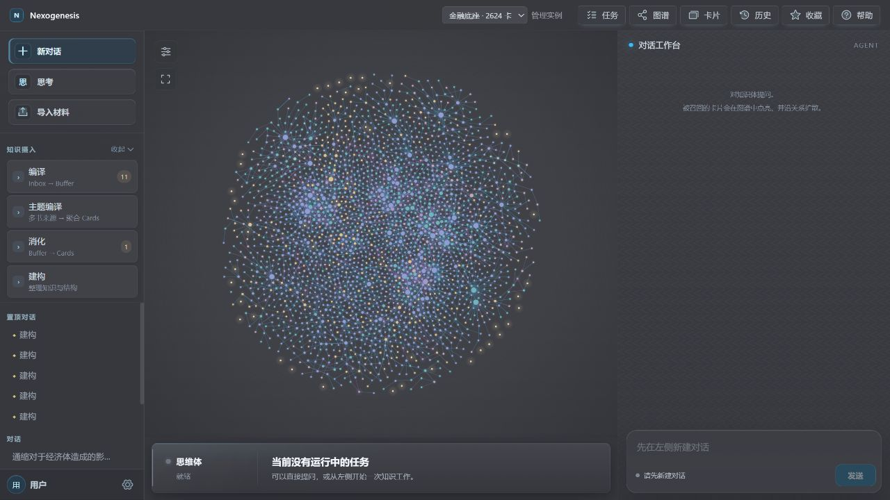
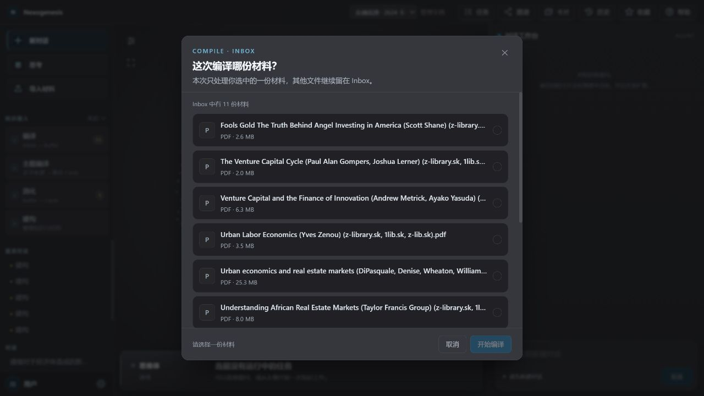
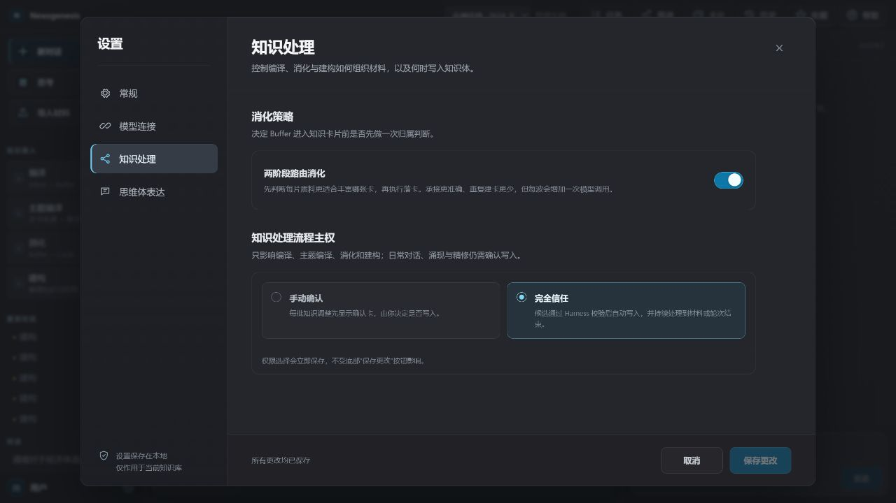
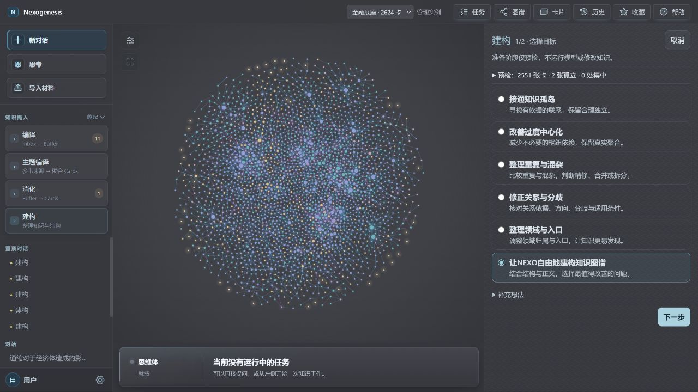

# 2026-09-07 编译、建构、思考统一入口与主题组织重构方案

> 状态：未来方案；统一编译与知识工作设置尚未实施，不能作为现行运行授权。
> 阅读入口：**第十一节是整合最新实践后的完整产品方案**；第一至九节保留主题、领域与知识处理的基本取舍，第十节保留既有交互设计及实施边界。
> 局部进展：思考入口、建构暂停讨论、消息插入及新版分析显式试用已有实现；聚合档案已有 Codex 实验写入路径，尚不是 Web 原生统一编译。
> 核对日期：2026-09-08。
> 独立职责：统一编译、建构与对话的用户入口、选择面板、知识工作设置、处理机制和验证方案。
> 边界：本文不替代 `AGENTS.md`、活契约、当前运行手册或近期开发路线；保存方案不代表已经授权实施、迁移知识体或修改项目规则。

## 一、目标与核心判断

  目标是让不熟悉项目的用户也能把材料充分、严谨地融入知识库，得到可独立阅读、可追溯、可比较、可用于推理的知识卡片。减少入口和步骤是降低使用成本的手段，不是知识质量改善的证明。

  建议将主要用户入口整合为“编译、建构、思考”，将普通编译、主题编译与消化的必要职责纳入统一的材料处理体验。同时探索整合长期主题与领域的组织职责，避免维护“主题一套、同名领域卡一套”的重复结构。

  不建议把“主题文件夹变化”自动解释为“领域边界与知识关系变化”。文件存放位置、组织归属和论证关系必须保持可区分；领域卡可以退出普通知识图，但不能因此丢失有价值的领域定义、问题边界和导航入口。

## 二、三个用户入口，不是三步固定流水线

| 入口 | 用户目标 | 核心职责 | 边界 |
|---|---|---|---|
| 编译 | 把新材料转化、融入可用知识 | 来源整理、知识提取、跨材料比较，按对象选择新建或修订，以及必要的局部接入 | 不借新材料摄入擅自重构整个知识库 |
| 建构 | 改善已有知识体 | 澄清卡片、拆并内容、调整关系、归属和入口 | 不局限于补边；写入受已确认的范围与调整层面约束 |
| 思考 | 利用知识完成解释、比较、研判和报告 | 按问题选择方法、取证和表达结果 | 默认只读，沉淀需要明确发起并经过相应授权 |

### 2.1 编译与消化如何合并

  “消化”可以退出一级入口，但其核心判断不能消失：材料应该丰富哪张已有卡片、形成什么新卡片，或为什么暂时只保留为来源。统一的是用户目标和操作体验，不是删除这些判断。

  “主题编译”可以成为编译内部采用的策略，不再要求用户预先理解它与普通编译的差别。策略应根据材料长度、异质性、现有知识和用户目标选择，而不是仅按文件数量分流。

  编译默认以“融入知识库”为完成目标，同时保留“只整理来源、暂不落卡”的明确选项。已有待消化 Buffer 需要兼容承接，不能因为入口合并而被遗忘或自动标记完成。

### 2.2 分支选项服务目标，不暴露内部术语

  可以借鉴当前建构的目标与范围准备方式，让用户说明要完成什么，再确认材料、处理范围和允许的操作。但不应要求用户逐项选择 Skill、Thinking Model 或 OPS，也不要求每个简单任务都经过多轮向导。

  思考入口展示“解释一个问题、比较观点、检验判断、形成报告”等结果目标，允许系统选择和调整方法。不同目标不必与某个内部技能形成固定的一对一关系。

  普通提问继续直接交流；对话中的“记一下”保留轻量的沉淀候选入口，不强迫用户先建立主题文件夹或重新走一次材料导入。

## 三、主题应长期积累，但不能由导入批次决定

### 3.1 区分本次材料范围与长期问题范围

  “这一批材料准备研究什么”和“知识库长期围绕什么问题组织”不是同一个问题。一次编译的任务范围可以是临时的，而长期主题应能持续接收不同来源、不同批次的知识。

  例如，一批银行危机图书可能同时贡献于流动性、信用周期、政策传导和制度史；流动性主题也会接收其它材料。不能默认每次编译都新建一个主题，然后让整批材料只属于它。

### 3.2 建议的主题组织规则

- 优先判断是否能够加入已有主题，不默认新建。
- 混合材料可以分流到多个主题，不强迫整批同属一个主题。
- 同一个知识对象或同一张卡可以服务多个主题；内容只保存一份，通过引用建立多重归属。
- 来源整理保留作者、章节、版本与原始语境，不能为了跨书聚合提前抹平差异。
- 主题为候选发现提供方向，但不能封闭全库检索，也不能成为建立论证关系的证据。
- 允许重要对象暂时没有合适的主题；不为完成分类而强行归属或丢弃内容。
- 不以成员数量单独判断主题质量；重点是问题范围是否清楚、成员是否适切、入口是否有用。

  文件夹可以作为存储方式，但不是语义身份。长期主题需要稳定标识；显示名称变化不应破坏来源和成员引用。必要定义、边界及人工判断保存在 Markdown 中，索引和成员视图可以派生，不建立第二套不可重建的语义事实源。

## 四、领域卡的调整方向：整合组织职责，不制造推理捷径

### 4.1 当前问题与不应误判之处

  当前契约中，`domains` 是组织归属，`domain` 不能作为任何 `relations` 的源或目标。领域卡不进入论证多跳是有意的限制，不应通过补连线或把领域改成普通命题来消除其视觉上的孤立。

  真正值得调整的是：组织容器被作为一种卡片与普通论证节点并列呈现，同时又可能与新的主题管理重复。

### 4.2 推荐的目标形态

  如果长期主题已经承担问题范围、来源积累、成员组织和推理入口职责，就不应再机械生成一张同名领域卡。可以探索将两者整合为长期主题页，而不是维护两份定义并反复同步。

  主题页负责范围、浏览、筛选和入口；普通知识图负责具体卡片之间有依据的关系。主题之间可以展示用于导航的关联，但必须能够下钻到实际桥接卡片；主题关联本身不能充当论证证据。

  这不是消灭领域组织，而是调整其载体与交互。如果仅把“领域卡”改名为“主题页”，却没有减少重复维护、改善查找和解除与论证节点的混用，改名本身没有足够价值。

### 4.3 迁移不能丢失已有知识

  领域正文中有价值的问题边界和阅读入口应保留在组织定义中；其中如果包含独立理论判断，应经语义审查后丰富或形成普通卡片。不能整张容器直接改成 model，也不能删除组织对象时把其中的实质知识一起丢掉。

  当前成员检索、归属校验和部分任务范围仍依赖 `domain` 类型，迁移不是简单删除文件。第一轮试验可保留当前存储格式，先验证新的主题呈现和使用方式；完整迁移必须另行确认，并遵守卡片不物理删除、写入经过 HarnessGateway 等现行规则。

## 五、主题改名与拆分：分清三种影响

| 变化 | 应当做什么 | 不应自动做什么 |
|---|---|---|
| 名称变化 | 保持稳定身份，更新显示名称与必要引用；核对是否仅为措辞调整 | 重新生成知识卡或论证关系 |
| 范围变化 | 修订主题边界，按内容重新判断成员，允许合理重叠 | 按文件位置搬迁全部知识、复制同一张卡或强迫互斥归属 |
| 知识判断变化 | 明确需要澄清、拆并或修订的卡片和关系，作为受控建构处理 | 将主题调整视为对所有成员正文和关系的隐式写入授权 |

  用户可以在同一个主题管理界面发起这些操作，但系统必须区分实际影响。看似改名、实则改变问题范围的操作，应按范围调整处理，而不是只替换标题。

  如果长期主题与领域最终合一，就不再需要“修改主题后同步对应领域”；修改的是同一个组织对象。组织调整可以触发知识结构的候选复查，但不能直接触发论证关系的自动重写。

  已完成的小规模领域试点澄清了两个领域边界，并调整六张卡的归属，没有改变普通卡正文或论证图。这证明组织改善与推理结构改变可以独立发生，不证明领域组织无用，也不证明剩余重叠归属都错误。

## 六、新编译的质量核心：充分理解与实际整合

  下列要求是质量义务，不是写死的工具调用顺序。模型仍需根据材料与工具观察选择下一步。

### 6.1 保住来源中的独特贡献

  不只寻找多本书的共同点，还要保留各自的独有机制、适用条件、反例、尺度差异和分歧。跨材料聚合不能取代对作者原有框架的理解。

### 6.2 与已有知识进行内容比较

  标题相近不等于可以合并，标题不同不等于必须新建。应比较知识功能、机制、条件、证据、独立复用价值和承载负担，以对象质量选择新建、修订、拆分或合并，不预设丰富旧卡优先，也不以减少新卡为目标。旧卡可以容纳文字不代表承载最优；避免重复造卡，也避免无限扩充为杂糅容器。

### 6.3 完成必要的局部接入

  编译应检查新知识如何被找到、理解和使用，有证据才建立关系。确实独立或证据不足的对象可以暂时独立，不以连通率为理由凑边。

  不应编译后留下大量未经检查的碎片，再要求用户另外执行建构来收拾；也不能借局部接入扩大为全库重构。范围外问题可以记录为后续建议。

### 6.4 核对内容的实际落点

  重要内容进入了哪张卡、丰富了什么、为什么只保留来源或暂缓，必须能够回查。多个知识对象可以共同丰富一张卡，一个复杂对象也可能由不同卡片承接；知识对象不是卡片数量配额。

  普通 Buffer 可以不再是强制停留的一站，但来源保真、对象追踪和中断恢复不能一起取消。主题编译当前也有正式来源层；不能把“不经过普通消化队列”误写成“不需要持久保存来源”。运行时摘要不能替代长期来源与语义事实。

## 七、最小验证：先证明质量收益，再决定完整迁移

### 7.1 样本与范围

  选择一个已有主题及少量涉及相邻主题的新材料，保留现有领域存储格式，在隔离知识体或副本上验证统一编译体验与主题组织方式。第一轮不迁移整个知识库，不同时建设新的通用 Agent 平台。

  如进行新旧流程比较，应冻结相同的材料与初始知识快照，记录模型、预算和实际执行差异；避免把换模型、材料难度或范围变化的影响误当作流程收益。

### 7.2 必须回答的问题

1. 能否按对象身份选择新建、修订或必要的拆并，同时避免重复卡和无限膨胀的旧卡？
2. 材料中的独有机制、条件和分歧是否实际得到保存？
3. 同一张卡能否服务多个主题而不复制内容？
4. 主题改名或拆分后，来源和引用是否完整，论证关系是否没有被误改？
5. 用户能否从主题入口找到知识，并完成一个实际解释或比较任务？
6. 中断后能否恢复，避免重复写入和把未处理内容误报为完成？

### 7.3 评价与验收

  主要比较来源忠实度、信息与边界充分性、知识落点合理性、关系成立性，以及真实提问中的检索和使用效果。记录用户干预次数、拒绝及修正次数、耗时和资源成本，区分工程可用性与语义质量。

  按钮减少、卡片增加、连通率提高、审计通过，都不能单独证明知识质量提高。尤其需要真实 Web 模型样本验证；代码、提示词和配置存在，不代表模型已能稳定独立完成这些任务。

### 7.4 成本与撤回

  第一轮主要成本是入口与主题视图适配、统一体验下的任务状态和完成义务衔接，以及真实材料评测。保留现有存储格式可以降低迁移成本，但不能因此长期维护两套主题事实源。

  如果没有观察到净收益，可以撤回实验入口与视图，继续使用原有流程；来源、卡片、主题定义和历史回执不应随实验撤回而丢失。若试验已经发生知识写入，应在副本验证，或通过另行确认的合法恢复事务处理，不能依赖删除文件或盲目覆盖生产知识体。

## 八、实施前必须保留的边界与待定项

- 本文只保存设计方向，不自动改变近期开发优先级，也不授权知识迁移。
- UI 合并不意味着立即合并所有内部 mode、任务状态或写入权限。当前不同流程的来源范围、授权、对象结算和完成门，需要在等价保护明确后才能调整。
- 所有知识体实质写入继续经过 HarnessGateway；单次写入层面与操作数量遵守现行契约。
- 思考结果不自动成为卡片，也不因进入统一入口获得写入权限。
- 是否彻底移除 `domain` 卡片类型、主题定义的最终 Markdown 格式与兼容迁移方式，在试验后另行决定。
- 自动学习、策略晋升和新工具平台不属于本方案的前置条件；不能用新的架构名称代替真实质量评测。

  最终原则：合并入口，保留必要判断；整合主题与领域的组织职责，不让文件夹支配知识结构。以可复用主题组织来源和知识，以有依据的卡片关系承担推理。

## 九、依据与关联文档

- [NEXO 思维与沉淀行动运行手册](../../2026-09-07-NEXO思维与沉淀行动运行手册.md)：当前行动职责、任务隔离、完成条件与建构准备。
- [当前实现、运行与限制](2026-08-30-当前实现、运行与限制.md)：已经实现与尚未验证的能力边界。
- [近期开发路线](2026-08-30-近期开发路线.md)：当前唯一近期工作清单；本文不自动替换它。
- [卡片类型与关系契约](../../../.agent/reference/card-contracts/ontology.md)：领域归属与论证关系的区别。
- [摄入与建构纪律](../../../.agent/reference/ingest-pipeline.md)：普通 Buffer、主题来源、知识对象与处置要求。
- [领域重构小规模试验：微观与计量](../../../04-OutBox/2026-09-07-领域重构小规模试验-微观与计量.md)：组织调整不等于论证图变化的实例证据；属于当前知识实例记录，不是通用运行规则。
- [Web 知识摄入、建构与受控自我优化升级方案](2026-09-07-Web知识摄入、建构与受控自我优化升级方案.md)：此前问题与优化建议；其中实现状态须与当前事实文档和代码核对。

## 十、思考面板与普通对话统一：本轮具体讨论

> 2026-09-07 补充；以下为根据当前代码形成的实施建议，尚未修改运行逻辑。这里只讨论思考、建构与普通聊天的衔接，不同时实施前文的编译合并和主题迁移。
> 本节保留设计到实施的追溯。10.8 记录已实施部分；普通分析的新目标与收尾契约以 [2026-09-08 思考分析设计](2026-09-08-思维体思考分析与讨论体验设计说明.md)为准，不再把旧 TM 配额与方法字段全部满足作为未来普通对话的完成门。

### 10.1 目标：同一种对话，不等于同一种执行权限

  用户可以从“新建对话”直接聊天，也可以从“思考”选择目标、填写问题后开启对话；建构沿用已有准备面板。三种入口创建的内容都应当是可以命名、查找、继续交流的普通对话，不让用户管理两套聊天记录。

  建议区分两个已有概念：Conversation/DSH session 保存长期对话上下文；CognitiveRun 保存一轮具体工作的目标、范围、预算、证据、权限和完成状态。共用对话容器与消息发送通道，保留不同 Run 的实际职责。没有必要另建一种永久的“思考任务”会话类型，也不能把 construct、assess、report 的完成条件全部压成 general。

  默认每次从按钮启动都新建独立对话，避免把上一项工作的上下文、草稿或授权带入；工作完成后允许在该对话里追问。不同对话仍有独立会话和运行状态。这不等于让多个模式共享隐式进度，也不修改 AGENTS 的任务隔离原则。

### 10.2 当前代码支持什么，又在哪里冲突

| 位置 | 当前可确认的行为 | 对本次需求的影响 |
|---|---|---|
| `packages/nexogenesis-web-host/lib/projects.js` / `pipeline.js` | 普通对话与建构都通过 `session.create`，使用 nexogenesis Agent preset | 无须更换模型会话引擎；主要工作在宿主路由、状态和前端呈现 |
| `web/src/components/ConstructSetup.tsx` | 两轮准备，目标、范围、工作量、调整层面、补充想法；正式开始才创建任务 | 可借用面板交互，但思考不需要复制写入授权与结构预检 |
| `web/src/components/Sidebar.tsx` 与 `App.tsx` | 普通列表过滤 `task_kind`；任务另在任务入口和工作中心呈现 | 只改一处过滤条件不足以完成统一 |
| `packages/nexogenesis-web-host/lib/chat.js` / `pipelineStageForMessage` | 活动任务的普通消息沿用 `task_kind`；终态任务缺 `resume_task` 时拒绝消息 | 建构完成后的解释、追问和新问题目前不能自然接续 |
| `packages/nexogenesis-tools/lib/cognition/run-store.js` / `start` | 只要当前 Run 带有冻结的 `construct_request`，就拒绝另起 Run；没有按完成状态豁免 | 即使移除 HTTP 拒绝，后续检索或分析仍可能失败；这是防止绕过建构范围和预算的保护，不能直接删除 |
| 同文件 / `current`、`ensure` | 每个 session 的索引指向当前一个 Run；运行中或待确认的 Run 会被复用 | 暂停建构后插入分析，会涉及旧 Run 的定位、恢复和权限隔离；不能只覆盖当前指针 |
| `packages/nexogenesis-web-host/lib/work.js` | 自动接续按实际 Run mode 与授权判断；工作中心的 stage、can_continue 仍依赖 `task_kind` | 去掉元数据不等于停掉自动接续，反而可能丢失恢复入口 |
| `web/src/App.tsx` / 排队发送 | 消息队列保存 conversationId 和 text，发送时使用会话的 `task_kind` | 引入模式转换后，旧排队消息不能被重新解释成新 Run 的执行指令 |

  以上是静态代码确认的机制与冲突，不是声称已经在真实模型中复现了全部故障。现有测试覆盖部分旧行为，不代表新体验已经可用。

### 10.3 思考面板：选择想完成什么，再自由聊

  建议从侧栏“思考”按钮打开与建构一致的对话栏准备面板；保留图谱，窄屏专注于准备内容。优先一屏完成，不照搬建构的两轮向导。面板准备期间不调用模型、不创建空对话、不修改知识，取消后回到原位置和原草稿。

| Before（当前） | After（建议） | 原因 |
|---|---|---|
| 思考主要依赖用户直接提问或知道命令 | 增加“思考”，保留独立的“新建对话” | 为有目标的思考提供起点，不妨碍自由聊天 |
| 建构准备围绕结构、范围和授权 | 思考准备围绕问题和预期帮助 | 复用交互习惯，不把两类工作的语义混在一起 |
| 普通列表隐藏带任务标记的对话 | 建构、思考、普通聊天在同一列表；可附轻量来源标签 | 用户找的是讨论过什么，不是内部工作流种类 |
| 任务对话输入始终暗示继续执行 | 输入提示依据当前工作状态，完成后恢复普通交流 | 避免将解释性追问误作继续修改 |

  面板只要求一个“想讨论的问题”。四个结果导向选项建议为：

| 选项 | 用户期待 | 首轮模型行为与现有能力承接 |
|---|---|---|
| 深入理解（默认） | 解释原因、机制和边界，把没想清楚的问题聊清楚 | nexo-talk；若问题缺少影响答案的范围，先简短澄清；需要论证时进入 analytical general Run |
| 比较解释 | 比较观点、机制或对象的共同点与分歧 | nexo-talk 的分析路径；对齐比较口径，依据证据选择 TM，不预设两边各占一半 |
| 检验判断 | 检查一个观点或选择在什么条件下成立 | nexo-assess / assess；识别关键假设、竞争解释、强反例和改变判断的信号 |
| 形成报告 | 围绕问题交付可独立阅读的完整分析 | nexo-report / report；按需补充受众、用途和格式，默认仍在对话中交付 |

  深度与报告形式分开：将“按问题决定 / 标准 / 深入”放在可选设置中，默认按问题决定，由已有 complexity_level 预算承接。选了报告不等于自动提高深度，选了深入也不应把之后每一句澄清都变成长研究。

  可选补充要求使用自然语言输入，容纳关心的时期、对象、已有观点和阅读重点。第一版不新增复杂的范围选择器，也不把某一领域当作禁止跨域取证的围栏。若未来提供严格来源限制，必须通过服务端 scope 实施，而不是只写一句提示。

  “开始对话”后显示简短的问题与选择摘要，进入普通消息界面。方法选项只影响这次起始工作，不是永久人格。之后用户可以反驳、改变问题、要求压缩或继续深入，无须重新打开面板。报告完成后可以讨论报告，而不是自动再生成一篇。

  首版不展示 TM/OPS 下拉菜单，不接入 `/deep-think` 固定执行测试，不新增“深入研究”Skill 或并行研究框架。面板不是新增联网研究能力的承诺；实际依据仍取决于可用工具与用户指定来源。

### 10.4 模型、TM、OPS 与 Harness 的具体分工

1. 前端提交问题及有限、可校验的目标/深度字段。服务端不接受客户端传入任意预算、可信授权或无约束工具清单。
2. 需要澄清时先对话；明确进入分析后建立本题 Run，复用 general / assess / report 与现有分析契约。面板字段进入本轮上下文，不能只改变按钮文案而不影响实际执行。
3. 模型依据问题选择适用 TM，可按新证据换向。机制比较、证据三角核对、条件情景是候选方法，不与四个按钮硬编码一一对应。
4. 模型通过 retrieve、read_cards 等获取候选和正文；有真实关系问题才使用图工具。候选摘要不是已读证据；后续问题可利用历史线索，但不能把旧审计直接当成本题通过。
5. 分析沿用证据集合、锚点与充分性完成门。模型回答结束与 Run 通过验收仍须区分；未通过时保留具体缺口，不因呈现为普通对话就标成完成。
6. 思考分析 Run 不继承建构的 trusted 写入授权。用户说“记一下”后结束只读分析，走现有捕获或精修与确认路径；所有知识实质写入继续经 HarnessGateway。
7. 每次只管理本轮授权。历史对话中的“完全信任”或过去的建构提示不能成为新分析、新范围或新建构的授权。

  上述是运行义务，不是固定工具调用脚本。无需强制每轮都选 TM、走图或生成报告：轻量聊天保持现有 direct / grounded_quick 路径。

### 10.5 最需要一起确定的边界：建构中、暂停后、完成后的聊天

| 当前状态 | 用户操作 | 建议行为 |
|---|---|---|
| 未启动，只打开准备面板 | 修改选项或取消 | 不创建 Run；不影响正在查看的原对话和草稿 |
| 普通聊天或思考已经回答 | 追问、反驳、改写或换问题 | 自由发送；按本轮实际需要选择轻量回答或新的分析 Run |
| 建构运行中 | 补充本次执行要求 | 排入原 Run；不能扩张冻结范围、调整层面或预算 |
| 建构运行中 | 想暂停修改、先讨论 | 显式“暂停并讨论”；到安全边界再切换，不和知识写入并发 |
| 建构等待批准或选择 | 自由补充意见 | 不是批准；不得绕过原确认。首版先处理或暂停原待办，不静默丢弃它 |
| 建构暂停、受阻或失败 | 询问原因、讨论结果 | 目标体验是只读讨论，不自动恢复写入；需要独立保存原 Run 和明确恢复目标 |
| 建构暂停、受阻或失败 | 点击“继续建构” | 恢复明确选中的原 Run、原范围与累计用量，不创建新额度，不重放已提交写入 |
| 建构通过验收 | 追问为什么这样调整 | 原对话直接交流；不再以“任务已结束”拒绝，不重启建构 |
| 建构已经完成 | 要求开展下一轮修改 | 明确形成新的建构目标与授权；首版可重新走建构面板，不从旧 Run 自动续命 |

  推荐的用户心智是“这段对话里刚做过一次建构”，而不是“这段对话永远只能建构”。不过，暂停中插入讨论再恢复，比完成后直接聊天复杂得多；可以分开交付，不能把尚不支持的接续伪装成已统一。

### 10.6 底层改动的最小有效范围

**可以先做的垂直切片**

- 新增独立思考准备组件，复用现有对话创建和消息流；新对话仍直接聊天。
- 让思考的首轮目标可靠进入现有分析入口，不用永久 task_kind 控制所有后续消息。
- 统一聊天列表与基本操作，来源标签只帮助识别；任务与待办保留为运行状态视图，不再是另一套聊天容器。
- 先完成“建构已经验收 → 同对话只读追问”。必须同步调整 HTTP 终态保护和 Runtime 的冻结建构保护：放行合法的新聊天/分析，同时继续拒绝借新 Run 重置旧建构范围或预算。

**不能只做局部替换的部分**

- 不直接删除 task_kind：先盘点路由、工作中心、恢复、消息显示、图谱刷新和排队发送的依赖；旧会话保留兼容读取，标签与执行权分离。
- 不直接删掉 `start()` 的冻结任务拒绝：需由实际工作状态、目标模式和显式转换判断许可。终态可开始新只读分析，不代表运行中的建构可另起 Run。
- 不把 `runtime.current(session)` 当作全部历史：暂停后讨论若另起 Run，会覆盖当前索引；继续按钮必须能指向原建构 Run，并校验其归属、状态、待办与范围。现有文件可继续保存历史，是否需要补充索引由恢复用例决定，不先引入通用任务平台。
- 不让排队消息在模式变化后盲目发送：需要绑定发送意图与预期运行，失配时明确提示。旧确认、旧自动续跑和迟到事件也不能落入新 Run。
- 不用放宽完成门改善聊天体验：展示“本轮回答已结束”和“建构已验收”分别由真实状态决定。

  首次实施建议先完成思考面板及建构完成后的自由追问；“暂停并讨论后再恢复”在运行目标绑定与旧确认保护通过后再开放。中间版本明确展示暂不支持的状态，不要求用户承担隐式切换风险。

### 10.7 验证与撤回

| 验证样本 | 必须观察到的结果 |
|---|---|
| 原对话有草稿，打开/取消思考 | 草稿和历史完整；无空会话、无模型调用 |
| 连点开始、启动失败、再次重试 | 不重复创建或重复发送；失败保留问题和选项，已创建会话可定位 |
| 四种思考目标分别启动 | 使用相同聊天界面；实际目标/模式正确，不仅文案变化 |
| 报告后要求一句话解释，再自由讨论 | 不强迫报告模板或研究预算，不默认写卡 |
| 建构通过验收后追问，再提出另一问题 | 旧 Run 不重开；新分析不继承授权、预算、范围或证据通过记录 |
| 暂停建构后选择继续 | 原 run_id、冻结范围、累计用量、回执保持一致 |
| 暂停后讨论再恢复（后续切片） | 只读讨论与旧建构可分别定位；无串写、覆盖待办或重复提交 |
| 思考中要求“记一下” | 正确转捕获；确认前没有知识写入 |
| 旧任务重开、刷新、流断开与实例切换 | 状态真实恢复，旧确认与续跑仅回到归属的会话/Run |
| 窄屏、键盘和输入法 | 面板可操作，焦点可恢复，Enter 不误提交仍在组合的中文输入 |

  本轮仅运行既有 `tests/chat-general-lifecycle.test.mjs` 与 `tests/work-lifecycle.test.mjs`：10 项通过，覆盖旧问答边界隔离、待答归属、后台接续、幂等收尾、暂停和实例切换等确定性行为。没有执行真实模型任务、改写真实知识或进行新界面的浏览器验收。这些结果只作为改动前基线。

  撤回时可关闭新入口、恢复旧路由与列表呈现；对话、Run、历史事件、提案和收据必须保留。若引入元数据字段，旧字段需有兼容路径；不删除旧任务或更改知识格式来完成 UI 迁移。本轮没有改变 AGENTS、近期路线或当前能力声明。

### 10.8 用户确认后的本地实现与验证

  用户明确要求第一版支持中途暂停讨论后恢复，并增加普通对话的随时插入。已据此实现思考面板、普通列表中的建构记录、同对话内独立只读讨论、原建构恢复，以及草稿/队列的原生 steer 插入。这里更新的是本次实施结果，10.2 的现状表与 10.7 的十项测试是实施前核查记录，不再代表新版代码全貌。

  使用现有 DSH session、CognitiveRun 与 HarnessGateway，没有新增模型框架或平行知识写入系统。原任务恢复指针由宿主保存，不能靠 LLM 修改 scope 解除；旧提案与问题在讨论时保留且不可提交，恢复后再处理。暂停等待实际执行停止，保留已经提交和结果尚待核对的操作，不将它们从头重做。

  DSH 已支持 `queue` 和 `steer` 两种原生投递，现已接入真实 steer，而不是把 queue 改一个显示名称。模型在下一个步骤边界接收插入，不等于撤销正在进行的工具调用。消息请求绑定预期运行并防重复；回执不确定时保留信息，不自动重发。页面草稿/未发队列未做持久化承诺。

  本地 175 项 Node、153 项前端测试和构建通过，桌面及窄屏的模拟浏览器链路通过。未重启在用后台、未跑真实模型或写真实知识；操作取消收束和实际思考质量仍需真实样本验收。当前讨论只读边界不开放“记一下”写入，需返回建构或新建授权对话，避免绕开冻结任务。正式能力边界以[当前实现](2026-08-30-当前实现、运行与限制.md)的新节为准。

## 十一、面向 Web 的完整知识工作方案

### 11.1 核心决策：统一用户目标，不制造万能流水线

用户需要的是“把材料变成好用的知识、把已有知识整理好、随时拿来思考”，不是管理编译器的内部阶段。

保留三个工作入口：**编译、建构、思考**；普通对话始终可以直接开始。编译吸收原普通编译、主题编译、消化的必要职责。建构负责已有知识的内容与结构改善。思考提供结果导向的起点，进入后就是可自由追问的对话。三者共享来源、检索、知识对象判断、受控写入及成果展示能力，但不共享隐式进度或写入授权。

这次应改变的不只是入口数量，还包括四个默认行为：

1. 按自然问题完成一小组可用成果，再扩大处理，不先积攒整批数百个候选。
2. 中间知识只维护一份有来源的聚合档案，不在多套“对象—候选—总账”正文之间反复翻译。
3. 用确定性预检减少无效往返，用有针对性的语义复核保住知识；不靠增加字段、调用次数或通读次数证明严谨。
4. 让用户能持续看到已保存成果和真实剩余范围，而不是只看到工具活动、卡片数量或一个笼统完成状态。

“质量有保障”应指可追溯、可检查、有风险控制和恢复机制，不是模型理解、事实正确或未知知识零遗漏的保证。

### 11.2 本次实践改变了哪些判断

依据[无 Buffer 实验记录](2026-09-08-无Buffer聚合编译实验记录.md)、[领域重构实践](2026-09-08-全域重构实践与Harness近期改进建议.md)和本次对话中的编译复盘：

| 观察 | 应采用的设计 | 不应得出的结论 |
|---|---|---|
| 取消 Buffer 后仍有多层候选转写、主助手重复整理和大量未落地对象 | 合并重复的语义载体，限制在制工作；先形成能验收的局部成果 | 改一个目录名就会提高效率 |
| 原书页号、版本、对象来源映射和格式适配曾出错 | 冻结真实书目版本；自动解析引用与装配补丁，提交前定位机械错误 | 都是 Harness 太严，应该跳过 |
| 交叉复核找出了公式成立条件、算法遗漏与错误归因 | 高风险公式、证据口径及关键推断定点复核，并回查原文 | 每张卡都由两个模型全文重写一次 |
| 旧卡承载过宽，新候选也会遗漏细节 | 不预设新建或修订优先，检查对象内具体贡献的实际承载 | 新卡越少越好，或卡片越多越充分 |
| 领域归属调整可不改变正文和论证关系 | 组织、内容、关系分别验收，按实际变更失效 | 每次分类都重新审完整论证图 |
| 分析已有有用结果却反复收尾 | 允许诚实的部分回答；分开执行结束、交付、证据限制 | 将未完成知识编译也改成绿色完成 |

上一轮“58 张新卡、13 张旧卡修订、2 份整本材料闭合”是当时的实践检查点，不是完整编译结果或未来数量目标。650 条局部认知操作记录与其中 353 条读卡记录也不能直接换算为模型调用或 Token 消耗；部分输出仅在本地执行。没有完整按阶段计费数据，不能给出伪精确的浪费比例。

### 11.3 用户选择面板与长期设置，各管一件事

| 位置 | 回答的问题 | 默认呈现 | 不放在这里的内容 |
|---|---|---|---|
| 工作入口 | 我现在想做什么？ | 编译、建构、思考；新对话直接交流 | 普通/主题编译、消化、TM、OPS |
| 本次选择面板 | 这次处理什么、达到什么结果、允许改哪里？ | 目标、材料或知识范围、执行方式的简短摘要 | 全部长期偏好、底层模型参数 |
| 知识工作设置 | 我通常怎样使用这个知识库？ | 用途、工作投入、确认方式、来源使用、经验辅助 | 固定卡数、最少边数、审计字段和工具配额 |
| 运行中的协作区 | 做到哪里、现在是否需要我？ | 当前问题、已保存成果、具体缺口、暂停/讨论/继续 | 不断刷新的完整日志 |

简单任务一屏就能开始。复杂批次在首次有界体检后展示可修改的处理建议，不强迫用户预先设计学科分类。模型分析材料会消耗资源，必须在用户点击启动或明确请求体检后发生；打开面板只能做本地只读检查，不能悄悄付费试编译。

普通用户不必写提示词。不填补充要求时也有完整默认行为；自然语言只表达个人目标，不承担替系统补充安全契约的责任。

### 11.4 编译面板：默认直达知识卡片

编译面板只要求选材料，其余使用可理解的默认值。

| 项目 | 建议选择与默认 | 执行含义 |
|---|---|---|
| 材料 | Inbox 多选；可导入；显示已部分处理、疑似重复、读取问题 | 冻结所选版本，不自动收入后来文件；重复版本核对已有成果而非全量重编 |
| 目标 | “融入知识库”（默认）；“围绕一个问题提取”；“仅整理来源” | 第一项以实际 Card 落地为目标；第二项限定语义范围；第三项明确不承诺落卡 |
| 组织 | “由内容决定”（默认）；指定已有主题 | 混合材料可以分入多个主题；指定主题是关注方向，不准强塞不相干内容 |
| 执行 | 继承知识工作设置，并显示本次确认方式和资源上限 | 临时修改仅影响本任务；执行授权与处理预算分别说明 |

启动冻结的是材料版本、用户目标、允许动作及局部影响边界，不要求在尚未阅读时预先猜出所有目标卡 ID。新编译的拟议授权可以覆盖“新建知识与调整直接相关卡片”，但每组提交前仍需按真实发现冻结具体目标与版本；大规模退役、主题范围重定义和无关邻域重构不包含在默认授权中。候选超出该边界时提交明确的扩展建议，不悄悄扩大任务。当前建构的固定卡片范围规则仍保持原样，不能用此设计绕开。

“继续未完成编译”来自已有任务/材料的明确恢复入口，不作为第四种语义模式，也不另起全额预算重做。同一文件仍在 Inbox，可能已有大量可用卡片；材料行应显示实际进度，而不是仅按是否归档判断“未开始”。旧 Buffer 作为待继续材料承接，不能自动结算，也不能再把新材料默认转回普通 Buffer。

完整编译不是“全量尽快读完”；围绕问题编译不是“质量较低”。两者区别在范围。问题提取结束后，其余实质章节仍记未处理，不能将整书归档为完整编译。自动归档必须逐材料核对已授权目标与整书处理状态。

### 11.5 编译内部：围绕问题滚动交付

模型按当前知识缺口决定阅读、比较、写入或换向，不规定后台固定语义调用顺序。确定性运行层负责范围、资源、版本和恢复。

**先把材料看对。** 本地检查格式、真实物理页与文本映射、文件指纹；开始后识别真实章节、关键图表/公式、作者框架及与现有来源的重复。低质量 OCR 不是无价值材料，关键表图不能仅凭标题推测。不可读的重要部分明确保留，其他可独立处理内容可以继续。

**用一个自然问题试跑到底。** 新型材料先选择有代表性的完整问题单元，包含必要定义、机制、条件、证据或反例；不能只挑最容易的绪论段落。完成来源保存、对象判断、卡片候选、必要接入和写后检查，再决定同类内容怎样继续。成熟且已验证的短材料可以直接处理，不强制每次另做一套试验。

**限制同时打开的工作量。** 初始实验可用“一组正在落地、一组待审”作为在制上限；组按自然问题划定，不设卡片配额。落地受阻时先解决阻碍或保存缺口，不继续把所有图书精读成数百个未审候选。材料总览仍需覆盖全部文件和章节；限制的是深加工中的工作，不是隐藏总范围。跨组发现相关贡献时引用稳定对象并增量更新，不禁止跨书综合。

**交付完整候选，不让主执行者重写全部。** 如将来具备并经允许使用并行阅读，协作者提供来源锚点、对象判断、完整候选内容、必要关系依据和未决问题。统一写入者负责冲突裁决及提交，不再重复扮演第二作者。简单任务仍由单一执行器完成；多 Agent 不是新编译的前置条件。

**依赖得到满足再提交。** 公式、关键识别假设和实质冲突的复核在相关卡片关闭前完成；重要发现可扩大同类复核。暂不清楚的内容保留待办，不先写成确定知识再安排纠错。后期发现新对象允许回开相关组，不能把首次清单当成知识全集。

**按贡献验收，不只按对象编号验收。** 一个对象映射到一张卡，仍可能遗漏其中算法、反例或口径。对实际存在的关键贡献分别定位落点；依附细节可保留来源，重要且可独立复用的内容不能全部留在中间层然后声称知识已落实。来源保留、无增量排除与待办都有具体理由，不能成为少落卡的捷径。

### 11.6 聚合中间层：可持续使用的知识工作底稿

继续试验现有 `03-Archive/aggregates/<topic>/<dossier>.md`，不立即迁移目录、不增加 Card 类型。这里保存有来源的知识工作底稿，不是已成熟卡片，也不是每次模型转写后新增的一层文件。

每份档案围绕一个可理解的问题，按需包含：

- 问题与边界：究竟在解释什么，哪些相似问题不在此处。
- 来源贡献：稳定对象标识、作者原意、具体机制/方法/证据、适用条件、原页或 EPUB 位置及版本。
- 比较与聚合：共同点、独有贡献、真实分歧、尺度差异；系统综合与作者结论分开。
- 当前知识落点：对应 Card/unit、实际承载内容、仍未承载的贡献及理由。

上述是同一底稿的几个部分，不要求每个对象填一套空表。短材料可以只有一份简短底稿；复杂跨书问题才需要更完整的比较。对象提取后不再依次重写为独立对象账、候选账、承接账和另一份正式档案。

身份需要分清：不同作者对相似命题的来源对象仍各有 ID，不因聚合而混成一个出处；跨书综合引用这些对象，正式 Card 再承载可复用知识。一个来源对象可贡献多张卡，一张卡也可引用多个对象；主题只是导航归属，同一对象跨主题引用但不复制声明。

待提交差异、运行队列、累计用量和收据属于现有运行记录；已决定的语义去向在 Markdown 中可回查，统计索引可重建。Card、来源档案与原件各有职责，不把候选 JSON 当成唯一知识，也不依赖运行日志才能理解一张卡。若落卡成功而去向记录尚未同步，恢复先按真实收据对账，不重复写卡；对账完成前不关闭相关对象。

对话检索默认区分正式卡片与来源底稿。底稿可以用于补充依据、查漏和解释作者原意，但必须标出其身份；“保存在 Archive”不等于所有内容都已审定。

新增档案的价值必须用“是否减少重复压缩、能否回查遗漏、是否帮助后续材料持续综合”证明。若只是把 Buffer 改名后继续堆积半成品，实验没有成功。

### 11.7 主题与领域：先统一入口和定义，再决定迁移

沿用第三至五节的原则。主题逐渐承担问题定义、来源积累、成员导航与待办展示；不按一次导入建一个永久主题，也不为每个主题自动生成一张同名领域卡。

第一版保留现有 `domain` 身份和成员机制，让主题入口引用既有领域定义；没有合适领域的临时研究主题只保存任务关注范围，不冒充新领域。不要同时建立两份可独立编辑的长期范围定义。只有实验确实证明兼容方式改善使用，才考虑主题/领域存储合一。

领域规模不设统一卡数门槛。两张卡也可能代表明确且待积累的问题，百张卡也可能组织合理；重构依据是纳排标准、机制层级和导航用途，不是平均分配成员。

主题之间的联系可以从成员卡真实关系派生，用于发现入口，必须能下钻到桥接卡与关系依据。它不计入论证连通率、不进入多跳推理证据。明确的跨域机制本身应进入普通 model/claim 等现有卡型。主题改名保持 ID；拆分或边界变化经组织预览重新判断归属；涉及正文与关系的变化转为明确的建构任务。

### 11.8 建构：从“运行一套检查”转向“解决知识使用问题”

复用现有六类目标和两轮准备，不另建一个相同面板。增加从卡片、主题与图谱选区就地带入焦点的入口；没有焦点时可以推荐一个局部，先解释为何值得处理，不把“自由建构”默认为全库持续写入。

用户主要表达三件事：哪里不好用、希望改善什么、允许调整的范围。面板把内部层面翻译为“内容与粒度、关系与分歧、主题归属”。全库体检默认是只读建议；执行选择一个明确范围，也可以在明确授权后连续处理多个局部。

每组建构保存一个可检验的使用目标，例如：“这几张卡是否重复，又是否各自保存了不可丢失的条件？”或“这个枢纽是否遮蔽了成员之间的真实机制？”写前保留需要保护的内容，也显式列出**准备纠正的旧命题**；不能要求必须保留错误原句来阻碍纠错。

写后按改变的层面核查：

- 内容：问题身份、独有机制、方法、证据、反例、来源是否保全；拆分后是否仍能完整解释。
- 关系：端点、方向、语义、条件及受影响邻域；保持独立可以是正确结果。
- 归属：主题边界、成员纳排、退役承接；正文与论证关系应保持不变。
- 使用：以真实提问验证能否找到和使用相关知识；全文词面命中只是定位线索。

若关键词探针没命中，但正文与来源有效，分别报告“内容已保存”和“可发现性待改进”。不能为通过探针往正文塞词，也不能将检索问题忽略成整个任务已完成。旧规则怎样调整须通过原生建构契约实施，本方案不授权当前任务越门。

集合级读取和预检可减少调用，语义仍由模型逐项判断。相互依赖的变化不能“通过几项就提交几项”造成断裂；应明确依赖、拆成合法的同层小事务，保留部分提交与待验收状态。单批最多三个紧密相关操作的现行边界不因此取消；整体撤回也不是一次原子回滚。

### 11.9 对话：随时可交流，重要判断能回到依据

以 [思考分析设计](2026-09-08-思维体思考分析与讨论体验设计说明.md)为详细依据，不重复另立分析协议。

普通问题直接输入；需要帮助选择目标时使用“深入理解、比较解释、检验判断、形成报告”。面板只影响当前起始请求，不把后续一句话追问锁成报告或深度研究。需要证据时实际检索与阅读，适合机制分析时主动检查关系、前提、竞争路径和接合边界；不按最低跳数或特殊工具次数制造深度。

编译、建构运行时保留“补充要求”“暂停并讨论”“停止”的区别。暂停等待安全边界，讨论只读，继续回到原任务和累计预算；新编译尚需实现这套衔接，不能以已有建构实现冒充。知识工作结束后自然追问，不自动恢复写入。

分析可以有缺口地交付，用户可“继续核查这一点”。这是明确的新研究授权，不是模型自己重开任务洗掉预算。要求保存新认识时走现有捕获/精修确认；暂停中的写任务讨论仍按当前保护处理。回答已生成不等于已保存报告或知识卡。

图谱应展示真实发现、阅读与采用的关系依据，不因关闭动画降低知识质量，也不为视觉效果补工具调用。用户能从具体判断回查卡片、原书和关键条件；路径存在不被标为语义已证实。

### 11.10 知识工作设置：少量稳定偏好，不让用户调质量算法

建议将当前“知识处理”改为“知识工作”，保留独立的模型连接与表达设置。基础页只放以下五组，更多诊断细节折叠。

| 设置 | 建议默认与选择 | 边界 |
|---|---|---|
| 知识用途 | 通用解释、比较和推理；可填写长期关注用途 | 影响命名、例证和检索入口；不自动排除与用途不直接相关的独特贡献 |
| 工作投入 | 按任务估算；可设本次/默认资源上限、允许更充分探索 | 上限影响处理规模与探索空间，不降低来源忠实度；无法全做时分段保留缺口 |
| 确认方式 | 新用户推荐“首组确认后继续”；另有“逐批确认”和“按本次授权自动处理” | 首组展示实际候选与后续范围，确认后才连续提交；不使用含混的“完全信任”，也不关闭安全与语义复核 |
| 来源使用 | 已选材料与本地知识；图像能力沿用模型连接页 | 需要联网、额外视觉服务或新供应商时明确权限与成本；不静默外传或切换 |
| 经验辅助 | 恢复进度与避免原样重试为基本能力；经验证的跨任务经验可查看、关闭 | 不自动修改规则，不推断用户画像，不把项目知识正文上传作训练材料 |

不再提供“两阶段路由更准确”这类尚未证明的质量承诺。是否需要单独比较、额外复核，由材料风险和对象冲突决定，不让普通用户选择“先丰富旧卡”或“多建新卡”。也不提供“零孤立”“每章几张卡”“最少几条边”“关闭来源验证”等设置。

“首组确认后继续”是拟议授权策略，不是当前 manual/trusted 的现成第三种模式。用户确认的是具体处理范围与允许动作，不只是点赞样例。涉及卡片退役/拆并、改变主题边界、修正明确由用户保护的判断或超出已确认影响范围时，重新展示影响并确认；不得仅由模型自称低风险获得豁免。原生策略与拦截尚未实现前，试验沿用逐批确认，不能仅用新文案模拟。

首次使用先完成模型连接与可用性检查，再处理真实材料。设置里区分“已填写凭据”“支持哪些输入”“本机连接检查结果”和“经过何种真实质量验证”；型号元数据不证明模型已经胜任本任务。模型思考强度与 NEXO 工作投入不是同一设置，不能联动成一键无限预算。

所有知识偏好采用一致的“保存后生效”交互，取消不改变保存值；收紧正在运行任务的权限另提供明确控制，不藏在普通偏好中。长期设置只给新任务提供默认值，开始前显示本次快照。现有用户的 manual/trusted 状态不得静默迁移或扩大，升级时展示等价影响并确认。

有效配置按“系统安全与权限上限 → 本次明确选择 → 实例长期默认 → 程序保守默认”解析；用户自然语言不能绕过上限。运行中改变范围、预算或授权，需要保存显式修订和累计用量，不通过新 Run 重置。范围缩小也要保留已做成果和原剩余项的真实去向。

### 11.11 质量保障：少做重复工作，不少做关键判断

| 检查性质 | 例子 | 处理方式 |
|---|---|---|
| 不可跳过的安全与事实检查 | 授权、实例、范围、文件/锚点、版本冲突、原子写入、收据、禁止幽灵链接 | 程序前置预检；不通过不提交相关事务；返回可定位的原因 |
| 必须解决或显式延期的语义风险 | 公式条件、因果归因、来源误读、关键算法遗漏、同词异义、丢失反例 | 模型回读原文和比较；高风险增加有界反对性复核；错误未解决不认证相关知识 |
| 组织与表达线索 | 长度、卡数、孤立度、枢纽集中、固定措辞、检索前几名 | 触发有理由的检查，不自动强迫扩写、合并、连边或重复研究 |

必需阅读与独立复核是两回事。重要知识都需要有效来源理解；第二遍查漏从不同原书入口查遗漏，不再全文机械双读。高风险对象重点审，其余跨章节、来源和类型分层抽查；抽查发现重大错误时扩大到同类内容。当前长书抽查下限等活契约仍有效，风险化替换须经对照及正式契约调整，不能由本轮方案直接豁免。

同一模型换上下文可以降低首遍锚定，不等于独立正确性认证。复核者先看原文和问题，再看候选；模型分歧要回到证据，不以多数票决定事实。简单对象无须每项增加一个模型调用；额外复核有独立成本预算。

保留正式提交的原子性，但把确定性错误尽量挡在候选准备时。工具 Schema、当前模式允许字段、预检与正式检查共用契约来源；查询 Schema 不应偷偷初始化可写任务。别名归一、unit 标记、ID、来源路径、版本和收据关联由程序装配，LLM 不手填可推导字段。可预检的数量/签名错误一次返回完整列表，避免逐错往返；无法确定的语义修正不可由程序猜填。

证据复用绑定来源、Card/unit 指纹、阅读覆盖、用途及相关依赖：只改领域不让全部正文阅读失效，改公式则重查其正文与推断，改来源则重查归因链。复用真实阅读不等于复用旧题的语义通过状态。批次关闭复用仍有效的写后检查，不再读一次所有未变参照卡；全材料关闭只重做受影响部分和全范围对账。此能力须原生实现失效规则，不能靠助手口头说“读过”。

失败分类至少分为参数/格式、版本冲突、语义证据缺口、外部依赖和用户选择。同样输入、版本、规则与拒绝原因无变化时不重复提交；有新证据、合法修正或外部状态变化时允许再试。不能把“同类错误只能出现一次”做成另一种无条件死锁。恢复只补失败与失效步骤，不重放成功事务。

### 11.12 成果、预算与用户介入

默认运行区显示四项：当前处理的问题、已经保存的知识、尚未处理/待核查范围、下一项动作。章节和对象总览可展开，图谱计数与工具日志另放诊断层。

编译分别显示“材料整体处理”“已识别对象去向”“卡片与来源检查”。初始未知对象总数不能提前估算为确定分母；页数读完、对象全有 ID 或卡片写入成功，都不能显示为“知识挖掘 100%”。整书有重要未读/未落实贡献时，继续标为部分处理；保留已产生的卡片。

结果区的典型文案是：“已保存本组成果；还有两章未处理，一张关键表待核查。可以讨论现有结果或继续剩余内容。”数字来自实际记录，不由模型编造。对于顺利完成的简单对话，不加巨大验收仪表盘。

等待用户只用于真正需要主权的事情：扩大范围/成本、选择相互冲突的用途、批准高影响调整、补充缺失材料或更换服务。参数错误、分页、普通归属比较不能反复交给不懂项目的使用者处理。确认卡展示具体差异、理由与风险；批准不使语义自动正确。

预算同时观察首次可用成果时间、总耗时、实际模型输入/输出用量（可取得时）、工具耗时、返回字符量、未完成内容积压与有效落地。未知用量显示未知，工具记录不等于模型请求，字符数不等于 Token。价格未经配置和核验，不显示伪精确费用。

在可控制的资源内预留收尾空间；接近上限停止开新问题组，保存已读内容与具体缺口。供应商额度耗尽时只能承诺保住已有状态，不能承诺仍生成完整总结。试验策略与流程优化也有单独上限，不把整批图书都变成无限探索样本。

刷新、断流、重复点击、浏览器关闭后，宿主以原任务及收据恢复；当前实例跨任务写入冲突仍要检查。不同实例同时运行不属于本轮目标。草稿和未发消息应补齐持久化与明确发送归属，不能把旧队列自动送入新工作。

### 11.13 经验与自我优化：纠错可以自动，规则晋升不能自作主张

复用[智能体记忆框架](2026-08-30-智能体记忆框架.md)，不另造通用记忆库。区分三种信息：

1. **任务进度与有效证据**：当前任务自动保存，用于恢复、不重复写入和避免无效重读。
2. **执行经验**：失败条件、有效修法、来源任务、契约/模型版本与适用范围；后续只取少量相关经验作为可质疑的建议。
3. **用户长期偏好**：由用户在设置中明确保存，不能从一次情绪或取舍推断为永久规则，更不能写入领域 Profile。

跨任务经验先形成可审阅候选，在隔离样本验证质量与成本，再由维护者批准进入版本化的 Skill、TM、OPS 或检查规则。普通用户不需要亲自维护这些文件，也不需要为每次系统自检确认；他们只需知道采用了什么已验证策略、可以停用哪些经验辅助。

“某次失败后通过了”不是好经验的充分条件：填关键词、凑边、藏起未完成内容也可能过门。经验必须记录反例、撤回条件和实际知识收益；旧版本经验与当前契约冲突时失效。禁止生产模型自行改 Harness、删除失败记录或把用户未批准的知识决定晋升为通用程序能力。

近期先实现同任务恢复与防重复，验证少量已知有效修法；跨任务自动提炼、离线对照与批准晋升是后续受控能力，不宣传为已经自动学习。

### 11.14 Web 原生能力与代码承接

不能把本次 Codex 脚本成功当成 Web 能力。聚合档案的 Gateway 方法已存在，但统一编译需要模型可见工具、原生范围/对象结算、恢复和材料关闭契约；不能长期借 construct 任务处理新来源而承担不适用的建构完成门。

| 现有位置 | 建议承接内容 | 明确未完成的部分 |
|---|---|---|
| `web/src/components/CompileSelectionModal.tsx`、`App.tsx` | 编译目标、混合材料多选、既有进度与本次设置摘要 | 原生统一准备和多材料闭合 |
| `ConstructSetup.tsx`、`ThinkingSetup.tsx` | 复用目标面板；就地带入焦点；保持自由对话 | 编译暂停讨论、全部目标真实模型验收 |
| `SettingsModal.tsx`、宿主 `settings.js` | 五组知识工作偏好、一致保存、能力与生效范围 | 任务快照、设置迁移与作用域的完整实现 |
| tools 的 `compile/`、Gateway 的 `commitAggregationDocument` | 来源冻结、聚合档案、精确追溯和实际去向 | 稳定的模型工具接口及端到端编译完成门 |
| `cognition/tools.js`、`run-store.js`、`working-memory.js` | 原生摄入契约、有界工作集、增量检查、累计预算和断点 | 从实验脚本转为受测的运行行为，不能仅增提示 |
| `graph-ops.js`、关系案件与语义补丁 | 复用读取、比较、模拟与单层写入 | 案件级有效裁决复用及集合操作依赖保护 |
| 宿主 `pipeline.js`、`work.js`、对话控制与前端 WorkCenter | 材料/对象/交付状态、继续原任务、迟到事件归属 | 新编译、旧 Buffer 与旧任务兼容 |

采用现有 DSH 会话、运行存储和 Gateway，不新增第二个 Agent 引擎。宿主负责确定性的调度边界，LLM 决定语义下一步。内部 mode 是否最终合并由等价保护决定，不为三个入口强行压成一个万能 mode；也不复制一套平行来源索引和知识写入器。

Web 使用用户选择的模型，DeepSeek 是需要真实验证的目标执行器之一。模型不够稳定时缩小在制工作、改善契约提示或明确局部能力不足；不能自动换供应商、降低标准或让用户学会内部术语。源码存在、后台能力已加载、真实模型稳定产出是三种不同状态。

### 11.15 两轮验证，先回答关键不确定性

以下是建议的方案验证顺序，不自动改写唯一近期路线或启动开发。先完成当前分析显式试用及建构准备的必要真实回归，再将确认后的统一编译切片纳入下一轮。

**第一轮：做一条真的能用的统一编译链路。**

在隔离副本选两份相关但有独有贡献的短章节，另带一份异质短材料，覆盖旧卡有增量、独立新对象、真正重复、公式/图表风险。实现材料选择、任务设置快照、一份聚合底稿、合法落卡与局部接入、部分处理显示、暂停恢复和最终对账；同时修正旧丰富偏好残留。不要同时迁移全部领域或建设经验平台。

使用同一模型、相同原件与初始知识快照比较旧流程和新流程。受资源允许时每条件至少三次独立运行；用另一组未参与调试的材料验证，不能只会处理已修过的样本。预算不足则标明试跑，不宣称统计结论。Codex 可辅助建立人工审阅样本，但不能替代 Web 真实调用。

预先保存人工认可的关键贡献和不可接受错误；允许不同但合理的卡片划分，不要求模型复刻参考标题或固定卡数。盲读成果后再看轨迹，分别评价完整性、忠实度、卡片粒度、关系依据、检索使用效果及成本。重点看新流程是否减少重复转写和无效审计，同时没有把知识留在底稿里。

**第二轮：验证三类工作衔接及更难材料。**

用同一小知识体完成编译后追问、发现问题后定向建构、暂停讨论、恢复、主题改名/局部范围调整、来源版本变化和重复导入。复用已有分析的“真实桥接有用”与“不应接合”样本；另加一次关键内容未读、模型额度耗尽、提交回执丢失和用户中途改要求。再用陌生用户试用，观察其能否不靠内部命令完成工作、理解部分成果并继续。

通过标准：

- 未授权/范围外写入、幽灵来源、重复提交、丢失独有贡献等严重问题不得已知带病上线。
- 原书抽核没有未处置的重大误读；核心贡献可定位，未做验证没有冒充完成。
- 关系成立及条件明确；合理独立不判失败，连通率改善不能抵消错边。
- 新建与修订均能正确选择，没有旧卡吸收率或卡数配额。
- 正式成果出现更早、无效重复可复现地减少；总成本按实测报告，质量没有可见退步。
- 暂停/恢复、草稿、确认、预算、材料归档与结果状态一致；桌面、390px、键盘和中文输入法通过实际交互。

初期样本通过只支持有限开放，不保证适应所有学科。没有收益就定位究竟是阅读、比较、补丁准备、模型响应还是检查造成成本，改一个主要因素再测；不继续同时扩大材料量、模型数与流程层数。

### 11.16 风险、成本与撤回

真正有成本的部分不是按钮，而是新编译原生契约、来源/对象/卡片跨阶段对账、依赖失效、权限快照与旧数据兼容。先做垂直切片可验证这些成本是否换来实际收益，不能在未测量前承诺节省多少 Token 或几小时处理完整书。

新增索引和进度视图均可由既有记录或 Markdown 重建。试用入口默认受能力标记控制；新前端对旧后台不自动降级成另一种编译任务，应保留选择并解释缺少什么能力。保留旧任务的继续路径，不批量追认旧材料完成，也不把 legacy Buffer 复制成重复卡。

撤回时关闭新任务入口，保留能读取新状态与聚合来源的兼容能力；在用任务先安全暂停。来源、Card、主题定义、原始材料、回执和用户决定不得随代码回退删除。已提交知识变更只能根据版本与收据经授权修订，不假设跨批原子回滚。调整 AGENTS、领域类型、现行硬门或归档语义时另行确认，不能以“实验自由度”替代治理。

### 11.17 本轮 Web 审查依据与验证边界

本轮使用产品流程审查技能，以实际页面截图和可访问性树检查入口、材料选择、知识设置与建构准备；未启动模型、保存设置或写入知识。页面为本机 3083，截图为 1280×720。它支持以下具体判断，不是完整任务或无障碍认证。

| 步骤 | 实际观察与健康判断 | 对方案的影响 |
|---|---|---|
| 1. 首页入口 | 可进入各工作；普通编译、主题编译、消化仍并列，暴露 Buffer 等内部术语 | 合并材料处理入口；让新任务直接进入准备，历史任务归工作中心 |
| 2. 编译材料选择 | 可打开、取消；仅能选一份，长文件名截断，没有本批目标和已部分处理摘要 | 多选、目标与进度进入同一准备面板；原始全名可展开，优先显示可读书名与版本 |
| 3. 知识设置 | 有确认模式；仍写“更适合丰富哪张卡”“承接更准确”，权限即时保存而底部另有取消/保存 | 去除过时偏好及未经实测的质量承诺；统一保存语义，区分设置默认与本任务授权 |
| 4. 建构准备 | 已有六类目标、只读预检与明确取消，显示在对话栏 | 保留既有可用基础，不再将目标面板列为从零开发；补齐就地焦点与执行验证 |

明显优点是准备与正式执行分开、材料未选时不能启动、目标项有可读说明。可见风险是部分辅助文字较小且对比偏弱、长书名辨认成本高；本轮没有测量对比度、完整焦点环、读屏或手机重排，不能声称符合 WCAG。后续验收需键盘可达、明确焦点恢复、文本状态不依赖颜色及窄屏主操作可见。

本次健康接口实际返回 `construct_setup`、`thinking_setup`、`analysis_delivery_v2`、`analysis_delivery_trial`、`conversation_discussion` 和 `native_steering` 为 true，说明这些后台能力已加载，修正了部分旧文档的“尚未重启”快照；没有据此宣称真实语义质量通过。模型连接页仍提示新适配器未加载，说明前后端能力必须逐项核对，不能只确认一个版本号或前端构建。

展开本次四步 Web 截图证据

1. 首页入口：操作入口可见，但仍要求选择内部流程。

2. 编译准备：单文件选择可用，不能表达混合材料的统一目标。

3. 知识设置：旧丰富偏好和两种保存语义仍可见。

4. 建构准备：目标选择已有可用基础，本轮未执行任务。

最终建议：用更少的入口、更清楚的本次选择和更稳定的长期默认，让模型围绕知识问题工作；用一份可追溯底稿、滚动落地、增量检查和真实模型评测支撑质量。统一的是用户体验与共用能力，不是把来源、知识、推理和权限混成一条无法解释的大流程。
