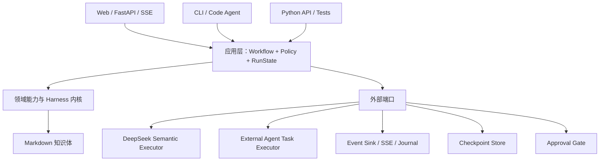

# Nexogenesis 能力内核与双执行平面重构设计

> 日期：2026-08-16
>
> 状态：用户已确认架构方向，待制定实施计划并分阶段落地
>
> 审查基线：开发仓 `538befe`
>
> 变更等级：v2 底层架构整理
>
> 作用：统一基础能力、工作流、运行状态、语义执行器和事件协议，消除 Web、CLI 与 Code Agent 之间的流程分叉

## 1. 决策摘要

  本次更新采用“能力内核 + 应用工作流 + 双执行平面 + 入口适配”的目标架构，并以渐进抽取方式迁移现有实现。

  已确认的核心决策如下：

1. Markdown 继续是唯一长期语义事实源；运行状态、事件和中间产物不得取代知识体文件。
2. Web 端保留编译、消化、建构三个知识工作流。
3. Code Agent 只参与编译和消化，不再参与建构、日常对话、涌现、研判、精修和专题报告。
4. 编译与消化分别只有一个正式 Workflow；Web + DeepSeek 与 Code Agent 使用同一 Workflow、同一策略、同一 Harness 和同一写入路径，只替换语义执行方式。
5. 建构以及全部思维体功能只面向 DeepSeek + Web，不为 Code Agent 或公共 CLI 维护等价编排。
6. Web、CLI 和 Code Agent 是入口适配器，不拥有业务流程。
7. `runtime/` 不再通过启动 CLI 子进程和解析标准输出复用内部能力。
8. 事件用于实时展示和审计，RunState 快照用于任务恢复，Markdown 用于长期知识事实；不采用完整事件溯源。
9. 旧 `/judge` 入口及其独立 Skill、路由、配置、模拟场景和测试全部删除，不保留兼容别名；多维分析统一使用 `assess`。
10. 迁移采用“目标架构明确、旧代码渐进抽取”的方式，不一次性重写全部工作流。
11. PDF、Word、EPUB、Markdown 和纯文本统一先进入材料标准化层；文件格式不得直接决定编译语义。
12. 图书、高质量报告、论文及用户显式标记的高价值长文，必须先形成可追溯的章节化 Markdown 文档包，通过结构与覆盖校验后才能逐章编译。
13. 原始文件、标准化 Markdown 和 Buffer 分属“来源保存—编译输入—知识质料”三个阶段，禁止让模型在一次调用中同时承担格式清洗、章节恢复和 Buffer 提炼。

## 2. 背景与问题定义

  当前项目已经具备编译、消化、建构、对话、涌现、研判、精修、专题报告等完整能力，也具备图检索、RAG、模型调用、写入事务、任务暂停和图谱事件。但代码主要围绕入口演化：CLI 命令先形成 Harness，随后 Web Runtime 在外层重新编排模型、任务和事件。

  当前最典型的结构性问题是：

```text
Web runtime/pipeline.py
  → 启动 python -m nexogenesis compile/digest/construct
  → 读取并解析 CLI stdout
  → 再调用模型
  → 再次调用 CLI 校验与应用
```

  这使 CLI 从“入口”变成了 Web 内部的文本协议，并造成以下长期摩擦：

- Web 修复只作用于 Web 外层，Code Agent 路径无法继承；
- CLI 文案同时承担用户报告和机器协议，修改提示语可能破坏运行时判断；
- 模型生成、Harness 校验、重试、事件和任务状态分散在不同模块；
- 取消任务需要同时管理协程和子进程；
- 动画事件由入口补发，无法始终对应真实能力动作；
- Skill 描述了理想流程，但 Harness 没有统一状态证明流程真正执行；
- 相同功能在不同入口下可能拥有不同数量限制、Prompt、错误恢复和完成条件；
- 测试更容易覆盖单个入口，却难以证明不同入口执行的是同一个语义流程。

  本次更新的根本目标不是增加更多工具，而是改变依赖方向：入口只能调用工作流，工作流组合稳定能力，能力通过明确端口访问模型、事件、检查点和写入事务。

## 3. 目标与非目标

### 3.1 目标

- 建立一个入口无关的应用层，承载工作流、策略、运行状态和完成条件；
- 让 Web、CLI 和 Code Agent 不再复制编译与消化流程；
- 让 Web 编译、消化、建构继续保留现有产品入口和用户体验；
- 让 Code Agent 作为编译、消化的外部语义执行者，而不是伪装成内部模型 API；
- 让每个真实能力动作产生结构化事件，供进度面板、动画、日志和最终报告消费；
- 让长任务可以在原子边界暂停、停止、恢复和防重复执行；
- 让模型输出、Harness 错误和定向修复使用统一结构化契约；
- 让 PDF、Word、EPUB 等常见文档经过统一、可追溯的 Markdown 标准化，再进入同一个 CompileWorkflow；
- 让高价值长文先恢复文档级结构并按章节组织，避免把整本书或整份报告直接切成失去上下文的字符窗；
- 让思维体的 AgentRunState、讨论记忆、证据账本和验证能力建立在同一运行底座上；
- 保留现有 Markdown 主权、写入确认和实践仓单向镜像纪律。

### 3.2 非目标

- 不引入 LangGraph、Temporal、CrewAI 等通用工作流框架；
- 不把所有函数包装成 Capability 类；
- 不采用依赖事件重放的完整事件溯源架构；
- 不让 RunState 或数据库成为新的知识事实源；
- 不把模型的私密思维链写入事件、日志或前端；
- 不同时重写所有工作流；
- 不要求不同模型对相同材料生成逐字相同的语义内容；
- 不为 Web 专属思维体功能开发 Code Agent 等价入口；
- 不在本次更新中解决多用户、分布式调度和跨机器执行。
- 不把 DOCX、EPUB 或 PDF 的版面外观完整复刻为 Markdown；标准化只保留编译所需的语义结构、来源锚点和必要表图信息。
- 不用大模型静默补写 OCR 缺字、缺页、公式或表格；无法可靠恢复的内容必须标记并进入人工处理或降级路径。

## 4. 入口支持矩阵

| 功能 | Web + DeepSeek | Code Agent | 公共 CLI | 目标实现 |
|---|---:|---:|---:|---|
| 编译 | 保留 | 支持 | 支持 | 单一 `CompileWorkflow`，双语义执行器 |
| 消化 | 保留 | 支持 | 支持 | 单一 `DigestWorkflow`，双语义执行器 |
| 建构 | 保留 | 不支持 | 不作为用户工作流暴露 | Web `ConstructWorkflow` |
| 日常对话 | 支持 | 不支持 | 不提供 | Web `DialogueWorkflow` |
| 涌现 | 支持 | 不支持 | 不提供 | `DialogueWorkflow + EmergePolicy` |
| 研判 | 支持 | 不支持 | 不提供 | `DialogueWorkflow + AssessPolicy` |
| 精修 | 支持 | 不支持 | 不提供 | `DialogueWorkflow + RefinePolicy` |
| 专题报告 | 支持 | 不支持 | 不提供 | `DialogueWorkflow + ReportPolicy` |
| validate/doctor/index | 后台调用 | 可在摄入维护中调用 | 保留 | Harness 技术命令 |
| write batch | 后台统一调用 | 不直接改知识体 | 保留唯一入口 | 单一写入权威 |

  “Code Agent 不支持”表示它不能自行编排或执行对应语义工作流，不表示底层只读命令必须从操作系统上隐藏。Code Agent 在编译和消化过程中可以使用工作流显式授权的扫描、检索、读取、校验和提交动作，但不得直接修改 Cards、Buffer 状态或归档目录。

  Web 继续保留左侧编译、消化、建构入口。这三项任务统一进入运行管理器，拥有一致的启动、进度、暂停、立即停止、恢复、完成报告和错误反馈。

## 5. 目标架构



### 5.1 第一层：领域能力与 Harness 内核

  这一层保存与入口无关的确定性能力和语义任务构造能力，主要沿用并整理现有模块：

- `ingest/`：材料扫描、体裁识别、阅读窗、Buffer 解析、批次规范化；
- `retrieve/`、`graph/`、`rag/`：候选检索、图展开、路径、邻居和上下文包；
- `thinking/`：注意力预算、STM、证据与讨论信号；
- `operations.py`、`store.py`、`schemas.py`：事务、写入、卡片契约和事实源访问；
- `indexing.py`：衍生索引刷新；
- 校验、归档、Buffer 状态和结构诊断能力。

  纯解析、计数、过滤和排序继续使用普通函数。只有满足以下至少一项的动作才提升为显式能力或服务：

- 被两个以上工作流复用；
- 有稳定、独立的输入输出契约；
- 需要独立校验或错误分类；
- 会产生持久化副作用；
- 需要取消、进度、失败或动画事件；
- 未来需要替换实现或外部服务。

#### 5.1.1 材料标准化与章节化 Markdown

  材料标准化是 CompileWorkflow 的正式前置能力，不是 Web 上传附件后的临时转换，也不是某个入口私有的预处理脚本。Web、CLI 和 Code Agent 发起编译时，必须调用同一套标准化能力、分类策略、质量检查和产物契约。

  支持的首批来源格式为：

| 来源格式 | 主要恢复对象 | 必须保留的来源锚点 | 常见失败 |
|---|---|---|---|
| PDF | 页、标题层级、段落、脚注、表格、图注 | 原文件哈希、页码、标题、图表编号 | 扫描件无文本层、双栏错序、页眉页脚混入、表格破坏 |
| Word（DOCX） | Heading 样式、段落、列表、脚注、表格、图片题注 | 原文件哈希、标题路径、段落或对象序号 | 视觉标题未使用样式、浮动文本框、批注修订、复杂表格 |
| EPUB | spine/nav/NCX、章节、脚注、内部链接、图片题注 | 原文件哈希、spine 顺序、章节 href/id | XHTML 锚点泄漏、目录重复、版权页混入、章节边界丢失 |
| Markdown | 标题树、段落、引用、表格、代码块 | 原文件哈希、标题路径、原始行区间 | EPUB 转换残留、标题级别跳跃、一个文件混装整本书 |
| TXT | 段落和可推断的小节 | 原文件哈希、原始行区间 | 无结构、编码错误、硬换行与自然段混淆 |

  标准化分成两个明确阶段：

```text
原始文件
→ 确定性提取：文本、结构信号、页码、脚注、表图与资源
→ 结构恢复：去除转换噪声、恢复标题树、判断章节边界、标记不确定区域
→ MaterialPackage 质量检查
→ 普通材料生成单篇 normalized.md
   或高价值材料生成 manifest + chapters/*.md
→ CompileWorkflow 读取标准化 Markdown，而不是再次解析原始格式
```

  确定性提取优先使用格式自身的结构，不得先把所有文件退化成无结构纯文本：

- PDF 优先读取目录、页码、文本块顺序和图表锚点；扫描件进入显式 OCR 分支；
- DOCX 优先读取 Heading 样式、段落关系、脚注和题注；不能只按字号猜标题；
- EPUB 优先读取 spine、nav/NCX 和 XHTML 章节，不得依赖 EPUB 转换后残留在正文里的 `xhtml` 字符串猜测全书结构；
- 已是 Markdown 的材料仍需检测其来源结构；EPUB 转出的长 Markdown 不得因扩展名是 `.md` 就默认判为 `essay`；
- TXT 只有在没有更可靠结构时，才使用规则或语义执行器辅助恢复小节。

  结构恢复允许语义执行器处理模糊标题、跨页段落和章节命名，但必须遵守以下边界：

- 只能重排、合并、去噪和标记，不能改写作者内容；
- 不能把缺失内容补成看似完整的正文；
- 每次结构调整必须能回指原文件页码、段落、spine item 或行区间；
- 低置信度章节、OCR 缺字、公式、表格和图片必须保留警告，不得静默通过；
- 材料标准化的语义任务与 Buffer 提炼任务分开执行、分开校验、分开保存结果。

#### 5.1.2 MaterialPackage 契约

  标准化产物统一表示为 `MaterialPackage`。建议结构如下：

```text
material-<id>/
├── manifest.yaml
├── normalized.md              # 普通材料或全篇导航页
├── chapters/                  # 高价值长文必须存在
│   ├── 001-前言.md
│   ├── 002-第一章.md
│   └── 003-第二章.md
├── assets/                    # 必要图表与图片，可选
└── diagnostics.json
```

```yaml
schema_version: 1
material_id: material-...
source:
  original_name: example.epub
  media_type: application/epub+zip
  sha256: "..."
extractor:
  name: epub-native
  version: 1
classification:
  genre: book
  confidence: 0.97
  reasons: [epub-spine, nav-chapters, long-form]
quality_tier: high
structure:
  chapter_count: 18
  ordered_chapter_ids: [chapter-001, chapter-002]
coverage:
  extracted_units: 18
  skipped_units: 3
  warnings: []
```

  `MaterialPackage` 是可重建的编译来源包，不是 Card 或 Buffer，也不是新的知识事实层。运行期间存放在 `.nexogenesis/runs/<run-id>/artifacts/materials/`；完成编译后，原始文件与用于本次编译的标准化包共同进入实践仓的来源归档，以便日后核对页码、章节和摘录。开发仓不得纳入任何具体材料包或转换样本正文。

#### 5.1.3 高价值材料的章节闸门

  是否进入章节化流程由 `quality_tier + genre + 用户覆盖` 决定，而不是由扩展名或字数单独决定。以下材料默认进入高价值路径：

- 图书和大部头长文；
- 高质量金融、行业、政策和研究报告；
- 学术论文；
- 用户显式标记为高价值的材料。

  高价值材料必须满足：

1. 先建立文档级地图，包括标题树、章节顺序、前后依赖、表图和附录范围；
2. 每个章节形成独立 Markdown 文件；章节过长时可以在章内再开阅读窗，但不得把两个章节混入同一阅读窗；
3. 每个章节保留稳定 `chapter_id` 和原始来源锚点，文件名只是显示信息，不能充当唯一身份；
4. 扉页、版权、目录、广告、制作者说明和作者简介先分类，再决定跳过、保留为元数据或进入编译，不能与正文同等批量产出 Buffer；
5. 全部章节通过顺序、覆盖、空章、重复章和乱码检查后，才能进入 Buffer 提炼；
6. CompileWorkflow 按章推进、按章检查点保存、按章统计 Buffer，并在文档级覆盖检查完成后才归档原材料。

  普通文章、对话和碎片仍先标准化为 Markdown，但不强制建立章节目录，也不强制两阶段语义审稿。标准化不能把轻量材料人为升级成大部头流程。

### 5.2 第二层：应用工作流与策略

  应用层拥有流程顺序、运行状态、预算、暂停边界、完成条件和错误恢复。目标工作流包括：

- `CompileWorkflow`；
- `DigestWorkflow`；
- `ConstructWorkflow`；
- `DialogueWorkflow`。

  `DialogueWorkflow` 通过 `TalkPolicy`、`AssessPolicy`、`EmergePolicy`、`RefinePolicy`、`ReportPolicy` 改变工具集合、证据要求、完成条件和确认边界，不复制 Agent Loop。

  体裁差异通过编译策略表达：

- `FinancialReportPolicy`；
- `BookPolicy`；
- `PaperPolicy`；
- `EssayPolicy`；
- `DialogueMaterialPolicy`；
- `FragmentPolicy`。

  Policy 优先是类型化配置和 Prompt 片段引用；只有确实存在不同控制行为时才实现代码策略类。

### 5.3 第三层：外部端口与基础设施适配器

  外部边界使用小型、显式的 Python `Protocol` 或等价接口：

```python
class SemanticExecutor(Protocol):
    async def execute(self, task: SemanticTask, context: RunContext) -> SemanticResult: ...

class EventSink(Protocol):
    async def emit(self, event: RuntimeEvent) -> None: ...

class CheckpointStore(Protocol):
    def load(self, run_id: str) -> RunState | None: ...
    def save(self, state: RunState) -> None: ...

class ApprovalGate(Protocol):
    async def request(self, proposal: Proposal, context: RunContext) -> ApprovalDecision: ...

class WriteBatchGateway(Protocol):
    def validate(self, batch: BatchOperation) -> ValidationResult: ...
    def apply(self, batch: BatchOperation, *, idempotency_key: str) -> ApplyResult: ...
```

  适配器实现包括：

- DeepSeek 模型执行器；
- 外部 Code Agent 任务执行器；
- 进程内 EventBus；
- SSE EventSink；
- NDJSON Event Journal；
- JSON Checkpoint Store；
- Web 确认适配器；
- CLI 确认与提交适配器。

### 5.4 第四层：入口适配

  入口只负责：

1. 解析用户参数；
2. 创建依赖和 RunContext；
3. 启动或恢复 Workflow；
4. 消费事件；
5. 展示结构化结果。

  FastAPI 路由不得自行拼接业务步骤；Click 命令不得拥有扫描、模型调用、校验或写入编排；前端不得根据文字猜测任务状态。

## 6. 包结构

  目标结构如下，实施时允许分阶段建立，不要求一次移动全部现有文件：

```text
nexogenesis/
├── application/
│   ├── context.py
│   ├── errors.py
│   ├── events.py
│   ├── models.py
│   ├── ports.py
│   ├── run_manager.py
│   └── workflows/
│       ├── compile.py
│       ├── digest.py
│       ├── construct.py
│       └── dialogue.py
├── policies/
│   ├── compile.py
│   └── dialogue.py
├── adapters/
│   ├── model/
│   │   ├── deepseek.py
│   │   └── external_task.py
│   ├── events/
│   │   ├── memory_bus.py
│   │   ├── journal.py
│   │   └── composite.py
│   ├── checkpoints/json_store.py
│   └── approvals/
├── commands/                 # CLI 薄适配器
├── runtime/                  # Web/FastAPI/SSE 适配器
├── materials/
│   ├── models.py             # MaterialPackage、章节、来源锚点
│   ├── classify.py           # 体裁与质量层级判断
│   ├── normalize.py          # 标准化用例
│   ├── quality.py            # 覆盖、乱码、结构与锚点闸门
│   └── extractors/
│       ├── pdf.py
│       ├── docx.py
│       ├── epub.py
│       ├── markdown.py
│       └── text.py
├── ingest/
├── retrieve/
├── graph/
├── rag/
└── thinking/
```

  不新增笼统的 `shared/` 杂物目录。可复用逻辑必须归入明确的领域模块、应用模型或端口适配器。

## 7. 运行契约

### 7.1 RunRequest

```yaml
workflow: compile
root: "D:/knowledge-body"
executor: deepseek
policy: financial-report
requested_by: web
options:
  process_all: false
  max_windows: 1
  material_quality: auto
  normalize_before_compile: true
```

  Request 只表达用户意图和可配置选项，不携带可变服务对象。

### 7.2 RunContext 与依赖

```python
@dataclass
class RunContext:
    root: Path
    run_id: str
    workflow: str
    state: RunState
    cancel_token: CancelToken
    actor: Actor
    conversation_id: str | None = None

@dataclass(frozen=True)
class WorkflowDependencies:
    semantic_executor: SemanticExecutor
    events: EventSink
    checkpoints: CheckpointStore
    approvals: ApprovalGate
    writes: WriteBatchGateway
```

  `RunContext` 不充当 Service Locator。Workflow 依赖通过构造器显式注入；领域函数只接收完成本动作所需的最小参数。

### 7.3 RunState

```yaml
schema_version: 1
run_id: run-...
workflow: digest
status: running
current_step: digest.wave.003.generate
policy_id: default-digest
policy_version: 1
executor: external_agent
input_fingerprint: sha256:...
steps: []
budgets: {}
artifacts: []
pending_task: null
pending_approval: null
stop_requested: false
pause_after_boundary: false
result: null
error: null
```

  Run 状态集合固定为：

```text
created
running
awaiting_executor
awaiting_approval
pausing
paused
cancelling
cancelled
completed
failed
```

  每个步骤状态固定为：

```text
pending / running / awaiting_external / completed / skipped / failed
```

### 7.4 StepState 与幂等

  每个可恢复步骤必须记录：

```yaml
step_id: compile.window.003.apply
input_fingerprint: sha256:...
idempotency_key: compile:<source-hash>:<window-id>:<policy-version>
attempt: 2
status: completed
started_at: "..."
completed_at: "..."
artifact_refs: []
result_summary: "写入 4 片 Buffer"
```

  产生副作用前保存意图，成功后保存结果。重复执行同一个 idempotency key 必须返回既有结果或安全拒绝，不得生成重复 Buffer、重复卡片或重复归档。

## 8. SemanticTask：统一模型与外部 Agent

  编译和消化不直接依赖某个模型协议。Workflow 产生结构化 `SemanticTask`，再交给选定执行器。

```yaml
schema_version: 1
task_id: compile.window.003.extract
run_id: run-...
kind: extract_buffers
policy_id: financial-report
policy_version: 2
prompt_ref: schemes/default/prompts/compile-report.txt
input_artifacts:
  - source: 00-Inbox/report.pdf
  - material_manifest: .nexogenesis/runs/.../materials/material-001/manifest.yaml
  - chapter: .nexogenesis/runs/.../materials/material-001/chapters/003-流动性周期.md
  - window: .nexogenesis/runs/.../window-003.md
output_contract: buffer-proposals-v2
constraints:
  max_buffers: 5
  preserve_page_anchors: true
  semantic_review_required: true
  chapter_id: chapter-003
```

### 8.1 DeepSeek 执行模式

```text
Workflow 创建 SemanticTask
→ DeepSeekSemanticExecutor 调用 API
→ 返回 SemanticResult
→ Workflow 解析、校验、修复或继续
```

  模型 API、流式协议、超时、空响应、工具调用格式和供应商兼容问题只存在于适配器层。

### 8.2 Code Agent 执行模式

```text
Workflow 创建 SemanticTask
→ ExternalAgentTaskExecutor 写任务包
→ Run 进入 awaiting_executor
→ Code Agent 阅读任务包和授权材料
→ CLI submit 结构化结果
→ Workflow 恢复、校验、修复或继续
```

  Code Agent 不是内部模型适配器。它是外部语义执行者，通过任务包和提交协议参与同一个 Workflow。

  Code Agent 不得直接编辑 `01-Cards/`、`05-Buffer/`、`03-Archive/` 或状态文件。所有结果必须作为 SemanticResult 提交，由 Workflow 和 Harness 决定是否写入。

### 8.3 SemanticResult

```yaml
schema_version: 1
task_id: compile.window.003.extract
executor: external_agent
executor_version: codex
content_type: buffer-proposals-v2
artifact: .nexogenesis/runs/.../result.md
submitted_at: "..."
```

  两种执行器不要求产生逐字相同的内容，但必须满足相同输出契约、数量预算、质量闸门、来源纪律、写入校验和完成条件。

## 9. 错误模型与恢复策略

  预期错误不得只作为字符串向上抛出。应用层至少区分：

| 错误类型 | 示例 | 默认恢复 |
|---|---|---|
| `InputContractError` | Inbox 文件不可读、参数非法 | 失败并提示用户修正 |
| `ProviderUnavailableError` | DeepSeek 网络失败 | 指数退避，达到上限后暂停 |
| `ModelOutputContractError` | 输出无法解析 | 定向修复或重新提交 |
| `HarnessValidationError` | 卡片字段、关系、语义槽错误 | 将结构化反馈交回语义执行器 |
| `WriteConflictError` | 事实源已被其他写入改变 | 重新加载并重新校验 |
| `ApprovalRequired` | 涌现、精修、报告待确认 | 进入 `awaiting_approval` |
| `RunCancelled` | 用户立即停止 | 丢弃未提交工作，保留已完成原子步骤 |
| `RetryExhaustedError` | 修复次数耗尽 | 暂停并保留诊断与中间产物 |

  错误对象必须包含稳定代码、所属步骤、可重试性、用户可读摘要、诊断详情和建议动作。前端展示摘要，日志保存诊断，Workflow 根据类型决定下一步。

## 10. 统一事件协议

### 10.1 事件信封

```yaml
schema_version: 1
event_id: evt-...
run_id: run-...
sequence: 17
workflow: digest
kind: graph.path_found
operation_id: retrieve-004
parent_operation_id: digest.wave.002
entity_ids: [card-a, card-b]
edge_ids: [edge-1]
payload:
  query: "..."
  channel: graph
timestamp: "..."
```

  `message` 可以作为可选展示字段，但不得作为机器判断依据。动画、日志和报告根据 `kind` 与结构化 payload 消费事件。

### 10.2 事件类别

**运行生命周期**

- `run.created`
- `run.started`
- `run.pause_requested`
- `run.paused`
- `run.resume_requested`
- `run.cancel_requested`
- `run.cancelled`
- `run.completed`
- `run.failed`

**工作流步骤**

- `step.started`
- `step.progress`
- `step.completed`
- `step.skipped`
- `step.failed`
- `checkpoint.saved`

**材料与编译**

- `material.scanned`
- `material.normalization_started`
- `material.extracted`
- `material.classified`
- `material.structure_recovered`
- `material.chapter_created`
- `material.normalization_warning`
- `material.normalization_completed`
- `compile.window_created`
- `compile.buffer_proposed`
- `compile.review_started`
- `material.archived`

**检索与图谱**

- `retrieve.started`
- `retrieve.hit`
- `retrieve.completed`
- `graph.seed_found`
- `graph.expanded`
- `graph.path_found`
- `graph.conflict_found`
- `card.read`

**模型与校验**

- `semantic_task.created`
- `semantic_task.awaiting_executor`
- `semantic_task.submitted`
- `model.response_progress`
- `validation.started`
- `validation.failed`
- `validation.passed`
- `repair.started`
- `repair.completed`

**写入与记忆**

- `proposal.created`
- `approval.requested`
- `approval.resolved`
- `write.started`
- `write.applied`
- `index.refreshed`
- `memory.committed`

### 10.3 四种状态主权

| 信息 | 权威载体 | 可否删除后重建 |
|---|---|---:|
| 长期知识语义 | Markdown 知识体 | 否 |
| 当前任务恢复 | RunState 快照 + 中间产物 | 可删除，但任务不能恢复 |
| 审计与故障诊断 | Event Journal | 可删除，不影响知识语义 |
| 实时动画与 UI | EventBus/SSE | 可丢帧，不影响任务正确性 |

  前端不参与状态决策。事件丢失最多影响实时展示，不能造成 Workflow 跳步、重复写入或无法恢复。

## 11. 运行控制

### 11.1 暂停与立即停止

  两类控制语义保持清晰：

- “本波后暂停”：设置 `pause_after_boundary`，完成当前最小原子工作单元后保存检查点并进入 paused；
- “立即停止”：取消模型请求或非原子工作，等待正在执行的原子写入结束，然后进入 cancelled。

  Compile 的安全边界是一扇阅读窗；Digest 的安全边界是一波原子写入；Construct 的安全边界是一个结构事务；Dialogue 的安全边界是一个工具调用或模型轮次。

### 11.2 恢复

  Resume 必须检查：

- Workflow 和 State schema 是否兼容；
- Policy 版本是否改变；
- 输入材料和知识体指纹是否改变；
- 已完成步骤的 artifact 是否仍存在；
- 待提交 SemanticTask 是否已经有结果；
- 上次中断是否发生在副作用前、执行中还是执行后。

  无法安全自动恢复时，状态保持 paused，向用户展示原因和可选动作，不自动从头重跑。

### 11.3 超时与重试

  超时属于单个外部调用，不代表整个 Run 失败。Workflow 根据错误分类执行：

- 原请求重试；
- 缩短上下文后重试；
- 进入外部 Agent 等待；
- 暂停并等待用户处理；
- 达到上限后失败。

  每次重试记录 attempt、错误代码和输入指纹，禁止无变化地无限重试。

## 12. 工作流设计

### 12.1 CompileWorkflow

```text
扫描材料
→ 识别来源格式
→ 提取文本、结构与来源锚点
→ 判断体裁和材料质量层级
→ 标准化为 Markdown MaterialPackage
→ 高价值材料建立文档级地图和章节文件
→ 执行结构、覆盖与乱码质量闸门
→ 按章节划分阅读窗
→ 为每窗计算 Buffer 预算
→ 创建提炼 SemanticTask
→ 执行或等待外部结果
→ 高价值材料进行第二阶段语义审稿
→ Harness 校验
→ 必要时定向返修
→ 逐窗幂等写入 Buffer
→ 文档级覆盖检查
→ 全部完成后归档原材料
→ 刷新索引并生成报告
```

  Web 选择 DeepSeek 执行器并自动推进；Code Agent 通过 CLI 获取任务包、提交结果并恢复流程。两者不得各自实现开窗、预算、审稿或写入逻辑。

  金融报告、图书和论文必须先完成章节化 Markdown，再逐章编译并经过第二阶段审稿；碎片和普通对话材料不执行两段式审稿。文档级地图用于跨章节概念一致性、章节覆盖和论证链检查，不写入知识卡。章节 Markdown 是标准化编译输入，不得把它误当成一组预制 Buffer。

  对高价值材料，CompileWorkflow 的最小安全边界从“任意字符窗”提升为“章节内阅读窗”。一章可以包含多个阅读窗，但一个阅读窗不能跨章；一章校验失败只阻塞该章及其后续依赖，不推翻已经幂等完成的章节。

### 12.2 DigestWorkflow

```text
扫描 scratch Buffer
→ 选择相关 Buffer 波次
→ Domain 路由
→ 检索近义卡、承接卡、冲突卡和关系目标
→ 深读少量关键卡
→ 组装受控上下文
→ 创建 new/enrich/skip SemanticTask
→ 执行或等待外部结果
→ 规范化事务
→ Harness 校验
→ 必要时定向返修
→ 原子写入
→ 标记 Buffer 状态
→ 验证写后事实源
→ 保存波次检查点并继续
```

  Web 与 Code Agent 共享 Buffer 选择、上下文预算、候选检索、new/enrich/skip 契约、修复循环和写入事务。Code Agent 可以通过 Workflow 授权的检索和读卡接口补充调查，但不得绕过任务状态直接落盘。

  DigestWorkflow 默认连续处理后续波次，直到 Buffer 耗尽、用户请求暂停、预算耗尽、无进展熔断或错误需要人工处理，不再固定完成一波后静默结束。

### 12.3 ConstructWorkflow

```text
增量诊断知识结构
→ 读取或更新结构问题队列
→ 按影响、置信度、成本和依赖选择问题
→ 检索相关局部子图
→ 深读关键卡片
→ DeepSeek 提出结构事务
→ Harness 校验
→ 必要时定向返修
→ 原子写入
→ 重新诊断受影响局部结构
→ 关闭、降级或保留问题
```

  ConstructWorkflow 只服务 Web + DeepSeek。Web 左侧建构入口、任务进度、暂停、停止、恢复和结果报告全部保留。CLI 旧命令只在迁移期作为内部 Harness 适配存在，目标状态下不作为 Code Agent 工作流暴露。

### 12.4 DialogueWorkflow

```text
识别 SkillPolicy
→ 建立或恢复 AgentRunState
→ 理解目标并制定可变调查计划
→ 检索、读卡、图展开和证据登记
→ 根据观察更新下一动作
→ 检查反证、边界和覆盖度
→ 验证答案或提案
→ 输出、确认或保存
→ 提交讨论记忆
```

  DialogueWorkflow 只服务 Web + DeepSeek，并支持以下策略：

| Policy | 核心差异 |
|---|---|
| Talk | 轻量问答或复杂调查，自适应预算，不自动写卡 |
| Assess | 多角度证据矩阵、反证与条件式定位 |
| Emerge | ≤3 候选、查重、new/enrich 判断、用户确认 |
| Refine | 目标卡、邻域、语义 diff、回归验证、用户确认 |
| Report | 章节证据槽、长任务恢复、反证和引用验证 |

  Web 内部不再为每个策略复制工具循环。Policy 定义允许工具、证据要求、预算、完成条件和写入权限；Workflow 管理状态、工具执行、验证和恢复。

## 13. Policy 与 Prompt 主权

  策略不得复制底层能力，也不得把 Prompt 全部硬编码进 Python。目标配置形态示例：

```yaml
id: financial-report
version: 2
window_strategy: section_aware
semantic_review: required
preserve:
  - metric_definition
  - time_range
  - forecast_conditions
  - chart_anchor
distinguish:
  - fact
  - model
  - forecast
  - allocation_advice
prompt_fragment: compile-report.txt
normalization:
  required: true
  output: chaptered-markdown
  preserve_page_anchors: true
  structure_gate: strict
```

  Prompt 文本继续由 `schemes/default/prompts/` 管理；卡片与写入契约继续由 `.agent/reference/` 管理；应用代码只加载策略和契约，不复制大段自然语言规则。

  格式适配策略与语义体裁策略必须分离。`EpubExtractor` 只回答如何读取 EPUB；`BookPolicy` 才回答如何按图书编译。EPUB 可以承载图书，也可能承载短篇文集；PDF 可以承载论文、报告或图书。禁止再次使用“扩展名即体裁”的隐式映射。

  Code Agent 可执行 Skill 仅保留编译、消化。Web 思维体的策略文件迁移到 `schemes/default/` 下的 Web Skill/Policy 区域，由 DialogueWorkflow 加载，避免外部 Code Agent 把 Web 思维体剧本当成自身可执行能力。

## 14. 权限与确认

### 14.1 效果等级

| 等级 | 行为 | 默认权限 |
|---|---|---|
| Read | 扫描、检索、读卡、诊断 | 自动 |
| Propose | 生成 Buffer、卡片或结构提案 | 自动生成，不自动成为事实 |
| Write | 修改知识体、归档、更新状态 | 仅经 Workflow + Harness |
| Approve | 将对话提案转为写入授权 | 用户确认或本轮显式 auto 授权 |

### 14.2 Code Agent 权限边界

  Code Agent 只被授权：

- 启动或恢复 CompileWorkflow；
- 启动或恢复 DigestWorkflow；
- 读取 Workflow 提供的材料、上下文、卡片和 Harness 反馈；
- 提交对应 SemanticTask 的结构化结果；
- 查看状态、事件和最终报告；
- 请求安全暂停或停止。

  Code Agent 不被授权：

- 直接执行建构、涌现、研判、精修和专题报告；
- 直接修改知识体 Markdown；
- 直接修改 RunState、Event Journal 或中间任务清单；
- 绕过 Workflow 调用写入事务；
- 自行扩展为其它思维体工作流。

## 15. 写入主权

  迁移期间，所有实质写入继续经过现有 `python -m nexogenesis write --batch <file>` 权威路径。Workflow 通过 `WriteBatchGateway` 调用它，不复制校验和事务实现。

  目标状态可以将唯一权威下沉为 `ApplyWriteBatchUseCase`，再让 CLI `write --batch`、Web Workflow 和测试共同调用该用例。但这会把宪法中的“命令入口”升级为“应用服务入口”，必须作为单独、显式的宪法修订实施，不能在普通重构中悄然改变。

  无论处于哪个迁移阶段，任意时刻只能存在一个正式写入权威。

## 16. Web 交互与图谱动画

  Web 工作流面板消费统一事件，展示：

- 当前 Workflow、Run ID 和执行器；
- 当前阶段和真实步骤；
- 已处理材料、Buffer、卡片和波次；
- 正在等待模型、外部执行器还是用户确认；
- 本波后暂停和立即停止；
- 可恢复状态与失败原因；
- 完成后的人类可读摘要。

  知识图谱只消费与真实知识动作有关的事件：

| 事件 | 动画 |
|---|---|
| `retrieve.started` | 轻微扫描波纹 |
| `graph.seed_found` | 种子节点先亮 |
| `graph.expanded` | 沿真实边错峰传播 |
| `graph.path_found` | 高亮真实关系路径 |
| `graph.conflict_found` | 冲突节点与原色边提示 |
| `card.read` | 节点橙黄色阅读光晕 |
| `write.applied` | 新建或丰富的真实节点反馈 |
| `run.completed/failed/cancelled` | 统一退出并恢复静息态 |

  材料扫描、模型等待、校验修复等没有真实卡片 id 的事件只进入工作流面板，不伪造图谱节点动画。

## 17. 状态与文件布局

  建议运行产物存放为：

```text
.nexogenesis/
└── runs/
    └── <run-id>/
        ├── state.json
        ├── request.json
        ├── events.ndjson
        ├── tasks/
        ├── results/
        ├── artifacts/
        │   └── materials/
        │       └── <material-id>/
        │           ├── manifest.yaml
        │           ├── normalized.md
        │           ├── chapters/
        │           ├── assets/
        │           └── diagnostics.json
        └── report.md
```

  这些文件全部是可删除的运行辅助状态，不进入开发仓，不成为知识事实。现有 `.nexogenesis/tmp/compile|digest|construct` 在迁移完成后逐步收敛到 run 目录；迁移期提供兼容读取，不长期维护两套状态。

## 18. 旧入口清理决议

  多维分析统一使用 `assess`。实施时必须完成：

- 删除旧独立 Skill 目录；
- 删除触发词和命令路由；
- 删除工具模式映射、配置 profile 和模拟场景；
- 删除对应测试、UI 文案和活文档索引；
- 历史设计文档保留历史事实，不参与当前运行；
- 用户输入已删除命令时按未知命令处理，不静默转发；
- 新代码、事件、测试和文档不再引入该名称。

  当前活动代码与契约的清理范围如下：

| 位置 | 目标动作 |
|---|---|
| `AGENTS.md`、`.agent/reference/` | 删除兼容入口与旧模式说明，只保留 assess 契约 |
| `.agent/skills/nexo-judge/` | 删除目录，不保留转发 Skill |
| `runtime/agent.py` | 删除触发词、路由与工具构建分支 |
| `runtime/agent_tools.py`、`retrieve/context_package.py` | 将所需检索语义统一到 assess，不保留旧 mode |
| `thinking/`、`schemes/default/attention.yaml` | 删除旧 profile/信号名称，迁移必要预算到 assess |
| `runtime/simulate.py`、`web/src/App.tsx` | 删除模拟场景、展示枚举与前端映射 |
| 当前测试 | 删除兼容性断言，补充 assess 唯一路径测试 |

  历史 plans/specs 不进行批量改写；它们只记录当时实现，不再进入运行时加载、当前索引和验收依据。

## 19. 从当前模块到目标模块

| 当前模块 | 当前问题 | 目标去向 |
|---|---|---|
| `runtime/pipeline.py` | Web 编排、CLI 子进程、模型、修复和报告混合 | 拆入三个 Workflow、SemanticExecutor 和 Web adapter |
| `runtime/pipeline_jobs.py` | 状态字段有限、内存任务与 JSON 混合 | `application/run_manager.py` + CheckpointStore |
| `runtime/agent.py` | 模型协议与 Agent Loop 混合 | DialogueWorkflow + DeepSeek adapter |
| `runtime/agent_tools.py` | 工具、检索、权限、事件、提案混合 | 领域能力 + Workflow tool adapter |
| `runtime/events.py` | 仅进程内短期事件 | EventSink 端口 + memory/SSE/journal 适配器 |
| `runtime/cognitive_events.py` | Web 专属语义适配 | 统一 RuntimeEvent 工厂与认知事件适配 |
| `commands/compile.py` | Click 与编译流程混合 | CompileWorkflow + CLI 薄壳 |
| `commands/digest.py` | Click 与消化流程混合 | DigestWorkflow + CLI 薄壳 |
| `commands/construct.py` | Click 与建构流程混合 | ConstructWorkflow；退出公共 Code Agent 入口 |
| `ingest/ingest.py`、`pdf_extractor.py` | 格式读取、体裁判断和编译开窗部分耦合；转换后的 EPUB Markdown 易误判为 essay | `materials/extractors/` + MaterialClassifier + MaterialPackage；`ingest/` 只消费标准化 Markdown |
| `.agent/skills/` | Code Agent 与 Web Playbook 混放 | 只保留 Code Agent 编译、消化 Skill |
| `schemes/default/prompts/` | 已有 Prompt 事实源 | 继续保留，并增加类型化 Policy 引用 |

## 20. 迁移计划

### P0：契约锁定与旧入口清理

- 更新宪法和 Skill 索引，明确 Code Agent 只执行编译、消化；
- 完成旧入口及独立 Skill 清理；
- 为现有 CLI/Web 编译、消化、建构建立 characterization tests；
- 冻结现有写入、归档、Buffer 状态和事件行为；
- 定义 RunState、SemanticTask、RuntimeEvent 和错误代码。

### P1：应用层骨架

- 新建 application、ports 和 adapters 基础模块；
- 实现 JSON Checkpoint Store；
- 实现组合 EventSink：进程内总线 + NDJSON journal；
- 实现 CancelToken、暂停边界和幂等步骤工具；
- 不改变现有用户行为。

### P2：Compile 最小纵向切片

```text
扫描 Inbox → 标准化一个来源文件 → 生成 MaterialPackage
→ 生成 CompilePlan → 生成一扇章节内阅读窗 → 保存状态 → 发事件
```

- 先实现 Markdown/TXT 适配器，再实现 EPUB、DOCX 和 PDF 原生结构适配器；
- CLI 和 Web 同时改为调用该切片；
- 对同一材料比较 MaterialPackage、计划、窗口和事件；
- 对 EPUB 转换 Markdown 与原生 EPUB 建立等价结构回归，防止整本书再次被判为 essay；
- 尚不迁移模型和写入。

### P3：完整 CompileWorkflow

- 迁移 DeepSeek 执行器；
- 实现 External Agent Task Executor；
- 迁移高价值材料复审、质量返修、逐窗写入和归档；
- 实现中断恢复和重复执行保护；
- 删除 Web 编译对子进程 CLI 的依赖。

### P4：完整 DigestWorkflow

- 迁移波次选择、检索、深读、上下文、new/enrich/skip、修复和原子写入；
- Web 和 Code Agent 使用相同 Workflow；
- 实现连续波、暂停、无进展熔断和可读完成报告；
- 删除 Web 消化对子进程 CLI 的依赖。

### P5：ConstructWorkflow Web 化

- 保留 Web 建构入口；
- 引入结构问题队列和局部复诊；
- 迁移 DeepSeek、Harness、事件和任务控制；
- 删除 Web 建构对子进程 CLI 的依赖；
- 将公共 Code Agent 建构入口退出正式支持矩阵。

### P6：DialogueWorkflow

- 引入 AgentRunState、计划、假设、证据账本、验证和 STM 提交；
- 迁移 talk、assess、emerge、refine、report 策略；
- 统一工具事件和图谱动画；
- 保持 Web 专属，不开发 Code Agent 适配。

### P7：清理与收口

- 删除旧入口编排、stdout 内部协议和重复模型调用；
- 收敛 `.nexogenesis/tmp/` 到 runs；
- 更新 AGENTS、README、活契约、Skill 索引和操作文档；
- 跑开发仓全量测试；
- 提交开发仓后由实践仓单向合并并执行真实材料回归。

## 21. 测试策略

### 21.1 能力与端口测试

- 纯函数单元测试；
- PDF、DOCX、EPUB、Markdown、TXT extractor 契约测试；
- MaterialPackage schema、来源哈希、章节顺序和锚点测试；
- 体裁与质量层级分类测试，覆盖“格式不等于体裁”；
- 标准化覆盖率、乱码、重复章、空章、页眉页脚和 EPUB 锚点清理测试；
- Model、Event、Checkpoint、Approval、Write 端口契约测试；
- 错误类型和重试决策测试；
- 幂等 key 和重复调用测试。

### 21.2 Workflow 场景测试

- 正常完成；
- 模型空响应；
- 输出格式错误后修复；
- Harness 校验错误后修复；
- 网络中断；
- 立即停止；
- 本波后暂停；
- 服务重启后恢复；
- 写入后客户端断开；
- 输入材料或知识体在暂停期间改变；
- 标准化在中途失败后恢复；
- 高价值材料章节缺失、重复、乱序或锚点丢失时阻止编译；
- 单章失败后保留已完成章节，修复后从该章恢复；
- 重复提交外部 Agent 结果；
- 重复恢复不产生重复事实。

### 21.3 入口一致性测试

  使用相同输入、相同 Policy 和脚本化假语义执行器时，Web 与 CLI 的编译/消化必须具有：

- 相同 MaterialPackage、体裁、质量层级和章节顺序；
- 相同计划；
- 相同窗口或 Buffer 波次；
- 相同 SemanticTask；
- 相同 Harness 结果；
- 相同事实源变更；
- 除 run_id、timestamp 外相同的规范化事件序列；
- 语义等价的完成报告。

  真实 DeepSeek 与真实 Code Agent 不要求产物逐字相同，改为比较契约通过率、重要信息覆盖、重复提案率、enrich/new 判断、来源锚点和最终写入质量。

### 21.4 Web 回归

- 编译、消化、建构三个按钮保持可用；
- 三类任务都能展示真实进度；
- 三类任务都支持暂停、停止和恢复；
- 动画只来自真实图谱事件；
- 任务结束后图谱恢复静息状态；
- 对话、涌现、研判、精修、报告不依赖 CLI；
- 用户确认流程不因客户端刷新而丢失。

## 22. 验收标准

### 22.1 架构验收

- Web 编译、消化、建构不再通过子进程调用各自 CLI；
- CLI compile/digest 只解析参数、创建依赖、调用 Workflow 和展示结果；
- Compile/Digest 不存在 Web 与 Code Agent 两套编排；
- Construct 和 Dialogue 的业务步骤不在 FastAPI 路由中；
- 事件、检查点、模型和写入均通过显式端口；
- 不存在新的通用 `shared/` 或万能 Context。

### 22.2 行为验收

- Web 编译、消化、建构能力完整保留；
- PDF、DOCX、EPUB、Markdown 和 TXT 均先生成可审计的标准化 Markdown，再进入编译；
- 图书、高质量报告、论文和用户标记的高价值长文均按章节进入编译，不存在整本直接落入 essay 普通路径的情况；
- 任一 Buffer 的来源能够追溯到 MaterialPackage 章节及原始页码、spine item、段落或行区间；
- 标准化质量未通过时不生成 Buffer，无法可靠恢复的缺字、表图和结构问题会呈现给用户；
- Code Agent 能完成高质量编译和消化，但不能绕过入口执行其它思维体工作流；
- 同一 Run 可以从 DeepSeek 等待切换为外部 Agent 提交，但任务契约不改变；
- 暂停、恢复和立即停止不会产生重复 Buffer、重复卡片或重复归档；
- Harness 错误可以结构化返还并定向修复；
- 所有知识写入仍经过唯一写入权威；
- 所有动画节点和边均能追溯到真实事件实体。

### 22.3 兼容与清理验收

- 旧别名不再被路由；
- 对应独立 Skill、配置、模拟、测试和当前文档索引已删除；
- 历史设计文档只作为历史记录，不再作为运行依据；
- 现有有效知识体 Markdown 无需迁移；
- 开发仓不引入实践知识样本；
- 实践仓只能从开发仓合并补丁，不反向提交。

## 23. 风险与控制

| 风险 | 控制 |
|---|---|
| 重构与行为改进混在一起 | 每阶段先做行为等价迁移，再单独优化策略 |
| Capability 类数量膨胀 | 只对稳定边界、副作用和可替换服务建接口 |
| RunContext 变成万能容器 | 状态与依赖分离，构造器显式注入 |
| 事件重新成为文本协议 | kind + typed payload；message 只展示 |
| 外部 Agent 直接改知识体 | 只接受 SemanticResult，写入由 Workflow 执行 |
| 暂停恢复产生重复写入 | step fingerprint + idempotency key + 写后核验 |
| 双执行器导致质量标准分叉 | 共享 Policy、输出契约、Harness 和评测集 |
| Web 专属逻辑重新进入 API | Workflow 场景测试直接调用应用层，不经 HTTP |
| 文档格式与语义体裁再次耦合 | Extractor 只负责格式，Classifier/Policy 单独决定体裁和质量层级 |
| 转换后 Markdown 丢失原始页码和章节 | MaterialPackage 强制来源哈希、章节 id、页码/spine/行区间锚点 |
| 大模型在结构恢复时改写原文 | 标准化 diff、覆盖率检查、低置信度警告和禁止静默补写 |
| 章节化产生大量无意义小文件 | 章节由原始目录与语义边界共同决定，设置最小内容阈值并合并伪标题 |
| 一次迁移范围过大 | Compile 纵向切片先行，逐个工作流切换 |

## 24. 回退策略

  每个 Workflow 迁移均使用独立 feature flag。新路径必须通过入口一致性和实践仓真实材料测试后才成为默认路径。

  回退只切换入口到旧编排，不回滚已经成功完成的知识体原子写入。RunState、Event Journal 和中间产物可以保留用于诊断。旧路径在对应新 Workflow 连续稳定后删除，不能无限期双轨维护。

## 25. 最终架构原则

1. 一个业务目标只有一个正式 Workflow。
2. 相同 Workflow 可以有不同语义执行器，但不能有不同 Harness 和写入规则。
3. Code Agent 只负责高质量编译、消化语义工作，不扩展为通用思维体入口。
4. Web 保留编译、消化、建构，并独占其余思维体功能。
5. Skill/Policy 定义语义策略，Workflow 定义运行和完成条件。
6. Harness 管确定性、权限、校验、事务和恢复；模型管语义判断。
7. 状态保存可恢复事实，不保存私密思维链。
8. 事件描述真实动作，不驱动知识事实，也不伪造动画。
9. Markdown 始终是唯一长期语义事实源。
10. 采用目标架构 A、渐进迁移 B 和轻量检查点 C，不采用完整事件溯源。
11. 原始格式先标准化为可追溯 Markdown，再进入语义编译；格式读取与体裁策略相互独立。
12. 高价值长文先建立文档地图和章节 Markdown，再逐章提炼 Buffer；不得让一次模型调用同时清洗格式、恢复结构和生成知识质料。
